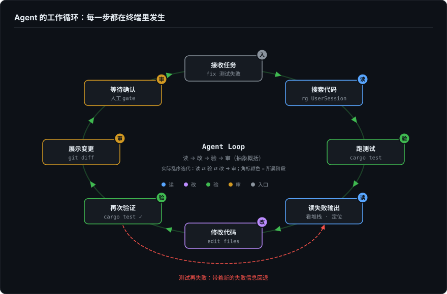
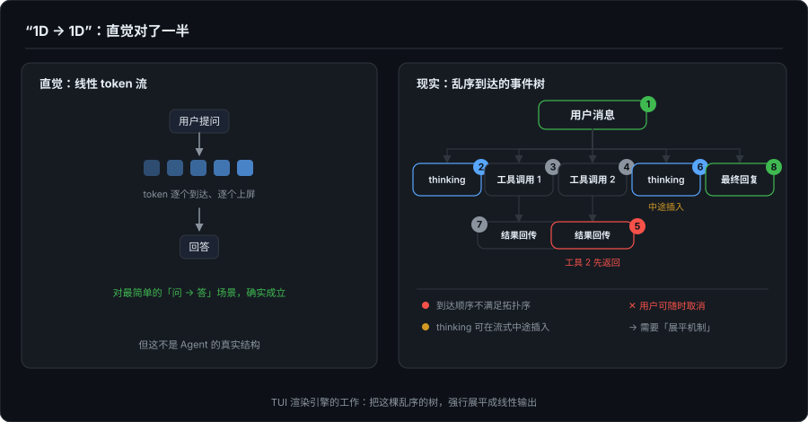

# Agent 时代的开发者界面（一）：为什么 Agent 从 CLI/TUI 开始——兼论程序员的信任模型

> 系列定位：从做过移动端、桌面端、TUI 和全栈的视角，重新理解 AI Agent 时代的人机界面与开发者工作流。
> 本文是系列第一篇，建立对 Agent 为什么优先走终端路线的完整认知。

---

## 一、一个场景

一个 coding agent 接到"修复测试失败"的任务。它不是直接给你答案。它会：

```bash
rg "UserSession"                          # 搜索调用链
cargo test 2>&1 | head -40                # 跑测试，看失败输出
```

读文件，找到可疑点。修改。再跑测试。发现又失败了——不是刚才那个 case，是另一个被牵连的。再改。再跑。通过了。然后：

```bash
git diff                                 # 展示变更
```

等你确认要不要提交。

这个过程从头到尾、每一步都在终端里发生。与其说终端被选成了 agent 的界面，不如说 agent 的工作方式本来就是一个终端会话。



这不是巧合。2025-2026 年，Anthropic 的 Claude Code、OpenAI 的 Codex CLI、Google 的 Gemini CLI、Block 的 Goose、Aider（2023 年先行者）、Devin CLI（Cognition）、Qwen Code 等等，头部 coding agent 里，CLI/TUI-first 是压倒性多数的选择。这些团队并非请不起 GUI 设计师，而且实际上也在朝着 GUI 的方向前进。他们做了同一个选择，因为有一些结构性的原因。

> 补记（2026.09，发布前）：这段判断和"压倒性多数"的说法形成于几个月前。到文章发布时，GUI 这侧的进展已经不止是"方向"：Anthropic 在 4 月给 Claude Code 的桌面端做了完整改版（为并行 agent 工作流设计）；OpenAI 在 7 月把 Codex 应用并入了新版 ChatGPT 桌面应用；Google 的 Antigravity 从 IDE 长成了 agent-first 平台，9 月起托管 agent 直接跑在 Gemini API 上，还出了自己的 CLI。CLI/TUI 仍然是这些产品的地基——这篇讲的正是地基为什么先是终端——但"多数派"的叙事正在快速过期。这个趋势不推翻本文的论证，后面的"多端投影"框架就是为它准备的。

---

## 二、最直接的回答：工作对象决定了工作界面

Agent 的工作对象是什么？

- 代码文件（文本）
- 命令行工具（文本输入，文本输出）
- 编译器 / linter / 测试框架（文本输出）
- git diff / log / status（文本输出）
- 日志和错误堆栈（文本）

所有这些，最自然的显示介质就是终端。终端就是为文本而生的。

反过来看 GUI 里展示这些东西的成本：

- 代码块：需要语法高亮引擎 + 等宽字体 + 复制按钮
- 终端输出：需要 ANSI 转义序列解析 + 虚拟终端模拟器
- diff：需要并排对比视图 + 行级高亮 + 部分采纳/拒绝交互
- 日志：需要虚拟滚动 + 搜索过滤 + 级别着色

每一项在 TUI 里是 `print()`，在 GUI 里是一个子系统。当然，`print()` 只是输出的起点,如果想让输出在流式场景下保持可读、可排版，是另一套引擎的成本，下一节就会看到。GUI 并非做不了，只是在 agent 还在快速迭代、工具调用协议还在变化、权限模型还在试探的阶段，每加一个 GUI 子系统就是一笔债务。

我之前看一个说法：做 GUI 要么 VSCode 换皮（功能上限被封死），要么自研（至少半年以上）。而 CLI 是每个 agent 无论如何都要提供的核心功能——SSH 进去、WSL 里跑、CI 里执行，CLI 是唯一通用解。这笔账算下来很朴素：GUI 太贵，CLI 绕不开。

---

## 三、"1D → 1D"这个说法对吗？

我看有人提过一个简洁的直觉判断：**LLM 的输出是 1D 的（线性 token 流），CLI 也是 1D 的（线性文本输出），所以天然匹配。**

这个判断对了一部分:对于最简单的"用户问 → AI 答"场景，确实如此。

token 到达 → 显示字符 → 下一个 token → 追加字符。算得上一条直线。

但 Agent 的真实输出不是一条直线。它是这样的：

```
用户消息
  ├── thinking（推理过程，可能很长）
  ├── 工具调用 1（开始 → 运行中 → 完成）
  │     └── 工具结果回传
  ├── 工具调用 2（可能与工具 1 并行，且可能比工具 1 先返回）
  ├── thinking（基于工具结果继续推理）
  └── 最终回复（流式输出）
```

这是一棵树。而且节点到达的顺序不满足这棵树的拓扑序（父节点、靠前的子树并不保证先到）。工具调用 2 可能比工具调用 1 先返回，thinking 块可能在流式输出的中途插入，用户随时可能按取消键。



CLI 之所以"看起来适配"，不是因为 Agent 的输出真的是 1D 的,而是 TUI 渲染引擎在背后做了大量工作，把一棵乱序到达的树强行展平成了线性输出。

这套展平机制（稳定槽位队列、shiftIndices 偏移追踪、thinking 原地替换、有上限的 FIFO 通知队列）的核心只有几百行 Swift 代码。本系列第 4 篇会详细拆解。这里我们先接受一个结论："1D → 1D"是用户看到的最终效果，不是 Agent 的真实结构,而且这个效果的实现成本不低。

---

## 四、更深层的原因：Agent 的状态模型还没稳定

一个普通 GUI 应用的信息架构通常很清晰：列表、详情、表单、编辑器、设置、通知。这些状态是预设的、有限的、可以画成状态机的。

Agent 的真实流程更像一个动态 workflow engine：

```
用户提出自然语言目标
  → agent 自己拆任务
  → 读取上下文
  → 搜索文件
  → 执行命令
  → 遇到错误
  → 修改计划
  → 编辑文件
  → 重新验证
  → 请求权限
  → 等待用户介入
  → 中断后恢复
  → 总结结果
```

每一步都不可预测。你不知道下一个事件是 thinking 还是 tool call 还是 streaming text 还是 error。你不知道用户会不会中途打断。你不知道工具返回是 3 行还是 3000 行。

在状态模型还在快速变化的阶段，过早投入重型 GUI 是在为一个还没定型的系统设计固定布局。CLI/TUI 的处理方式是务实的：**把复杂过程线性化为事件流，一行一行往下写**。等到事件模型稳定了，再考虑 GUI 怎么投影这些事件。

这解释了为什么 Aider（2023）、Claude Code（2025）、Codex CLI（2025）都走了 CLI-first 路线——倒不是请不起人做界面，当时的首要任务是**把 agent runtime、工具调用协议、权限模型和失败恢复跑通**。CLI 是最低成本、最快反馈的实验台。

---

## 五、环境继承：零成本的"进入现场"

开发项目的真实环境通常很复杂：多语言、多包管理器、monorepo、私有依赖源、本地证书、SSH key、git credential、自定义 Makefile / Justfile、CI 脚本、shell profile、环境变量、docker / dev container……

CLI Agent 默认运行在项目目录中。它直接继承：

```
cwd             → 就在项目根目录
PATH            → 所有本地工具链可用
env             → 项目需要的环境变量都在
git config      → 用户身份、凭证、hooks
SSH config      → 私有仓库、远程服务器
```

零配置。`cd ~/project && claude` 就够了。

GUI 要做到同样可靠，需要额外处理一堆桌面端问题：

- 文件系统权限（macOS sandbox、Windows UAC）
- shell 环境继承（login shell vs non-login shell 差异）
- 跨平台差异（路径分隔符、换行符、进程管理）
- code signing、auto update、crash recovery
- terminal pty 管理、child process lifecycle
- 企业网络、proxy、VPN

每多一层桌面集成，就多一层出错的可能。在"继承开发环境"这个维度上，CLI 是最可靠的方案。

---

## 六、中场过渡：这些解释了"为什么 CLI/TUI 先出现"，但还有一个更深的问题

以上说了四个原因：
1. 工作对象是文本 → 终端最自然
2. 做 GUI 太贵，CLI 绕不开 → 经济上的必然
3. 状态模型未稳定 → CLI 是低成本实验台
4. 环境继承零成本 → 直接进入工程现场

这些足以解释为什么 agent 从 CLI/TUI 起步。但还有一个更深的问题：**为什么程序员更信任 CLI/TUI agent？**

因为 CLI/TUI 满足了一个程序员对开发工具最核心的三个需求。

---

## 七、程序员信任开发工具的三个条件

### 7.1 可观察

程序员接受一个 agent 的前提是：我能看到它在做什么。

不是"我相信它"，是"我能验证它"。具体来说：

- 它准备改哪些文件？
- 为什么改这里？
- 跑了什么命令？命令输出是什么？
- 测试失败在哪里？哪一行？
- diff 是否合理？有没有误改无关文件？
- 是否访问了网络？是否改了 lockfile？
- 是否提交或推送了？

CLI/TUI 在这个维度上有天然优势——命令、输出、diff、错误堆栈，全部以原生形态展示在终端里。GUI 要做到同等可见性，需要设计专门的信息面板——命令历史面板、输出日志面板、diff 审查面板。这部分的复杂性远比 TUI 要大的多.

### 7.2 可复现

agent 做的事，用户自己能复现吗？

CLI Agent 的每一个操作——读文件、跑测试、git diff——用的都是项目里的真实命令。输出是这些命令的真实输出。如果 agent 说"测试通过了"，用户可以在自己的终端里跑同一行命令验证。

更重要的是：如果 agent 做错了，用户可以**接管**。`git reset HEAD~1`，手动改，重跑。agent 没有引入一个"只有 agent 能操作"的中间层。

### 7.3 可回滚

所有 agent 的代码变更都在 git 工作区里。

用户可以 `git diff` 逐行审查，可以 `git add -p` 分块暂存，可以 `git checkout -- <file>` 撤销。git 本身就是最可靠的安全网——不是因为 agent 不会犯错，而是因为错误可以被精确回退。

这三条:**可观察、可复现、可回滚**，合在一起，构成了程序员对自动化工具的信任边界。程序员不讨厌自动化。但程序员讨厌**不可解释的自动化**，一个黑箱告诉你"搞定了"，但你看不到它做了什么、无法验证、也无法回退。

---

## 八、三种界面在信任模型上的差异

| | CLI/TUI | GUI/Desktop | IDE 插件 |
|---|---|---|---|
| **可观察** | 命令和输出原样展示，diff 原生渲染 | 需要设计专门的信息面板 | 与编辑器深度集成，但 agent 操作的边界可能模糊 |
| **可复现** | 每个命令都可以复制、重跑 | 命令可能被抽象为按钮操作 | 取决于插件暴露多少底层命令 |
| **可回滚** | git 工作区原生可见，用户完全掌控 | git 操作可能被 GUI 封装 | 编辑器的 undo + git 双重保障 |
| **信任建立速度** | 快——看到命令和输出就信任了 | 中——需要额外验证 | 中——编辑器的 undo 历史提供安全感 |
| **黑箱风险** | 低——所有操作以文本形式暴露 | 高——容易被封装成"一键完成" | 中——可能在编辑器后台悄悄改文件 |

这张表不是要证明 CLI/TUI 在所有维度上优于 GUI，事实上不管是我自己的思考还是现实发展都证明了 GUI 化是发展的目标。GUI 在 diff 审查（并排对比、行级采纳/拒绝）、长会话管理（cell 复用、分页加载）、多模态附件（图片、文件预览）上有结构性优势。这些在本系列后篇会展开。

这里要说明的是另一件事：**CLI/TUI 在当前阶段胜出，理由不在"更好"，在这三条信任基线它天然满足。做 GUI 的时候如果忽视了这三个维度，把 agent 包装成一个"一键完成"的按钮，反而会失去开发者用户**。

---

## 九、不只是"早期形态"

有一种观点认为 CLI/TUI 只是 agent 的"早期原型"，等产品成熟了自然会转向 GUI。目前是探索 Agentic 框架的阶段，界面是次要的——Claude Desktop 和 Codex App（2026 年 7 月起已整合进 ChatGPT 桌面应用）的出现似乎也在印证这个方向。

这个判断对了一半。GUI 确实会在更广泛的用户群中占据更大份额。非技术用户不会打开终端。

但另一半隐含了一个更强的假设：**CLI/TUI 和 GUI 是线性进化关系，前者迟早被后者迭代掉。**

这个假设成立吗？SSH 到远程服务器跑 agent、CI/CD 流水线里集成 agent、在 tmux 里恢复一个跑了 3 小时的会话——这些场景里，CLI/TUI 的位置到底是什么？要完整回答这个问题，"进化论"这个框架不够用。后面会给出另一个框架——Event Sourcing：CLI/TUI 和 GUI 的关系不是谁迭代谁，而是同一条事件流在不同介质上的投影。这里先按下不表。

---

## 十、这篇的收束

这篇文章试图回答一个问题：为什么 2025-2026 年的头部 coding agent 在一开始绝大多数选择了 CLI/TUI-first，而且这不太可能是一个会被"快速迭代掉"的早期选择。

三条线汇总：

1. **工作对象和工作方式决定了起点**
    agent 操作的是代码、命令、git、测试、日志——终端生态是原生匹配。GUI 要为每一样东西写一个子系统，工程成本不在同一量级。

1. **状态模型未稳定 + 环境继承零成本**
    agent 的工作流是动态的、不确定的、会中断和恢复的。CLI 用线性事件流处理复杂性，同时零配置继承开发环境的全部上下文。

1. **信任模型天然匹配**
    可观察（命令和输出原样展示）、可复现（每个操作都可以手动重跑）、可回滚（一切在 git 工作区里）。归根结底，终端让 agent 的行为可被审计。

CLI/TUI 是 Agent 在"执行阶段"的最优投影。
GUI 的机会在下一层——把复杂过程结构化、把 diff 和风险审查化、把多任务和团队协作产品化。这会是本系列后续各篇逐步展开的内容。

---

## 下一篇

接下来会沉到技术底层：**TUI 到底是怎么渲染的？** ANSI 转义序列、字符网格、物理行 vs 逻辑行、增量 diff、RenderLoop 帧调度——从 ForgeLoopTUI 的实际源码出发，讲清楚一个 TUI 渲染引擎到底在做什么。


<!--
---

 *本文为系列第 1 篇。系列全部技术细节基于 [ForgeLoopTUI](https://github.com/BiBoyang/ForgeLoopTUI) v1.2.0 和 [FlowDown](https://github.com/Lakr233/FlowDown) 的实际源码分析。知乎讨论参考：[为什么现在大多 Code Agent 的主形态是 CLI/TUI？](https://www.zhihu.com/question/2026125412049101416)*

-->
