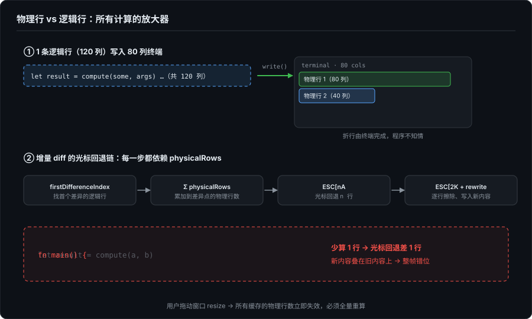
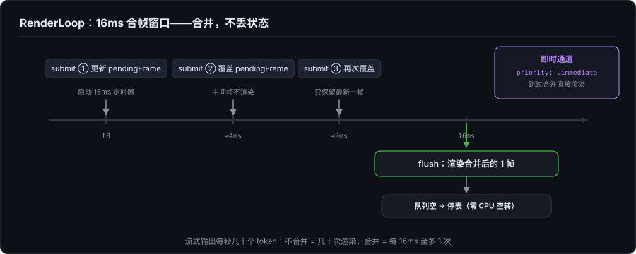
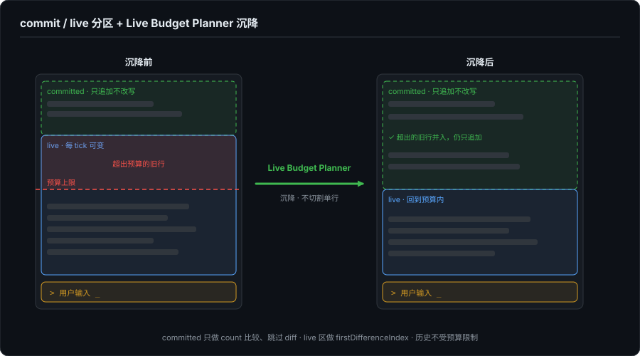

# Agent 时代的开发者界面（二）：TUI 不是低配 GUI——字符网格里的渲染引擎

> 系列第二篇。上一篇讲了 Agent 为什么从 CLI/TUI 开始——工作对象、状态模型、环境继承、信任基线。这一篇沉到技术底层：TUI 到底是怎么渲染的？那个在终端里看似简单的界面，底下是一套什么样的引擎？

---

## 一、从一个常见的错觉说起

先看一眼这个领域的实际阵容：2025-2026 年的主流 coding agent:Claude Code、Codex CLI、Gemini CLI、Goose、Aider、Devin CLI、Qwen Code——绝大多数是 TUI-first。上一篇讲了这个选择的结构性原因（这份名单的时间锚点、以及 2026 年秋天 GUI 一侧的进展，见第 1 篇的补记），这一篇讲它们脚下的技术底座。

很多人对 TUI 的印象是"在终端里画界面"。用一些现成的框架,比如说——Bubble Tea（Go）、Ink/React（JS）、Ratatui（Rust）—— 组合几个组件，就能在终端里做出类似 GUI 的布局。

这条路能做出来。很多项目也确实走通了。但这条路和"手写一个 TUI 渲染引擎"之间，隔着一段很少有人细看过的距离。框架帮你做了什么？框架没帮你做什么？不搞清楚这些，TUI 就永远只是"GUI 的低配模仿"。

这篇文章做的事：以 ForgeLoopTUI（我写的一个用 Swift 写的 TUI 渲染引擎）的实际源码为参照，逐层拆开一个 TUI 渲染引擎到底在处理什么问题。从 ANSI 字节到屏幕上的字符这一完整的链路。

* 注:之所以拿这个项目做参照,是因为这是我使用 Swift 做的一个实验性质的产品,虽然一开始的目的并非实验品,但是实际上后期因为缺乏各种 TUI 相关的基础组件,导致我想要实现各种功能都需要手搓,在这个过程中我学到了很多更加底层的知识.

---

## 二、字符网格：一切困境的根源，也是一切优势的根源

TUI 的渲染介质是终端。终端输出的不是像素，是等宽字符网格。你可以把任何一个字符放在任何一个格子里——但放不下一个像素。

这个限制同时定义了 TUI 的上下限。

**下限（做不到的）**：圆角、渐变阴影、可变字体、行内图片、自定义控件。一切只能靠字符和颜色表达。

**上限（被低估的）**：24-bit true color 在现代终端里基本普及（iTerm2、kitty、WezTerm、Windows Terminal），语法高亮完全可以做到——只是需要手写 tokenizer。OSC 8 超链接（`ESC]8;;<url>ESC\`）可以让终端里的文本变得可点击跳转。Box-drawing 字符可以画出清晰的 UI 边界。

字符网格是限制——限制的是实现成本，不是表达上限。

但字符网格带来的麻烦远比"没有像素"更根本。真正的问题是：**终端没有 undo。**

---

## 三、终端没有 undo，你只能向前写

**声明式不是 GUI 的专利，命令式也不是 TUI 的本质**——Ink 让你在终端里写 JSX，框架 diff 完再发 ANSI；GUI 自己也命令式了几十年（QuickDraw、UIKit 手写 frame），声明式要到 React（2013）才在 Web 端成为主流。这是框架层的事，两种介质上都能长。

真正的差异在更底下一层——**程序和显示端之间的契约**。

GUI 的显示端是有状态的：window server 和合成器持有每个窗口的像素，窗口被挡住再露出来，不用你的代码重画；点击落在哪个 view，系统替你做命中测试。手写 frame 也站在这套基础设施上。

终端给程序的契约是一条**只写的字节流**：字符发出去就进了模拟器的网格，你既不能回读"第三行第五列现在是什么"，也没有"撤销上一次写入"的 API。想改？只能用 ANSI 转义序列回到目标位置 → 擦除 → 重写。模拟器自己当然持有网格（否则它没法显示），但那份状态不在你的契约里。

整个增量 diff 渲染机制的复杂性都源于这一点。理想情况下不需要 undo，只需要 `print()`。但是真做起来你没法不需要 undo,因为 Agent 的流式输出会高频触发渲染，不断改写已显示的内容（比如说表格），所以你需要精确知道光标在哪、上一帧是什么、差异从第几行开始，然后生成一串 ANSI 序列，像手术一样修改终端屏幕上的内容。

---

## 四、ANSI 转义序列：半个世纪的遗产

### 4.1 工作原理

ANSI 转义序列的核心是 `ESC`（0x1B）后跟控制指令。最常见的 CSI（Control Sequence Introducer）格式：

```
ESC [ 参数 ; 参数 ... 中间字节 终结字节
```

常用序列速查（ANSI 坐标系是 1-based，行和列都从 1 开始）：

| 序列 | 含义 |
|---|---|
| `ESC[2J` | 清除整个屏幕 |
| `ESC[H` | 光标回到 (1,1) |
| `ESC[5A` | 光标上移 5 行 |
| `ESC[3B` | 光标下移 3 行 |
| `ESC[10C` | 光标右移 10 列 |
| `ESC[2K` | 清除当前行 |
| `ESC[1;32m` | SGR: 粗体 + 绿色前景 |
| `ESC[0m` | SGR: 重置所有样式 |
| `ESC[5L` | IL: 在当前行插入 5 行 |
| `ESC[20G` | CHA: 光标水平移动到第 20 列 |

### 4.2 ANSI 状态机

只输出序列不需要解析器。但如果你要做 `visibleWidth` 计算——去掉 ANSI 序列后知道文本实际占据多少列——就需要能识别哪些字节是序列、哪些是可见字符。

我做 ForgeLoopTUI 的 `ANSIParser` 实现了一个字节级有限状态机：

```
ground ── 0x1B ──→ escape ── '[' ──→ csiEntry
  ↑                 │                  │
  ├── 可见字符       │ 非法 escape      ├── param 字节 → csiParam
  │                  ↓                  │
  └── 文本事件     ground             ├── 中间字节 → csiIntermediate
                                      │
                                      └── 终结字节 → 输出 CSI 事件 → ground
```

它处理了分片到达（一次 `write()` 只收到半个序列）、连续 ESC、非法中间字节等所有边界。解析器本身不赋予样式语义——只区分"文本字符"和"CSI 序列"，语义由上层的 `SGRState` 和 `VirtualTerminal` 赋予。

### 4.3 终端能力的降级链

不同终端的能力差异巨大。我写的 ForgeLoopTUI 用 `TerminalCapability` 枚举建模了降级链：

```
truecolor (16M 色)   ← iTerm2, kitty, Windows Terminal, WezTerm
ansi256 (256 色)     ← tmux（screen-256color 常见配置）, 老 xterm
ansi16 (16 色)       ← 最老的 xterm, 嵌入式终端
plain (无颜色)       ← 管道输出 (> file.txt), dumb terminal
```

`NO_COLOR`、`TERM=dumb`、`isatty()` 等环境检测，自动完成降级。GUI 里的 Dark Mode 自适应是手写的工作量，TUI 里靠终端颜色方案自动继承，但代价是你不知道用户终端到底是什么配色。

---

## 五、物理行 vs 逻辑行：所有计算的放大器

TUI 渲染中一个绕不开的错位：

> **你的程序操作的是逻辑行（`\n` 分隔），但 ANSI 光标移动需要物理行（wrap 后的显示器行数）。**

GUI 里"一行太长自动换行"是文本引擎在布局阶段处理的，渲染层看到的就是已换行的结果。TUI 里换行是终端模拟器做的——你写一行 120 字符到 80 列宽终端，终端自己折成两行，程序不知道。



### 5.1 为什么物理行让增量 diff 翻倍复杂

增量 diff 的每一步都依赖物理行：

1. `firstDifferenceIndex` 找到第一条变化的逻辑行 → O(min(m,n))
2. 计算从帧头到差异点的物理行数 → O(n)，累加每行 physicalRows
3. 计算差异点之后旧帧的物理行数 → O(n)
4. 用 `ESC[rewindRows A]` 回退光标
5. 逐行 `ESC[2K` 清除
6. 再回退，写入新内容

每一步都依赖 physicalRows 的精确性。如果终端 resize（用户拖动窗口），所有缓存的物理行数全部失效——`lastFramePhysicalRows`、`lastCommittedPhysicalRows`、`lastLivePhysicalRows` 必须立即重算。少算 1 行，光标回退就差 1 行，新内容覆盖旧内容，屏幕变乱码。

### 5.2 physicalRows 的计算

```swift
public func physicalRows(for line: String, width: Int) -> Int {
    guard width > 0 else { return 1 }
    let vw = visibleWidth(line)           // 去掉 ANSI 序列后的可见列数
    if vw == 0 { return 1 }               // 空行占 1 物理行
    return (vw + width - 1) / width       // 向上取整
}
```

公式简单，麻烦在 `visibleWidth` 要先剥离 ANSI 序列（不占宽度但占字节），然后对每个 Unicode scalar 判定宽度。`scalarIsWide` 硬编码了 98 个 Unicode 区间，覆盖 CJK、假名、韩文、全角标点、emoji。这不是规范性的，是经验性的——Unicode 每年更新，新 emoji 不断加入，各终端对"模糊宽度"字符的处理各异。所有按 scalar 判定宽度的实现，在 ZWJ 序列（如 👨‍💻）和 VS16 变体选择符上都会算错，这是行业级的共同盲区。

---

## 六、全量重绘 vs 增量 diff

### 6.1 两种策略

ForgeLoopTUI 提供两种 `RenderStrategy`：

```
legacyAbsolute:  清屏归位 ESC[2J ESC[H + 逐行输出全部内容
inlineAnchor:    基于上一帧缓存做增量 diff（默认）
```

**legacyAbsolute** 永远正确但大帧闪烁明显。

**inlineAnchor** 的决策链：

```
首帧(无历史)？      → 直接输出全部内容
帧高度超过终端高度？ → 退化为 legacyAbsolute
两帧完全相同？       → 零渲染（仅调整光标位置）
否则                → 计算差异 → 回退 → 清除尾部 → 重写尾部
```

### 6.2 diff 算法与取舍

```swift
private func firstDifferenceIndex(lhs: [String], rhs: [String]) -> Int? {
    let minCount = min(lhs.count, rhs.count)
    for index in 0..<minCount where lhs[index] != rhs[index] {
        return index
    }
    return lhs.count == rhs.count ? nil : minCount
}
```

逐行字符串比较，O(min(m,n))。没用 Myers diff。原因很实际：

- 流式场景里，增量大多来自尾部增长或局部修改——逐行比较够用
- 物理行计算才是真正的瓶颈——每行都要跑 `visibleWidth` + `physicalRows`
- 终端窗口通常 <100 行——引入一个 diff 库为这个规模不值得

这是 TUI 渲染和 GUI 渲染的一个微妙区别：GUI 一侧（无论是声明式框架 diff 两棵 view tree，还是 UIKit 这种命令式框架直接改控件）换行都由文本引擎在布局阶段算好，应用面对的始终是逻辑内容；TUI 里换行是终端模拟器替你做的、对你不可见，应用想知道自己写了几行，就得自己做物理坐标计算——瓶颈不在 diff 算法，在每行的宽度判定。

---

## 七、帧状态记忆

增量 diff 的前提是记住上一帧。`TUI` 类维护了 8 个关键字段：

```
previousLines            // 完整上一帧内容（用于逐行 diff）
lastFramePhysicalRows    // 上一帧总物理行数（用于光标回退计算）
lastCursorAnchored       // 上一帧是否锚定了光标
lastCursorOffset         // 上一帧的光标列偏移

committedLines           // committed 区上一帧（用于分区 diff）
lastCommittedPhysicalRows
previousLiveLines        // live 区上一帧
lastLivePhysicalRows
```

任何一个值算错——比如 physicalRows 差了 1，光标回退就差 1 行，整帧偏位。

### 7.1 光标放置的 undo 机制

Agent TUI 的典型布局：内容在上、输入框在下。渲染只能从上往下写，写完内容，光标在底部。然后需要把光标移到输入行。

ForgeLoopTUI 的做法：渲染内容后发出位移序列把光标移到目标位置，同时记录这次位移。下一帧渲染前，先发反向序列把光标移回"规范锚点"（最后一行末尾），再做 diff：

```swift
// 渲染后：记录位移
pendingPlacementUndoUp = upClamped
pendingPlacementUndoHorizontal = leftDelta

// 下一帧渲染前：先 undo
private func consumePlacementUndo() -> String {
    // 如有 marker 路径的精确 undo 序列则优先使用
    // 否则用相对位移恢复
}
```

两种光标模式：
- **`.relative`**：`ESC[nA]`/`ESC[nD]`，简单但 IME 候选窗可能干扰
- **`.marker`**：物理行计算 + `ESC[colG]`（CHA 绝对列），对中文输入法更可靠

### 7.2 记忆的脆弱性

所有帧状态基于一个未明文的假设：终端模拟器行为与预期一致。但实际中不同终端对 wrap 行上的 `ESC[nA]` 行为并不一致，IME 候选窗会临时劫持光标，tmux buffer 可能与外部终端不同步，用户可能在两帧之间滚动。

任何一个假设被打破，diff 坐标就出错，没有全局恢复。

---

## 八、RenderLoop：帧合并调度器

TUI 渲染的频率上限没必要对齐显示器的 60Hz，因为终端 ANSI 输出是串行字节流，没有垂直同步的概念。ForgeLoopTUI 的 16ms tick 是合帧窗口的上限，不是目标帧率，也不是承诺值。

```
normal submit  → 更新 pendingFrame → 启动 16ms 定时器
normal submit  → 覆盖 pendingFrame（只保留最新，不渲染中间帧）
normal submit  → 覆盖 pendingFrame
                  ↓ 16ms 到
                flush: 渲染 pendingFrame（合并后只画一帧）
                  ↓ 队列空
                停止定时器（零 CPU 空转）
```



设计要点：
- **合并，不丢状态**：保留最新帧，不渲染中间帧。最终状态正确
- **即时通道**：`priority: .immediate` 跳过合并直接渲染（用户回车、工具调用完成时）
- **空闲即停**：flush 后队列空则停 timer，下次 submit 时重启

Agent 流式输出每秒几十个 token，每个都可能触发渲染。不合并 = 每秒几十次渲染触发，每次都产生一串 ANSI 输出；合并 = 每 16ms 至多渲染一次。

---

## 九、Live Budget Planner + commit/live 分区模型

这是整个 ForgeLoopTUI 架构里最重要的两个设计决策。

### 9.1 commit / live 分区

把一帧切成两块：

```
┌──────────────────────────┐
│  用户消息                 │  ← committed: 只追加，不改写
│  AI 已完成回复             │  ← committed: 只追加，不改写
│  ───────────────────     │
│  AI 流式输出中...         │  ← live: 每 tick 都可能变
│  工具调用: running...     │  ← live: 每 tick 都可能变
│  ───────────────────     │
│  > 用户输入 _            │  ← cursorPlacement 锚点
└──────────────────────────┘
```



收益三重：
1. **committed 跳过 diff**：只做 count 比较，确认纯追加即可
2. **live 做 diff**：只对少量行做 `firstDifferenceIndex`
3. **Live Budget Planner 只在 live 区生效**：历史消息不受预算限制

快速路径在 committed 纯追加 + live 未变时触发：

```swift
if isPureAppend, liveDiff == nil {
    output += "\u{1B}[\(appendedCount)L"  // IL: 在当前行插入空行
    output += appendedLines.joined(separator: ttyNewline)
    output += live.joined(separator: ttyNewline)
}
```

`ESC[nL]`（IL, Insert Lines）在当前行插入 n 行，当前行及以下顺移——不需要擦除和重写 live 区。硬约束：所有追加行必须是单物理行——代码块和表格几乎总是跨多个物理行，天然不满足这个约束，实际上走不到快速路径。

### 9.2 Live Budget Planner

Agent 流式输出无限增长，终端只有 24-50 行。`LiveBudgetPlanner` 做一件事：**当 live 区超出预算，把旧的 live 行"沉降"到 committed 区**。

```
渲染前:
  committed: [历史消息1, 历史消息2]
  live:      [流式行1, ..., 流式行50]  ← 超出预算

沉降后:
  committed: [历史消息1, 历史消息2, 流式行1, ..., 流式行10]
  live:      [流式行11, ..., 流式行50]
```

核心约束：**不做部分行切割**。一行要么在 live，要么全部沉降，因为部分切割意味着处理被切开的 Markdown 语法（表格边界、代码块边界），复杂度不可承受。

两种预算模式：`.logicalLines`（按逻辑行数限制）和 `.physicalRows`（按 wrap 后物理行限制，适合 Markdown）。算法是 O(n) 单次前缀累加：

```swift
let rowsPerLine = live.map { rows(for: $0) }
var remaining = rowsPerLine.reduce(0, +)
var settleCount = 0
while settleCount < maxSettle, remaining > budget {
    remaining -= rowsPerLine[settleCount]
    settleCount += 1
}
```

---

## 十、所有权模型：谁为已完成内容记账

> 本节为 2026.09 补记。本篇写完后我读了 Codex、Grok Build 的源码和 Claude Code 的发布产物，发现这里漏掉了一条重要的分界线，完整论述见第 11 篇，这里只补坐标系。

本篇从头到尾解剖的是一种特定范式：**全屏自管**，即屏幕上每一行都归引擎管，committed 区虽然"只追加、不改写"，但只要还显示在屏幕上，就持续参与每帧的 diff 和 resize 重算，引擎为它持续记账。

另一种范式是 **inline viewport**：内容一旦在语义上定型（工具调用完成、回复结束），就立刻打印进终端的原生 scrollback，从此归终端管，引擎销账；引擎只维护底部一小块活区。但要特别说明：**2026 年中的头部实现没有一家单边押注**——Claude Code 和 Kimi Code 默认 inline（前者是内置 Ink fork，`Messages.tsx` 的 `shouldRenderStatically()` 决定一条消息何时"静态化"），Codex 和 Grok Build 默认反而是全屏（都内置 inline 降级路径，前者是 `insert_history.rs`，测试直接叫 `vt100_live_commit`）——四家全都把这条分界线做成了产品内部的开关。细节见第 11 篇。

两派的 live 区渲染是同构的：增量 diff、双缓冲、erase-rewrite 大家都做。

分歧只在所有权：一个 block 完成之后，谁继续为它记账。全屏自管派换来任意可见历史的可改写性，代价是帧状态的持续脆弱；inline 派换来状态表面积的急剧缩小，代价是历史不可触碰（改写需求路由到模态查看器或导出）、resize 需要核平重印。完整的机制解剖和税单对照见第 11 篇。

---

## 十一、为什么框架教不会你这些

回到开头的问题。用 Bubble Tea 或 Ink 写一个 TUI，你不需要知道 ANSI 状态机怎么处理分片到达、不需要手动计算物理行、不需要自己维护 8 个帧状态字段。框架帮你做了这些，但框架的选择也定义了你的上限。

ForgeLoopTUI 走的路是**渲染引擎级别**的控制。它没有引入第三方 Markdown 库（手写逐字符 inline formatting 扫描），没有引入 Myers diff（终端窗口 <100 行不值得），没有依赖任何 UI 框架的组合模型。代价是代码量上去了，回报是：你可以精确控制每一帧的每一个 ANSI 字节。

* 代价就是项目的复杂度直线上升，我遇到的每个在其他第三方框架能处理的问题，我都需要和 AI 一起研究解决，极度耗费精力，当然好处就是我也从中学到了不少知识

哪种路更好？取决于你在什么约束下交付。但如果你要做的是 Agent TUI——流式输出、工具调用乱序返回、中途取消、thinking 展开/折叠——框架的通用抽象迟早会撞墙。第 4 篇会展示这些墙具体长什么样。

---

## 总结

TUI 的技术全景：在终端这片上世纪 70 年代末的地基上，用几十个 ANSI 转义序列构建增量 diff 渲染引擎。

困境：协议层没有声明式 API、没有 undo——声明式要靠 Ink 这类库在应用侧补，undo 要靠引擎自己存上一帧；物理行与逻辑行的认知错位让 diff 每一步都依赖 O(n) 的显式宽度计算、帧状态记忆脆弱到一次 resize 就能全盘失效。

优势：资源占用极低、跨平台零成本、管道可测试、tmux 断线恢复。GUI 并非做不到这些，只是要做到同等体验，工程成本和基础设施门槛高一个数量级。第一篇讲过信任模型，这一篇补充了另一面：CLI/TUI 给开发者 agent 提供了一个可以精确控制每一帧的渲染基座。

下一篇讲 Markdown 在 TUI 上的流式渲染——降级映射、Stable Prefix Cache、表格 retreat 机制，以及为什么"流式期间要不要渲染 Markdown"是一个真正的工程难题。

---

## 参考与延伸

*本文所有技术细节基于 [ForgeLoopTUI](https://github.com/BiBoyang/ForgeLoopTUI) v1.2.0 的实际源码。Agent TUI 的另一条实现路径可参考 [tiankonguse 的 Bubble Tea + Lipgloss 方案](https://github.tiankonguse.com/blog/2026/05/19/agent-tui.html)。两条路线的差别值得说透：组合框架（Bubble Tea + Lipgloss）给你 widget 树和声明式布局，渲染细节由框架代劳；手写 ANSI 状态机则要自己做物理行计算、增量 diff、合帧调度——也就是本篇从头到尾展示的这套东西。前者上手快，但上限由框架定义；后者代码量上去了，换来对每一帧每一个 ANSI 字节的精确控制。两条路线的深度差一个数量级。*
