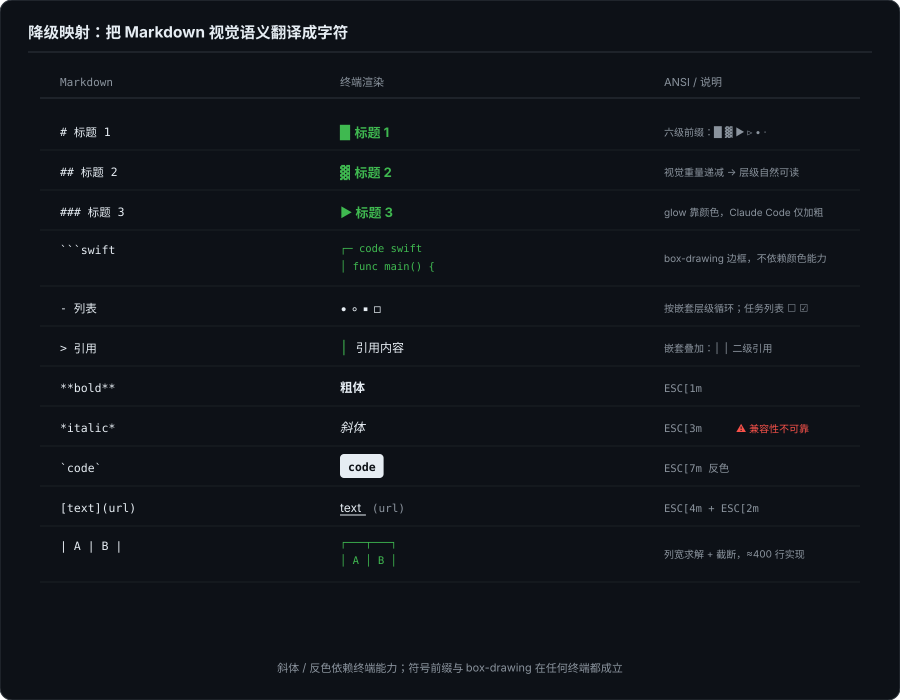
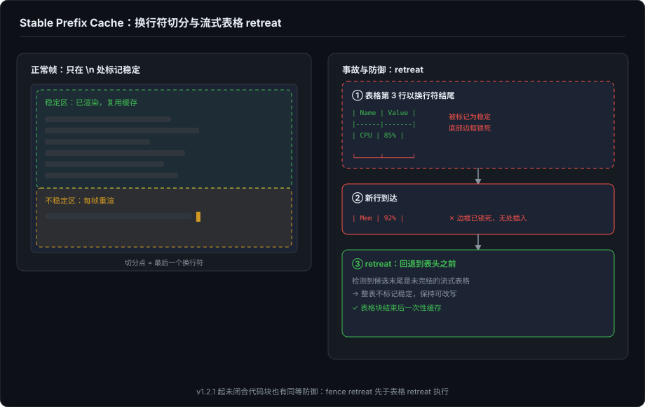

# Agent 时代的开发者界面（三）：Markdown 在 TUI 上的流式地狱

> 系列第三篇。上一篇拆解了 TUI 渲染引擎的底层——ANSI 序列、字符网格、物理行计算、增量 diff。这一篇聚焦 Agent 场景里最让人头疼的问题之一：在只有字符的终端里，把流式输出的 Markdown 渲染成可读的样子。

---

## 一、Markdown 天生反感流式

Markdown 是 John Gruber 在 2004 年设计的，设计目标很明确：一种"写起来像纯文本、看起来像格式化文档"的轻量标记语言。它的解析模型是"写完 → 一次性解析 → 渲染"。

这里有一个结构性的矛盾：

```
Markdown 的设计前提:          Agent 的实际输出:
─────                         ─────
完整文档                      token-by-token 流式到达
闭合的块级结构                随时可能出现半个代码块
确定的语法树                  下一个 token 可能反转已解析的结构
```

举一个简单的例子。Agent 输出到一半时：

```
我们今天讨论三个要点：
1. TUI 的字符网格
2. Markdown
```

此时解析器会把这两行识别为有序列表的头部。但下一个 token 可能是：

```
不是唯一的选择
```

这行没有数字前缀——按 CommonMark 的 lazy continuation 规则，它会续接到最后一个打开的块上，也就是第二项的多行续文，不是新列表项也不是普通段落。但解析器在流式到达的那一刻根本不知道。

更致命的情况：

```
```swift        ← 代码块开始
let x = 1
```             ← 闭合了。但模型下一秒又吐出一行代码——
let y = 2        ← 它是新段落，还是代码？
```

严格说这不是 Markdown 的词法歧义——CommonMark 的规则是确定的。歧义来自流式本身：解析器每一帧都要对"目前已到达的内容"给出确定结论，而这个结论随时可能被后续 token 推翻。更典型的例子是更长的开 fence：四个反引号打开的块里，三连反引号是合法内容，一行 ``` 到底是内容还是闭合，要看到更多上下文才能判定——而"更多上下文"还没生成出来。

---

## 二、降级映射：把视觉语义翻译成字符

第 2 篇讲过，TUI 只有字符。Heading 用不了 24pt 字号，ForgeLoopTUI 的选择是符号前缀。这就是"降级映射"——把 Markdown 的视觉语义翻译成终端字符网格能表达的形式。



### 2.1 Heading

```swift
switch markerCount {
case 1: prefix = "█ "    // <h1>
case 2: prefix = "▓ "    // <h2>
case 3: prefix = "▶ "    // <h3>
case 4: prefix = "▹ "    // <h4>
case 5: prefix = "• "    // <h5>
default: prefix = "· "   // <h6>
}
```

六种前缀符号对应六级标题。"█"比"·"视觉重量大，读者自然把它解读为更高级别的标题。另一条路线是颜色和样式：glow 把所有标题统一加粗染蓝，层级仍靠 `#` 前缀数量区分（仅 H1 额外去掉 `#` 并加整行背景高亮）；Claude Code 更省——标题仅加粗（H1 加下划线），无颜色、无层级区分。ForgeLoopTUI 走的是纯符号路线。

### 2.2 代码块

```
┌─ code swift
│ func main() {
│     print("hello")
│ }
└─ end code
```

Box-drawing 字符画出边框。语言标签放在起始行。算不上漂亮，但边界在任何终端里都清晰可见。另一条路线是背景色（glow 给代码块整体加背景色，delta 在 diff 场景用整行背景色），视觉区分度更好，代价是依赖终端的背景色渲染——box-drawing 不依赖任何颜色能力。

### 2.3 有序/无序列表

```
• 第一项
◦ 嵌套项
▪ 更深嵌套
▫ 再深一层
```

四个不同符号按嵌套层级循环。任务列表用 `☐` 和 `☑`。

### 2.4 Blockquote

用 `│ ` 前缀加左侧竖线。嵌套引用叠加前缀：`│ │ 二级嵌套`。

### 2.5 内联格式

| Markdown | TUI 渲染 | ANSI 序列 |
|---|---|---|
| `` `code` `` | 反色显示 | `ESC[7m` |
| `**bold**` | 粗体 | `ESC[1m` |
| `*italic*` | 斜体 | `ESC[3m` |
| `~~strike~~` | 删除线 | `ESC[9m` |
| `[text](url)` | 下划线文本 + 灰色 URL | `ESC[4m` / `ESC[2m` |

斜体 `ESC[3m` 的兼容性不可靠——有的终端渲染成反色，有的直接忽略。

这里有一个值得注意的细节：`applyInlineFormatting` 不依赖任何 Markdown 解析库。它是手写的逐字符扫描，自己找 `**`、`*`、`` ` ``、`~~`、`[text](url)` 的边界。不引入 cmark 或任何第三方依赖。原因很简单：终端里不需要 HTML 语义树，只需要知道"这两个星号之间加粗体 ANSI 序列"。

### 2.6 表格——最复杂的子系统

表格是整个 Markdown 引擎里代码量最大的部分，连实现带配置接近 400 行。终端里的表格有三种失败模式：

**模式一：列太宽，终端放不下。** 解决策略由 `TableOverflowBehavior` 控制：

```
compactThenTruncateThenDegrade（默认）：
  1. 先挤压每列宽度（不低于 minColumnWidth = 6）
  2. 还不够 → 截断单元格内容（加截断符 "…"）
  3. 仍然不够 → 退化：放弃 box-drawing，回退到原始 Markdown 文本
```

退化是最后手段——box-drawing 表格变成原始 `| col1 | col2 |` 格式，可读性下降但至少不溢出。

**模式二：列被截得太狠，内容看不清。** `autoReadable` 策略在截断比例超过阈值时自动退化：

```swift
if truncatedCellRatio > 0.4  // 超过 40% 的单元格被截断
   || trimmedWidthRatio > 0.3  // 或总宽度被砍掉 30% 以上
{ return nil }  // 退化
```

每列被压到只剩 6 字符宽的表格比原始 Markdown 更难读，不如直接退化。

**模式三：表格还在流式输入中。** 这是最棘手的。Agent 输出到一半：

```
| Name | Value |
|------|-------|
| CPU  | 85%   |
| Mem  | ← 这里还在写
```

`TableStreamingBehavior` 控制行为：`.monotonic` 立即渲染所有已完成的行，`.strict` 等到表格块完全结束才渲染。但默认的 `.monotonic` 还有一个隐藏的防御逻辑——`retreatToAvoidSplittingTrailingStreamingTable`，这是第三节要讲的核心机制。

### 2.7 先决条件：宽度得算对

以上三种失败模式都建立在一个前提上：宽度算得对。而终端里的宽度不等于字符数——CJK 字符占两列，多数 emoji 占两列，ANSI 序列占零列。ForgeLoopTUI 的 `DisplayWidth.visibleWidth` 先剥掉 CSI 序列，再按 Unicode 区间判定宽字符计 2、其余计 1，表格的列宽求解和截断全部走这个函数。

它的局限也值得知道：判定是按单个 Unicode scalar 做的，不处理组合序列——ZWJ 序列（如 👨‍💻）和 VS16 变体选择符会被算错宽度，表格边框随之错位。这是所有按 scalar 判定宽度的实现的共同盲区，不独 ForgeLoopTUI；中文 Agent 场景里 CJK 是家常便饭，宽度问题比纯英文场景暴露得更频繁。

---

## 三、Stable Prefix Cache：在流式里偷懒

第 2 篇讲了 TUI 的增量 diff 机制——记住上一帧，只重绘变化部分。Markdown 渲染引擎也用了类似的思路，但不是 diff 行，而是缓存"稳定前缀"。

### 3.1 为什么只能在换行符处切分

```swift
public func render(text: String, isFinal: Bool) -> [String] {
    // 1. 如果新文本不以缓存的 stableSource 开头 → 缓存失效
    if !stableSource.isEmpty, !text.hasPrefix(stableSource) { reset() }

    // 2. 切掉已缓存的前缀，只处理新增部分
    let suffix = String(text.dropFirst(stableSource.count))
    let advance = stableAdvance(in: suffix, isFinal: isFinal)
    if advance > 0 {
        let stableDelta = String(suffix.prefix(advance))
        stableSource += stableDelta
        stableRendered += renderFully(text: stableDelta, isFinal: true)
    }

    // 3. 不稳定后缀（最后一行）每次重新渲染
    let unstable = String(text.dropFirst(stableSource.count))
    let unstableRendered = renderFully(text: unstable, isFinal: isFinal)
    return stableRendered + unstableRendered
}
```

`stableAdvance` 只在换行符处将文本标记为"稳定"。因为 Markdown 的块级结构——段落、标题、列表项、代码块边界——都以换行符分隔。一行没写完之前，你无法确定它是什么块级元素。

```
稳定区（已渲染，缓存）         不稳定区（每次重渲）
─────                         ─────
## 标题\n                      代码块开始\n
列表项1\n                      代码内容\n
列表项2\n                      正在输出的这行...
```

### 3.2 流式表格的稳定性陷阱

`stableAdvance` 有一个关键的防御机制。如果文本以换行符结尾，它会把到那个换行符为止的部分标记为稳定——但如果这个换行符恰好在一张未完成的流式表格中间呢？

```
| Name | Value |
|------|-------|
| CPU  | 85%   |          ← 这行以换行结尾，会被标记为稳定
| Mem  | 正在输出...        ← 没有换行，不稳定
```

如果第三行被标记为稳定（因为它以换行符结尾），渲染后的 box-drawing 表格会包含底部边框 `└─┴─┘`。下一帧第四行到了，需要加一行——但第三行已经"稳定"了，底部边框被锁死在缓存里。



`retreatToAvoidSplittingTrailingStreamingTable` 就是这个防御（节选自源码，部分局部变量定义省略）：

```swift
private func retreatToAvoidSplittingTrailingStreamingTable(
    lines: [String], remainder: String
) -> Int? {
    // 如果剩余部分以 "|" 开头 → 可能是不完整表格的续行
    guard trimmedRemainder.hasPrefix("|") else { return nil }

    // 从尾部向上扫描，找到完整的表格头+分隔行
    // 然后退回到表格开始之前
    for start in stride(from: end - 2, through: 0, by: -1) {
        guard let headerCells = parseTableCells(lines[start]),
              let divider = parseDividerCells(lines[start + 1]),
              divider.count == headerCells.count else { continue }

        // 验证所有数据行列数匹配
        var allRowsMatch = true
        for rowIndex in (start + 2)...end {
            guard let rowCells = parseTableCells(lines[rowIndex]),
                  rowCells.count == headerCells.count else {
                allRowsMatch = false; break
            }
        }
        if allRowsMatch {
            // 找到完整表格 → 回退到表格头之前，整个表格保持不稳定
            return retreat
        }
    }
    return nil
}
```

逻辑：如果下一个 token 以 `|` 开头，检测候选文本的末尾是否构成一张完整的表格（表头 + 分隔行 + 至少一行数据）。如果是，整个表格都不标记为稳定——等表格块彻底结束后才一次性缓存。

### 3.3 盲区：代码块没有同等的防御

表格有 retreat 机制，代码块没有。一个未闭合的代码块可能被切进稳定区，而 `renderFully` 每次调用都从 `inCodeFence = false` 重新开始，fence 状态不会被记录。后果是连锁的：

```
第一帧: "```swift\nlet x = 1\n"
  → 全部进入稳定区，渲染为:
    ┌─ code swift
    │ let x = 1

第二帧: "let y = 2\n"
  → 落在不稳定区，但 inCodeFence 状态已丢失
  → 被当成普通段落渲染，没有 │ 前缀

第三帧: "```\n"（真正的闭合 fence）
  → 不稳定区把它误判为开 fence
  → 渲染成一个新的 "┌─ code"
```

这是 v1.2.0 及之前版本的一个真实盲区。修复思路和表格一致——retreat 时检测候选末尾是否处于未闭合的代码块内，是则回退到 fence 开始之前。该修复（`retreatToAvoidSplittingUnclosedCodeFence`）已在 v1.2.1 合入：fence retreat 先于表格 retreat 执行（未闭合 fence 之内的表格状行不是真表格），fence 判定复用 `isCodeFenceDelimiter`，与 `renderFully` 的状态切换语义保持一致。在 v1.2.0 上，规避方案见第四节的路线二。

### 3.4 65K 字符上限

```swift
private let maxStableSourceChars = 65_536

if stableSource.count > maxStableSourceChars { reset() }
```

稳定缓存不能无限增长。一次长对话的流式输出可能超过几万个字符。65K 是折中值：超出后 reset，下一帧把全部内容重新渲染一次，重新开始缓存。

---

## 四、流式期间到底要不要渲染 Markdown

第 2 篇和第 7 篇（GUI 部分）都会涉及这个问题，值得把账算清楚。

Agent 流式输出时，每秒几十个 token 到达。即使有 Stable Prefix Cache，每次渲染仍然需要：

1. 跑 `stableAdvance`——扫描候选文本，检测是否是流式表格（可能 O(n) 回退扫描）
2. 渲染不稳定后缀——即使只有一行，也要跑完整的管线：代码块检测 → 表格检测 → structured line 检测 → inline formatting

面对这笔成本，工程上有两条路线：

**路线一：全程渲染 Markdown，用缓存摊薄成本。** ForgeLoopTUI 的实际选择——`TranscriptRenderer` 持有一个 `StreamingMarkdownEngine`，流式和结束走同一个引擎，靠 Stable Prefix Cache 保证每帧只处理增量。代价是第三节的防御逻辑（以及 v1.2.0 之前存在的代码块盲区）。

**路线二：流式期间纯文本，结束后一次性切换。** Markdown 在流式期间提供的是"好看"而不是"必要"——代码、列表以纯文本展示，可读性损失很小。等流式结束，所有块级结构闭合，解析器不需要做任何防御性猜测，一次完整渲染搞定。这条路同时绕开了代码块盲区。

ForgeLoopTUI 为路线二保留了 `PlainTextMarkdownEngine`：

```swift
public func render(text: String, isFinal: Bool) -> [String] {
    guard !text.isEmpty else { return [] }
    return text.split(separator: "\n", omittingEmptySubsequences: false).map(String.init)
}
```

它就是 `split("\n")`——零解析开销，零防御逻辑，零缓存状态。接入方完全可以在流式期间注入它，`isFinal` 时再切回 `StreamingMarkdownEngine`。

两条路线没有对错，是纯工程权衡。中间态也存在——做一个"轻量 Markdown 引擎"，只做 inline formatting 和代码块检测，跳过表格和 blockquote，在流式期间保留最基本的可读性。

---

## 五、代码块检测的边界

ForgeLoopTUI 的代码块检测不依赖完整 Markdown 解析——先去掉行首尾空白，再检查是否以三个或以上的 `` ` `` 或 `~` 开头：

```swift
private func isCodeFenceDelimiter(_ line: String) -> Bool {
    let trimmed = line.trimmingCharacters(in: .whitespaces)
    guard let first = trimmed.first, first == "`" || first == "~" else { return false }
    let run = trimmed.prefix(while: { $0 == first })
    return run.count >= 3
}
```

这和 CommonMark 规范有两个微妙区别。其一，CommonMark 要求闭合 fence 的长度不小于开 fence——三个反引号打开，三个或更多才能关闭；四个反引号打开的块里，三连反引号只是内容。ForgeLoopTUI 不检查长度匹配，只要看到三连反引号就切换 in-code-fence 状态。其二，先 trim 意味着 CommonMark"fence 最多允许 3 格缩进"的规则被丢弃——缩进 4 格以上的行若以三连反引号开头，会被误判为 fence。

这是一个有意的简化。在 Agent 流式场景下，代码块的内容来自 LLM 输出，不太会出现"四个反引号打开、三个反引号在内容里"的边界情况。而且实现正确的分隔符匹配需要回溯——代码块可能在几十行之前打开——与 Stable Prefix Cache 的假设冲突。

---

## 六、从这里出发

TUI 上 Markdown 流式渲染的核心矛盾可以总结为三句话：

1. **Markdown 是"写完再解析"的语言，Agent 是"边想边输出"的过程。** 两者的设计哲学根本冲突。
2. **终端只有字符，Markdown 的视觉语义必须降级映射。** 降级不等于功能缺失——true color 语法高亮和 OSC 8 可点击超链接在终端里都可行，成本是手写 tokenizer 而非调库。
3. **流式渲染 Markdown 的成本可以靠 Stable Prefix Cache 摊薄，但防御逻辑和盲区是必要之恶。** 纯文本 fallback（流式期间跳过 Markdown、结束再切换）是更省的选择。

下一篇讲 Agent TUI 最核心的难题——流式输出、工具调用、thinking 展开后，这些问题如何从"难"变成"几近失控"。第 1 篇提过一个判断：Agent 的真实输出不是 1D 的。下一篇会把这句话完整展开。

---

*本文所有技术细节基于 [ForgeLoopTUI](https://github.com/BiBoyang/ForgeLoopTUI) v1.2.0 的实际源码。§3.3 的代码块盲区已在 v1.2.1 修复（`retreatToAvoidSplittingUnclosedCodeFence`），正文保留该盲区的完整分析作为案例。*
