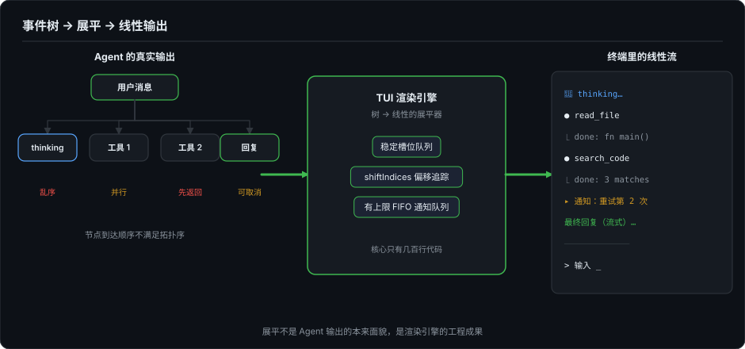
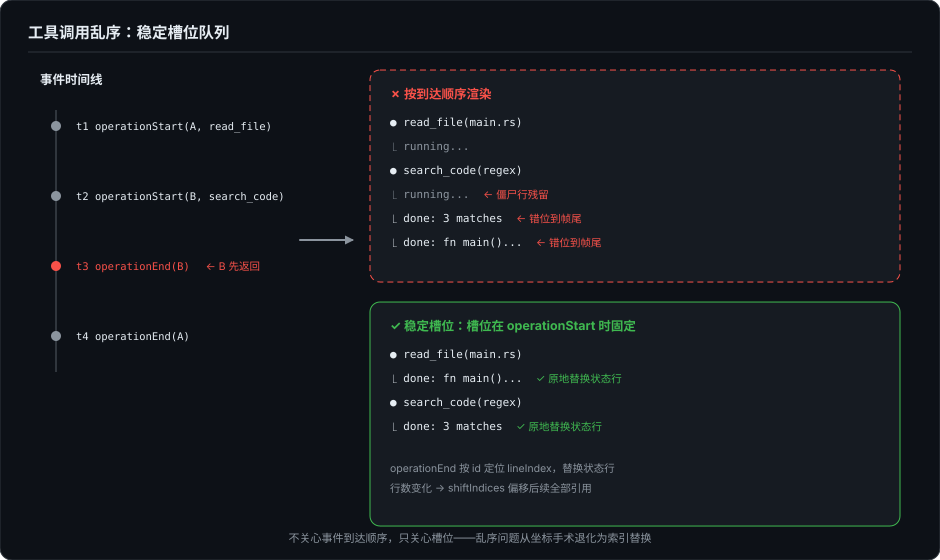

# Agent TUI——当事件树撞上线性终端

> 系列第四篇，TUI 三部曲的最后一篇。第 2 篇建立了渲染引擎的基础，第 3 篇拆解了 Markdown 在终端里的流式难题。这一篇聚焦 Agent 场景独有的一组问题：流式输出、工具调用、thinking 展开、用户输入四件事同时在终端里发生，渲染系统面对的问题从"画得好看"变成了"能不能不崩"。

---

## 一、回到那个直觉："1D → 1D"

第 1 篇提过一个观点：有人说 LLM 输出是 1D 的线性 token 流，CLI 也是 1D 的，所以天然匹配。

现在可以完整回应这句话了。

对于最简单的"用户问 → AI 答"，确实如此。但 Agent 的真实输出结构是这样的：

```
用户消息
  ├── thinking（模型推理过程，可能很长）
  ├── 工具调用 1（开始 → 运行中 → 完成/失败）
  │     └── 工具结果回传
  ├── 工具调用 2（可能与工具 1 并行，且可能比工具 1 先返回）
  ├── thinking（基于工具结果继续推理）
  └── 最终回复（流式输出）
```

这不是一条线，是一棵树。而且节点到达顺序不是拓扑序。工具调用 2 可能比工具调用 1 先返回，thinking 块可能在流式输出的中途插入，用户随时按取消键。

CLI 看起来"适配"，靠的是 **TUI 渲染引擎在背后做了一套复杂的展平机制：把一棵乱序到达的树强行投影成线性输出。** Agent 的输出本身并不是 1D 的。这套机制就是本文要拆解的东西。



---

## 二、CoreRenderEvent：去掉会话角色语义的事件系统

ForgeLoopTUI 设计了一套不绑定业务模型的事件词汇：

```swift
public enum CoreRenderEvent {
    case insert(lines: [String])                              // 静态文本
    case blockStart(id: String)                               // 开始流式块
    case blockUpdate(id: String, lines: [String])             // 更新流式块
    case blockEnd(id: String, lines: [String], footer: String?) // 结束流式块
    case blockCancel(id: String)                              // 用户取消
    case thinking(content: String, isFinal: Bool)             // 推理过程
    case operationStart(id: String, header: String, status: String)  // 工具开始
    case operationEnd(id: String, isError: Bool, result: String?)    // 工具结束
    case notification(text: String)                           // 通知
}
```

关键设计决策：**不区分 user/assistant/tool 的会话角色语义，但保留执行结构语义。** thinking、operationStart/End 这些事件类型本身就是 Agent 的执行语义，它们不回答"这句话是谁说的"，只标记"执行进行到哪一步"。chat 语义由上层 Adapter 注入，Core 层只知道"有一段内容要插入""有一个块在流式更新""有一个操作开始了"。这让渲染系统可以复用到任何场景：AI 聊天、构建日志、测试报告，都不用改渲染逻辑。

代价是渲染器不知道事件之间的业务关系。它不知道 `operationEnd("tool_1")` 对应哪个 `operationStart`，不知道 thinking 结束后会不会有流式输出。这些关系由 `TranscriptRenderer` 内部维护，通过一套索引追踪系统。

---

## 三、工具调用的乱序渲染

这是 Agent TUI 中最棘手的渲染问题。

### 3.1 问题

Agent 发起两个工具调用：

```
时间线:
  t1: operationStart(id: "A", header: "● read_file(main.rs)")
  t2: operationStart(id: "B", header: "● search_code(regex)")
  t3: operationEnd(id: "B", result: "3 matches")   ← B 先返回
  t4: operationEnd(id: "A", result: "fn main() { ... }")  ← A 后返回
```

如果按到达顺序渲染，输出是：

```
● read_file(main.rs)
⎿ running...
● search_code(regex)
⎿ running...
⎿ done: 3 matches    ← 应该替换 B 的 running 行，却被追加到了帧尾
⎿ done: fn main()... ← A 的结果同样追加在最后
```

B 的 `done` 行本应替换掉 B 自己的 `⎿ running...`，但按到达顺序渲染只会把结果追加到帧尾——B 的 running 行残留成僵尸状态，结果行却落到了离自己 header 两行开外的位置。



### 3.2 稳定槽位队列

ForgeLoopTUI 的解法是 `pendingTools` 数组：按 operationStart 到达顺序维护槽位。

```swift
case .operationStart(let id, let header, let status):
    append(header)       // ● read_file(main.rs)
    append(status)       // ⎿ running...
    pendingTools.append((id: id, lineIndex: lines.count - 1))
    // lineIndex 指向 status 行的位置
```

`operationStart` 时记录了每个工具的状态行在 Transcript 中的绝对行号。当 `operationEnd` 到来时：

```swift
case .operationEnd(let id, let isError, let result):
    guard let slotIndex = pendingTools.firstIndex(where: { $0.id == id }) else { break }
    let lineIndex = pendingTools[slotIndex].lineIndex
    pendingTools.remove(at: slotIndex)
    let resultLines = formatToolResult(result)
    // 用结果行替换原来的 "⎿ running..." 行
    lines.replace(range: lineIndex..<(lineIndex + 1), with: resultLines)
```

关键：**不关心事件到达顺序，只关心槽位。** 每个工具在第一次 `operationStart` 时就分配了一个固定位置（`lineIndex`）。后续的 `operationEnd` 直接定位到那个位置替换状态行，不管中间插入了多少其他工具。（顺带说明：`lines` 不是裸数组，是带边界钳制封装的 `TranscriptBuffer`，`replace(range:with:)` 内部钳制后走标准 `replaceSubrange`。）

但有一个连锁问题：如果 B 先结束，B 的结果文本比 `⎿ running...` 长（3 行 vs 1 行），在 B 的位置插入 3 行会把后续所有行的索引推偏 2 行。这时需要 `shiftIndices` 把所有受影响的引用全部偏移：

```swift
private func shiftIndices(after threshold: Int, by delta: Int) {
    for index in pendingTools.indices {
        if pendingTools[index].lineIndex > threshold {
            pendingTools[index].lineIndex += delta
        }
    }
    // 同理偏移 notificationLines、streamingRange、completedRange、thinkingRange
}
```

不做这个偏移，下一个 `operationEnd` 的 `lineIndex` 就指向了错误的行，结果写到别人的位置。

> 补记（2026.08）：本节描述的是全屏自管派的乱序处理：在扁平行数组上做坐标手术。inline viewport 派把乱序配对提前到了数据层：工具调用按稳定 id 在内存模型里配对、完成后才"发射"进终端 scrollback，乱序问题从坐标手术退化为字典查找。详见第 11 篇。

这里要和第 2 篇的一个结论对齐：commit/live 分区模型里，committed 区"只追加，不改写"。那上面这些 `lines.replace` 原地替换（以及后面 thinking 的原地更新、通知的删除）不矛盾吗？不矛盾，关键在时序：这些操作针对的行都还处于 live 阶段，尚未被 Live Budget Planner 沉降到 committed 区。一行内容在 commit 之前是可变的，可以被替换、删除、连带偏移；一旦沉降完成，它进入只追加区域，后续任何事件都不会再改写它。"不可变"是 commit 之后的性质，不是写入即生效的性质。

---

## 四、thinking 块的渲染

thinking（推理过程）和普通流式输出的区别在于：它是模型在"想"，不是对用户的回复。视觉上需要区分。

```swift
case .thinking(let content, let isFinal):
    let thinkingLines = content.isEmpty
        ? []
        : content.split(separator: "\n").map { "💭 \($0)" }
```

每行加 `💭 ` 前缀。thinking 块维护自己的 `thinkingRange`，每次更新是原地替换：

```swift
if let range = thinkingRange {
    let delta = thinkingLines.count - range.count
    lines.replace(range: range, with: thinkingLines)
    if delta != 0 {
        shiftIndices(after: range.upperBound - 1, by: delta)
    }
    thinkingRange = range.lowerBound..<(range.lowerBound + thinkingLines.count)
} else {
    let start = lines.count
    lines.append(contentsOf: thinkingLines)
    thinkingRange = start..<(start + thinkingLines.count)
}
```

首次 `thinking` 事件创建新范围；后续事件在同一个范围原地替换，因为 thinking 内容是累积更新的，每次收到的都是完整文本。注意替换会改变行数：新旧行数差 `delta` 不为零时，必须像「三」「五」那样偏移后续索引，否则排在 thinking 之后的工具槽位和流式范围会全部错位。

`isFinal` 为 true 时清除 `thinkingRange`，后续的流式回复或工具调用正常追加在后面。

---

## 五、通知的 FIFO 队列（有上限）

Agent 在运行过程中会产生系统通知："工具调用超时""网络重试第 3 次""上下文窗口使用率 85%"。这些通知需要展示但不能淹没主要对话内容。

```swift
case .notification(let text):
    appendNotification("▸ \(text)")
```

`appendNotification` 维护一个有上限的 FIFO 索引队列：

```swift
private var notificationLines: [Int] = []  // 存行号，不存内容

private func appendNotification(_ line: String) {
    lines.append(line)
    notificationLines.append(lines.count - 1)

    while notificationLines.count > options.maxNotificationLines {  // 默认 3
        let oldIndex = notificationLines.removeFirst()
        lines.replace(range: oldIndex..<(oldIndex + 1), with: [])
        shiftIndices(after: oldIndex - 1, by: -1)
    }
}
```

超过上限（默认 3 条）时，最旧的通知行从 Transcript 中删除，后续所有索引偏移 -1。这里没有折叠机制，直接删除：通知是瞬态的，过时即无用。

---

## 六、blockCancel：用户按下取消键

Agent 正在流式输出一段很长的代码，用户按了 Esc 取消。这时不能只是停止发送新内容——已经显示在屏幕上的流式内容需要被清除，换成 `[cancelled]` 标记。

```swift
case .blockCancel:
    replaceStreaming(with: ["[cancelled]"])
    streamingRange = nil
    completedRange = nil
    markdownEngine.reset()
    append("")
```

`replaceStreaming` 是统一的"替换当前流式区域"方法：

```swift
private func replaceStreaming(with newLines: [String]) {
    let range = streamingRange ?? (lines.count..<lines.count)
    lines.replace(range: range, with: newLines)
    streamingRange = range.lowerBound..<(range.lowerBound + newLines.count)
}
```

如果 `streamingRange` 为 nil（没有活跃的流式块），退化为 append。取消后清空 `streamingRange` 和 `completedRange`，Markdown 引擎重置，Agent 可以立即开始下一个请求。

---

## 七、工具结果的截断

工具返回值可能很长：`read_file` 可能返回几百行代码，`search_code` 可能返回几十条匹配。在终端里全量展示会淹没对话流。

```swift
private func formatToolResult(_ text: String?) -> [String] {
    guard let text, !text.isEmpty else { return [] }

    let allLines = text.split(separator: "\n").map(String.init)
    var previewLines = Array(allLines.prefix(options.maxSummaryLines))  // 默认 3 行

    if allLines.count > options.maxSummaryLines {
        previewLines.append("...")
    }

    return previewLines.map { line in
        if line.count > options.maxSummaryChars {  // 默认 120 字符
            return String(line.prefix(options.maxSummaryChars)) + "..."
        }
        return line
    }
}
```

每行限制 120 字符 + 总共最多 3 行。在当前 commit/live 分区模型下，折叠不是一个简单的 show/hide 开关：一旦要让历史区域可折叠，就得重新定义已提交内容的可见性和重绘策略。当前选择了最直接的方案：截断，用 `...` 标记。

---

## 八、多行输入框与帧合成

第 2 篇详细讲了 commit/live 分区模型和 cursorPlacement 机制。Agent 场景下有一个特殊问题：**多行输入**。

普通聊天 TUI 只需要单行输入框。Agent 场景中，用户经常需要粘贴多行代码、编辑长 prompt、在输入框里直接换行。

ForgeLoopTUI 的 `MultiLineInputState` 支持多行文本输入，光标锚定在输入框的当前编辑位置。这里有一个微妙的竞态：Agent 正在流式输出，用户同时在多行输入框里打字。两件事都在触发渲染。上游把不同来源的状态合成帧之后，第 2 篇讲的 RenderLoop 帧合并负责把这帧稳定刷出去，避免终端在"追加流式内容"和"更新输入框光标"之间出现 ANSI 序列交错。

---

## 九、Agent 的不确定性如何放大一切

前两篇讲的 TUI 问题（物理行计算、增量 diff 的脆弱性、Markdown 的流式不确定性）在普通聊天场景下已经是难题。Agent 场景让每个问题都严重了一个量级。

**内容长度不可预测。** 普通聊天的回复可能有几十到几百个 token。Agent 的工具调用结果可能是一整个文件的数千行代码。第 2 篇讲的 Live Budget Planner 在 Agent 场景下从"优化"变成了"必需的防御"：没有 budget 限制，一次工具返回就能把帧推到几百物理行，全量重绘 + 终端滚动缓冲区溢出。

**事件类型不可预测。** 你无法预知下一个事件是 thinking、tool call、streaming text、还是 error。渲染器必须正确响应所有事件组合，包括之前没见过的组合。比如某些模型的 thinking 块可以在流式回复的中间穿插出现，这不是规范行为，但实际发生了。

**中断时机不可预测。** 用户可能在流式输出的任何时刻取消。取消时 Markdown 引擎可能处于任何状态——代码块中间、表格中间、列表中间。`blockCancel` 必须无条件 reset 引擎、清空 streaming 状态、写取消标记，不能假定 Markdown 结构完整。

这三个"不可预测"叠加在一起，意味着 Agent TUI 的渲染系统不能对事件序列做任何结构性假设。每个事件到达时，只根据当前 Transcript 的索引状态做局部替换，不依赖"前一个事件是什么"，不假设"下一个事件什么时候到"。

这不是"无状态"。恰恰相反，渲染器的全部正确性都系于一份共享的可变状态：`lines`（Transcript 的内容数组）和几个 Range（streaming/thinking/completed 的位置追踪）。准确的说法是**事件处理无会话假设**。这也是为什么 `applyCore` 是一个巨大的 switch 语句：每个 case 独立处理一个事件类型，不依赖前序事件的种类，只依赖那份共享索引状态。

---

> 补记（2026.10）：本篇的槽位队列是扁平行数组上的坐标手术；第三节末尾的补记提过，inline 派把乱序配对提前到数据层，坐标手术退化为字典查找。最近读 Codex 的 TUI 源码（`codex-rs/tui/src/chatwidget/streaming.rs` 一带），见到了这个论断的一种完整实现形态，补在这里作为证据。
>
> Codex 的 transcript 不是行数组，是**定稿 cell 序列 + 唯一一个 active 槽位**。cell 是类型化的：`AgentMessageCell` 承载流式放行的行、`StreamingAgentTailCell` 是活动尾部、`ExecCell` 是工具调用、回答定稿后整段换成由原始源支撑的 `AgentMarkdownCell`（resize 时可从源重渲染）。流式期间尾部 cell 反复重建进 active 槽位，但内容没变就不触动版本号——`sync_active_stream_tail` 先比较、相等就直接返回，避免无效重绘；commit tick 放行的行则固化为新 cell，追加进定稿序列。
>
> 对照本篇，三个观察。其一，乱序与偏移问题在结构上消失：cell 有类型和身份，定位是查表而非坐标运算，`shiftIndices` 那样的连带偏移没有存在必要。其二，"原地可改写"的范围被压缩到一个槽位：本篇里流式块、thinking、工具槽位、通知都在同一份 `lines` 上做手术，正确性系于全局索引的同步偏移；Codex 把所有可变性收进唯一一个 active cell，定稿区连索引都不必维护。其三，权威来源的取舍：流式 delta 可能因传输饱和丢失，Codex 在 item 完成事件到达时用完成文本与流式累积源对账，注释写得很白——"item completion is authoritative"，传输丢 delta 不能让 transcript 截断。这个设计前提本篇没有对应物：ForgeLoopTUI 假定事件流本身可靠。

---

## 十、TUI 三部曲的终点

三篇文章覆盖了从底层渲染到上层 Agent 场景的完整技术栈：

```
第2篇: ANSI 序列 + 字符网格 + 增量 diff  → 渲染引擎层
第3篇: 降级映射 + Stable Prefix Cache + 流式检测 → Markdown 层
第4篇: 事件乱序 + 工具渲染 + 状态管理    → Agent 层
```

这三层之间有一个递进关系：每一层都建立在下一层之上，每一层的问题都因为底层的限制而更难解决。Agent 的树状事件在终端里变成线性输出——这个"树展平"的过程，就是 TUI 渲染引擎存在的全部意义。

但展平只是手段。真正的问题是：凭什么树状事件一定要被展平成线性？如果终端不是唯一的投影介质呢？

不过在去中场之前，还差最后一块。第 2 到第 4 篇讲的全是输出侧——怎么把内容画对、画快、画不崩；输入侧——键盘事件怎么进来、弹窗怎么不打架、终端能力怎么探测——还一页未写。接下来两篇（第 21、22 篇）补上这一半，然后才是系列的中场：**Event Sourcing，Agent UI 的底层模型**。中场会解释 CLI/TUI 的挣扎为什么不是终端的锅：真正有结构性矛盾的是"树状事件 → 线性输出"这个投影方式本身。一旦把 Agent 的执行抽象为事件流，CLI/TUI/GUI/IDE/Web/Mobile 各自应该站在哪里，就不再是形态之争了。

---

*本文所有技术细节基于 [ForgeLoopTUI](https://github.com/BiBoyang/ForgeLoopTUI) v1.2.0 的实际源码。其中 thinking 替换的 `shiftIndices` 调用为 v1.2.1 的索引偏移修复，v1.2.0 及更早版本中不存在。补记部分基于 [Codex](https://github.com/openai/codex) 本地源码 2026-10-04 的阅读：`codex-rs/tui/src/chatwidget/streaming.rs`、`history_cell.rs`，快照 main `6b9826e3`（2026-09-09）。*
