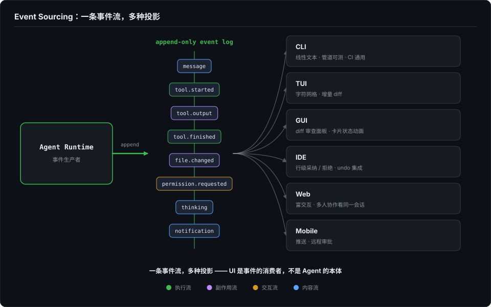
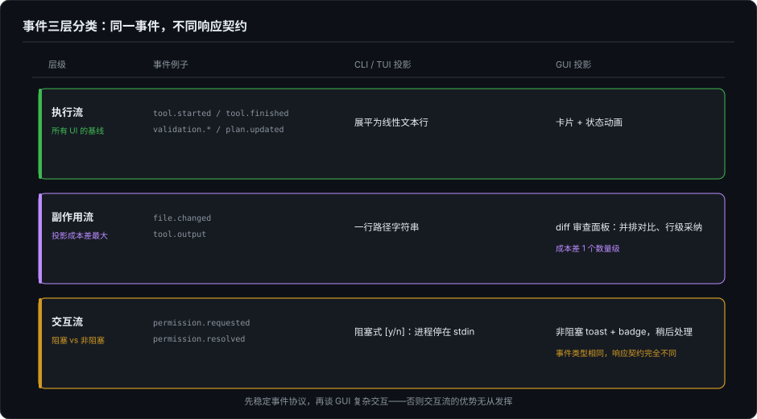

# Agent 时代的开发者界面（五）：中场——Event Sourcing，Agent UI 的底层模型

> 系列第五篇，正篇的中场。前三篇（02–04）完成了 TUI 侧的完整深潜——渲染引擎、Markdown 流式、事件树展平。这一篇不继续往前冲，而是往上走一层：这三篇暴露的所有挣扎，到底有没有一个统一的理论解释？如果有，它是什么？

---

## 一、中场为什么有必要

回顾前三篇的核心矛盾：

- **第 2 篇**：终端没有 undo，增量 diff 依赖 8 个帧状态字段，一次 resize 全盘失效。为什么 TUI 的渲染正确性一定要绑在这么脆弱的状态上？
- **第 3 篇**：Markdown 是"写完再解析"的语言，Agent 是"边想边输出"的过程。Stable Prefix Cache 有代码块盲区，表格需要 retreat 机制。为什么这些防御逻辑一个都不能少？
- **第 4 篇**：Agent 输出是一棵树，工具调用乱序到达，thinking 中途穿插。稳定槽位队列 + shiftIndices 偏移追踪 + 有上限的 FIFO 通知队列——为什么渲染器要维护这么多索引？

答案藏在一个更根本的问题里：

> **Agent 的执行过程本身不是任何 UI 的"内部状态"。它是一组独立于界面的、按时间顺序发生的事件。TUI 的困境——脆弱的状态记忆、防御逻辑、索引追踪——并不来自"终端难用"，而是来自"把事件树强行投影成线性输出"这个投影操作本身的结构性代价。**

换一个投影方式（比如 GUI），这些代价并不会消失——它们会以不同的形态重新出现。

---

## 二、Agent 的执行本质：一条事件流

如果你把 Agent 的一次完整执行记录下来，去掉所有 UI 相关的渲染细节，底层是什么？

```ts
type AgentEvent =
  | { type: "message"; role: "user" | "agent"; content: string }
  | { type: "tool.started"; toolCallId: string; tool: string; args: unknown }
  | { type: "tool.output"; toolCallId: string; chunk: string }
  | { type: "tool.finished"; toolCallId: string; status: "ok" | "error" }
  | { type: "file.changed"; path: string; diff: string }
  | { type: "permission.requested"; requestId: string; risk: RiskLevel }
  | { type: "permission.resolved"; requestId: string; approved: boolean }
  | { type: "task.plan.updated"; items: PlanItem[] }
  | { type: "validation.started"; command: string }
  | { type: "validation.finished"; result: ValidationResult }
  | { type: "thinking"; content: string; isFinal: boolean }
  | { type: "notification"; text: string }
```

这是一条 append-only 的事件流。Agent 的每一次推理、每一个工具调用、每一次权限请求、每一个文件变更，都只是这条流上的一个新事件。

关键洞察：**这条事件流独立于任何 UI 而存在。** 无论你用 CLI、TUI、GUI、IDE 还是 Web，底层都是同一件事——Agent 在做它的工作，产生事件。UI 的职责只是把这些事件投影到用户的感知空间。

这就是 Event Sourcing 在 Agent 领域的应用：**Agent Runtime 是事件生产者，各种 UI 是事件消费者。不同 UI 是同一事件流的不同投影（projection）。**



---

## 三、事件的三层分类

上面列的那些事件类型可以自然地分成三层：

| 层级 | 事件类型 | 特点 |
|------|---------|------|
| **执行流** | tool.started / tool.finished / validation.* / task.plan.updated | 时间线核心，所有 UI 都必须处理 |
| **副作用流** | file.changed / tool.output | 可批量、可合并、可延迟投影 |
| **交互流** | permission.requested / permission.resolved | 阻塞型——需要 UI 在限定时间内给出响应 |

这三层只覆盖"执行相关"的事件。`message`、`thinking`、`notification` 不在其中——它们是内容流（对话内容、推理过程、系统提示），同样以事件形式被各端投影，但不参与执行流/副作用流/交互流的划分。

这个分类的价值不在于学术上是否严谨，而在于它解释了为什么不同 UI 对"同一套事件"的消费策略如此不同。



**执行流**是所有 UI 都要处理的基线。CLI 把它展平成线性文本，GUI 把它映射成卡片和状态动画。

**副作用流**在不同 UI 上的处理成本差异最大。TUI 里 `file.changed` 就是一行路径字符串；GUI 里它需要一个 diff 审查面板——并排对比、行级高亮、部分采纳/拒绝。同一个事件，投影成本差一个数量级。

**交互流**是最有意思的。CLI 里 `permission.requested` 是阻塞式 `[y/n]`——输入循环停下来，进程阻塞在 stdin 上等用户输入。GUI 里同一个事件可以是非阻塞 toast + badge counter——用户喝咖啡回来再处理。**事件类型相同，但 UI 和事件之间的响应契约完全不同。** 这就是为什么"先稳定事件协议，再谈 GUI 复杂交互"不是一句空话——如果你在事件协议里没有区分"需要即时响应"和"可以延迟处理"，GUI 的优势就无从发挥。

---

## 四、两种极端说法的共同盲区

当前关于 Agent UI 的讨论里，有两种极端的说法。

**说法一：CLI/TUI 只是早期原型，GUI 必然到来。** 这个观点假设 CLI/TUI 和 GUI 是线性进化关系——蛋 → 幼虫 → 成虫。但用 event-sourcing 的框架看，这不是进化，是**共存**。SSH 到远程服务器跑 agent、在 tmux 里恢复一个跑了 3 小时的会话——这些场景里 CLI/TUI 不是"过渡方案"，是最优投影。GUI 在 diff 审查和多模态展示上有结构性优势，但这不是"替代"，是"分工"。

再往下推一层：这个说法还隐含一个成本假设——GUI 的投影成本会随着框架成熟趋近于零，所以"替代"只是时间问题。但 Agent GUI 的成本大头不在"画界面"，而在两个媒介的基线差异带来的子系统数量：diff 审查面板、权限弹窗、多模态附件，每一个都是独立子系统（第 6 篇会逐一拆解）。这个成本由 Agent 场景的需求决定，不随框架成熟收敛。

**说法二：GUI Agent 方向可能从根本上就是错的，Agent 就应该走 CLI 原生路线。** 这是港大 CLI-Anything 项目（2026.06）的立场。这个说法正确的一面是：为 Agent 设计结构化接口、输出 JSON 而非像素，确实比让 Agent 模仿人类操作 GUI 更可靠。但它错误的一面是：把"Agent 的核心接口应该是结构化的"和"用户界面应该全是 CLI"混为一谈了。event-sourcing 框架下，Agent 核心走结构化协议，用户界面走多端投影——这两件事不互斥。

再往下推一层：CLI-Anything 回答的是"Agent 如何可靠地操作软件"——这是接口层的问题，结构化协议确实是正确答案。但"人如何可靠地监督 Agent"是另一个问题——审查 diff、批准权限、审计历史，这些事情的载体是视觉界面，不是 JSON。把接口层的正确结论外推到界面层，就是这个说法越界的地方。

两种说法的共同盲区：**把 UI 当成了 Agent 的本体，而不是 Agent 的投影。**

---

## 五、从 ForgeLoopTUI 的 CoreRenderEvent 到 GUI 的 diffable snapshot

第 4 篇详细拆解了 ForgeLoopTUI 的 `CoreRenderEvent` 枚举和 `TranscriptRenderer` 的索引追踪系统。回头看这套设计：

```swift
case operationStart(id: "A", header: "...", status: "...")
// → pendingTools.append((id: "A", lineIndex: 42))

case operationEnd(id: "A", isError: false, result: "...")
// → 定位 lineIndex 42，替换状态行
// → shiftIndices 偏移后续所有引用
```

`pendingTools` 本质上是一个**在内存中维护的事件关联索引**。它做的事就是：把分散到达的 `operationStart` 和 `operationEnd` 重新配对，确保渲染结果在视觉上是连续的。

现在把这个思路映射到 GUI。在 `UICollectionView` 或者 `LazyColumn` 的世界里，你不需要手写 `shiftIndices`。你需要的是：

```
event stream → diffable data source → snapshot → cell 复用
```

`operationStart` → 插入一个新的 tool card cell（pending 状态）。`operationEnd` → 找到对应 cell，更新为 done/error 状态，触发局部重绘。框架帮你处理索引偏移——这是 `UICollectionViewDiffableDataSource` 的内置能力。

同一个数据结构，不同的投影成本。TUI 要手写 200 行索引追踪；GUI 框架内置。但反过来，GUI 要为"tool card 的 pending → running → done 状态动画"写一套完整的 cell 生命周期管理——TUI 只需要换一行文本。

这套 cell 生命周期管理拆开看并不轻松。状态迁移要走批量更新才能保证动画连贯，不能这个 cell 已经翻牌、那个 cell 还在旋转；内容高度随流式更新不断变化，每条事件都可能触发一次局部 relayout；cell 被回收复用时必须完整重置——进度动画、展开状态、错误样式，漏重置一个，就是"新消息显示上一条的旋转图标"这种经典 bug。TUI 侧的对应物是第 2 篇那 8 个帧状态字段，集中在一处、错一处全盘可见；GUI 侧的对应物是分散在每个 cell 里的状态机，单点错、局部错，但排查时要面对的是几十种 cell 类型各自的生命周期。

**投影成本不消失，只是换了形态。**

---

## 六、append-only event log 的长期价值

事件流不只是渲染层的技术选型。它在 Agent 产品的几个关键维度上都有结构性的价值：

**恢复。** 用户关闭客户端、Agent 继续执行。重连时，客户端从 event log 的最后一条已知事件开始消费，所有状态重建——不需要存储"当时的 UI 状态"，只需要回放事件。第 2 篇讲的帧状态记忆（8 个字段、resize 全盘失效）之所以脆弱，正是因为 TUI 存的是"渲染结果"而不是"事件源头"。

**审计。** 想知道 Agent 昨天在哪个文件上做了什么改动？查 event log——`file.changed` 事件带时间戳、路径和 diff。不需要翻聊天记录。

**协作。** 两个用户看同一个 Agent 会话——Web 端看到富文本 diff 面板，IDE 端看到行级采纳/拒绝按钮。同一个事件流，两个投影。不需要为每个端单独维护状态。

**回放。** 调试 Agent 行为时，回放 event log 比复现对话快得多。

已有开源实践在走这条路——Zacp 通过 ACP 协议把多个 CLI Agent 的事件流转发到 WebUI，是多端投影的一个雏形。细节第 9 篇展开。

---

## 七、这个框架不能解决什么

Event Sourcing 解释了结构，但有两个问题它不能替你回答。

**第一，事件的粒度应该多细？** 太粗——`file.changed` 包含整个文件的 diff，GUI 上的 diff 面板没法做行级高亮。太细——每个 token 都是一个事件，事件量爆炸，storage 和 replay 成本不可接受。粒度的答案不来自理论，来自具体 UI 的交互需求。

**第二，交互流的响应契约怎么设计？** `permission.requested` 是阻塞还是非阻塞？超时时间多少？哪些权限可以批量预批，哪些必须逐个确认？这些不是事件类型的字段问题，是产品设计问题。Event Sourcing 能告诉你"这里需要一个 permission 事件"，但不能告诉你"这个事件应该在 UI 上存活多久"。

---

## 八、中场小结

这篇文章试图证明一件事：

> **Agent UI 的问题，本质不是 CLI/TUI 和 GUI 的形态之争，而是如何为一条不确定、乱序、可中断的事件流设计多端投影。**

前三篇（02–04）的 TUI 深潜，展示的是"线性投影"这种特定投影方式的完整成本。接下来三篇（06–08）转向 GUI，展示同一套事件在像素世界里的投影成本——同样的结构性矛盾，不同的表现形式。

一条事件流，多种投影。

---

## 下一篇

第 6 篇：为什么做一个"不错"的 Agent GUI 这么难——从"两个媒介的基线不同"切入，拆解 FlowDown 的七个子系统，看同样的 Agent 事件在 GUI 世界需要多少额外的基础设施。

---

*本文的 event-sourcing 框架部分受 [ForgeLoopTUI](https://github.com/BiBoyang/ForgeLoopTUI) 的 CoreRenderEvent 设计和 [Zacp](https://github.com/helloxz/zacp) 的 ACP 多 Agent WebUI 架构启发。知乎讨论参考：[为什么现在大多 Code Agent 的主形态是 CLI/TUI？](https://www.zhihu.com/question/2026125412049101416)。港大 CLI-Anything 项目：[https://github.com/HKUDS/CLI-Anything](https://github.com/HKUDS/CLI-Anything)。*
