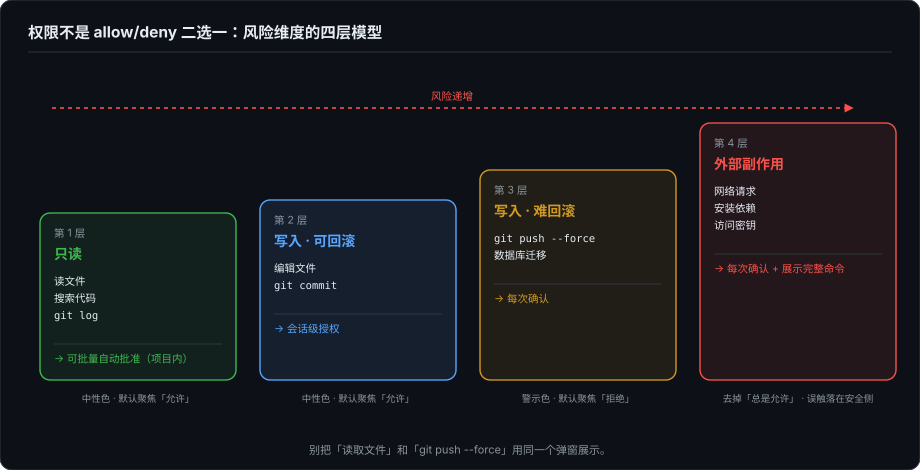
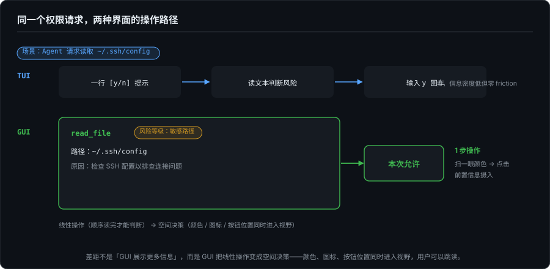
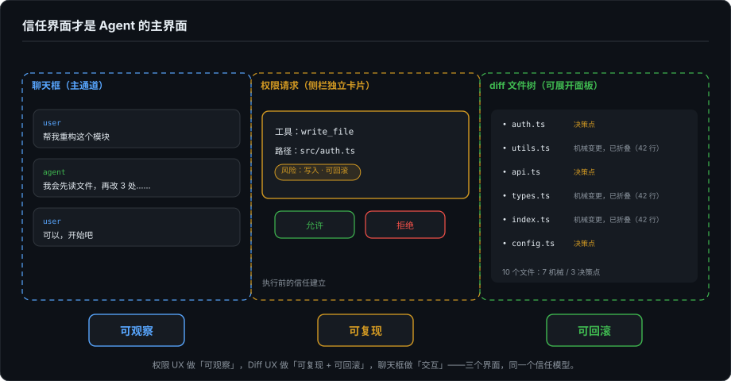

# Agent 时代的开发者界面（八）：权限 UX 与 Diff UX——Agent 真正的"主界面"

> 系列第八篇。前七篇的大部分篇幅花在了"怎么渲染"上——ANSI 序列、Markdown 降级、事件树展平、CoreText 管线。这一篇换一个问题：在 Agent 产出的所有内容里，什么最值得精心设计界面？答案不是聊天框。

---

## 一、聊天框是 Agent 的"命令行"，不是它的"主界面"

用 Agent 的日常：你在聊天框里说"修一下这个 bug"，然后你盯着的不是自己的话，是两样东西——

1. Agent 要做什么操作？读哪个文件？改哪一行？删什么东西？推不推送？（**权限**）
2. Agent 做完之后，到底改了什么？有没有顺手改了不该改的？（**diff**）

聊天是指令和解释。权限是"执行前"的信任建立。diff 是"执行后"的信任验证。

如果你把 Agent 的 UI 设计成一个大聊天框 + 小字状态栏，你其实是在用"命令行"的范式做 Agent——所有信息都挤在一条线性流里。但 Agent 不是命令行工具。它是一个会主动发起操作、会产生副作用、需要你审计其产出的智能体。**聊天框是交互入口，不是信息架构。**

---

## 二、上半篇：权限 UX

### 2.1 权限不是 allow/deny 二选一

一个 Agent 请求"读取文件"，权限 UX 需要回答的问题远比 yes/no 多：

- **为什么**需要这个权限？因为用户要求"修复测试"，需要读测试失败的堆栈里引用的源文件。
- **影响范围**是什么？只读当前项目目录，不访问系统文件。
- **具体命令**是什么？`cat src/auth/session.rs`。
- **可回滚吗**？读操作天然安全，不产生副作用。

换成"删除文件"或"git push"：影响范围变了，风险变了，UI 也应该变。但不少 Agent 的权限 UX 只有一级——"allow / deny"——不区分风险等级。

### 2.2 风险维度的四层模型

| 风险维度 | 操作示例 | 建议授权粒度 |
|---------|---------|------------|
| **只读** | 读文件、搜索代码、查看 git log | 可批量自动批准（项目内） |
| **写入（可回滚）** | 编辑文件、git commit | 会话级授权 |
| **写入（难回滚）** | git push --force、数据库迁移 | 每次确认 |
| **外部副作用** | 网络请求、安装依赖、访问密钥 | 每次确认 + 展示完整命令 |

这四层不是写在协议里的——它们来自操作本身的属性。一个好的权限 UX 在展示权限请求时，应该让用户一眼看到它在哪一层，而不是把"读取文件"和"git push --force"用同一个弹窗展示。

### 2.3 授权粒度：一次性 vs 会话 vs 项目 vs 全局

- **一次性**：仅此一次。默认对高风险操作。
- **会话级**：本次对话中同类操作自动通过。适合"编辑文件"——一个修复任务可能改 5 个文件，每次都弹窗是折磨。
- **项目级**：当前项目内同类操作自动通过。适合"读文件""搜索代码"——项目内读操作几乎没有风险。
- **全局**：永远自动通过。适合"显示当前时间""获取 git branch"等零风险操作。

就我观察到的产品而言，做满四层的很少，多数停在前面两层。后两层需要持久化授权策略：本地存储一份"信任规则"，Agent 在上报权限请求前先匹配规则。这不难实现——Claude Code 的 `/permissions` 和 settings 文件已经在做（会话、项目、全局三级），但把四层做全、且把规则管理做好的，仍然不多。

### 2.4 授权疲劳和过度打断的平衡

第 5 篇讲过 TUI 的 `[y/n]` 是阻塞式的——Agent 停下来等用户输入；同一篇还分析了 `permission.requested` 事件的交互流特性：它需要 UI 在限定时间内给出响应。

GUI 的优势在这里：同一个权限请求，可以做非阻塞的 toast + badge，用户喝咖啡回来再处理。但这也引入了一个新问题——如果用户不在，Agent 就一直等着？超时策略和默认行为（超时拒绝 vs 超时自动批准低风险操作）是权限 UX 里最需要产品判断力的部分，也是最容易被忽视的。

信任等级还要在界面上被"表达"出来，而不只是存在于配置里。常见的做法是把 2.2 的四层风险映射到视觉层级：只读操作用中性色、默认按钮聚焦"允许"；难回滚和外部副作用换警示色、去掉"总是允许"选项、默认聚焦"拒绝"——让用户在误触场景下落在安全的一侧。信任等级表达得好的界面，用户不读完整段描述也能判断"这个请求值不值得停下来细看"；表达得差的界面，所有请求长一个样，用户要么全部无脑点允许，要么全部停下来读——上面说的授权疲劳和过度打断，一半原因在这里。

> 补记（2026.09）：本篇定稿后的第二天，这个取舍就有了新的行业答案。8 月 14 日起，Claude Code 的 auto mode 成为 Pro/Max/Team 计划的默认（3 月上线，此前只是可选项）：一个 AI 分类器替用户批准常规操作、拦下不可逆和危险的命令。Anthropic 给出的依据是分类器能抓住约 80–89% 的危险命令，而审批疲劳的人类只有 13–14%。这等于在"逐条确认"和"无脑放行"之间插进了第三个审批者，把授权疲劳工程化地绕开了。但它同时造出一个新问题：程序员要的是可观察，分类器自己的判断过程却是一个新的黑箱——第 1 篇的信任模型在这里遇到了新的考题。

### 2.5 三种界面上的权限 UX 差异

| | CLI/TUI | GUI Desktop | Web |
|---|---|---|---|
| **展示** | 一行文本 + `[y/n]` | 弹窗/内联卡片，含完整上下文 | 同 GUI |
| **阻塞性** | 完全阻塞 | 可非阻塞（toast + badge） | 取决于实现 |
| **批量批准** | `y` 或 `a`（全部） | 多选列表 | 多选列表 |
| **信任规则持久化** | 配置文件（如 Claude Code 的 `.claude/settings.json`） | 本地存储 + UI 管理面板 | 服务端存储 |
| **离场处理** | 不支持（用户离开 = Agent 挂起） | 超时策略 + 后台通知 | 移动端推送 |

TUI 最简单但最脆弱——用户离开终端，Agent 就卡在权限请求上。GUI 有能力做得更好，但设计复杂度也更高。

### 2.6 操作路径长度：同一个权限请求，两种界面的真实差距

衡量 UI 好坏有一个直接的方法：不是看"展示多少信息"，而是看**从看到请求到完成决策需要几步操作**。

同一个场景——Agent 请求读取 `~/.ssh/config`：

**TUI 路径：** 一行 `[y/n]` 提示 → 用户读文本判断风险 → 输入 `y` → 回车。3 步，信息密度低但是零 friction。适合：快速判断、低风险操作、用户在电脑前。

**GUI 路径：** 弹窗展示（工具名 + 文件路径 + 风险等级颜色 + 操作原因）→ 用户扫一眼颜色判断风险等级 → 点击"本次允许"。1 步操作，但前置了信息摄入时间。适合：高风险操作、用户需要完整上下文才能决策、用户可能不在电脑前（异步处理）。

关键洞察：**两种界面在权限 UX 上的差距不是"GUI 展示更多信息所以更好"，而是"GUI 可以把线性操作变成空间决策"。** TUI 里你只能按顺序读——先读工具名、再读文件路径、再判断风险——因为终端只有一维空间。GUI 里颜色标记、图标、按钮位置同时进入视野，用户可以跳读。这是第 3–4 篇讲的"降级映射"在 UX 层的对应物：TUI 把空间信息压缩成线性文本，GUI 保留了空间维度。

---

## 三、下半篇：Diff UX

### 3.1 对 coding agent 来说，最终产物是 diff

你让 Agent 修一个 bug。它想了，搜了，改了，跑了测试。对话流里有 50 行 thinking、3 个工具调用、200 行日志。但最终你要看的东西只有一样：**它到底改了哪些文件，每一处改动是否合理。**

聊天是指令和解释。diff 才是交付物。

### 3.2 Agent 的 diff 和人类的 diff，审查需求不同

人类 PR review 关注：逻辑是否正确、风格是否一致、是否有隐患。

Agent 的 diff review 需要额外关注四件事：

- **意图对齐**：它改的是不是我想要它改的？它有没有自己"发明"一个需求？
- **范围蔓延**：有没有顺手改了不该改的——动了 lockfile、改了无关文件的 import、格式化了没碰过的函数？
- **幻觉检测**：有没有引入不存在的 API、错误的方法签名、凭空捏造的配置项？
- **连锁影响**：改 A 文件是因为改了 B 文件所以必须跟改，还是它随机碰的？

这意味着 Agent diff review 需要额外的上下文信息叠加——在 diff 旁边标注"这行是因为上一步搜索 `UserSession` 找到的引用"或"这个改动是基于测试失败输出中的第 3 行"。传统 diff view 不提供这些。

### 3.3 好的 Agent diff UX 应该怎么做

- **按文件组织**：树状文件列表 + 每个文件的变更行数。一眼看到"动了 3 个文件，其中 2 个是预期的，1 个是 lockfile——等等，它为什么动 lockfile？"
- **按语义组织**：同一类变更归为一组——"所有重命名""所有格式化""所有逻辑变更"分开展示。机械变更折叠起来快速扫过，审查精力集中在真正改了逻辑的 hunk 上。
- **按风险标记**：纯重构（变量重命名）→ 低风险绿色。逻辑变更 → 中风险黄色。引入新依赖、改动 API 签名 → 高风险红色。
- **部分采纳/拒绝**：用户可以 hunk 级别接受或回退，不是全量接受或全量拒绝。`git add -p` 的 GUI 版本。
- **测试关联**：每个变更旁边标注"这个改动使得测试 X 从失败变成通过"——建立 diff 和测试结果之间的因果关系。

按语义组织的价值在量大时最明显：一次修 10 个文件的 diff 里，可能 7 个文件只是 import 跟随调整，真正的决策点只有 3 个 hunk。把机械变更折叠成一组（"另外 7 个文件的 import 同步，共 42 行"），审查的认知负载从 O(文件数) 降到 O(决策点数)。这需要从 Agent 的事件流里提取意图信息——`file.changed` 事件本身不告诉你"这个改动是跟着哪个改动来的"，聚类是 diff UX 层要补的工作。

这些不是新发明——Code Review 工具（Gerrit、Reviewable、GitHub PR review）已经做了很多年。但 Agent 产出的 diff 有两个独特的约束：一是量可能很大（一次修 10 个文件的 bug），二是上下文信息需要从 Agent 的事件流里提取，不是从 git log 里提取。

### 3.4 Diff UX 是 CLI 和 GUI 分工最清晰的点

CLI/TUI：适合**快速扫一眼**。`git diff` 在终端里看 20 行变更，半秒判断"没问题"。适合小任务、小改动。

CLI/TUI 还有一个容易被低估的位置：**过程展示**。Agent 工作过程中，每产生一个 `file.changed`，终端里就实时追加一段 `+/-` 行——用户在 Agent 边干的时候边看 diff 逐步成形，发现方向不对可以立即打断，不用等它写完 10 个文件再审。GUI 的 diff 面板通常按"完成后集中审查"设计，实时流式展示反而是它的弱项——并排视图在中间态下频繁重排，阅读体验很差。过程展示用 CLI/TUI，集中审查用 GUI，这才是两种介质在 diff 上真正的分工。

GUI/IDE：适合**深度审查**。并排对比、行级高亮、hunk 级采纳/拒绝、文件树导航。适合大任务、多文件改动、需要仔细审计的场景。

这不是谁更好——是同一份 diff 在两种介质的投影各有优势。第 5 篇的 event-sourcing 框架在这里再次成立：`file.changed` 事件只有一个，但 TUI 投影（`+/-` 行文本）和 GUI 投影（并排审查面板）服务于不同阶段的用户需求。

### 3.5 信息提取效率：为什么 GUI diff 不只是"更好看"

第 3 篇讲过 TUI 的表格渲染——用 box-drawing 字符画边框（`┌───┬───┐`），在终端里它"像一个表格"，但它的本质是字符排列。当终端宽度不够时，需要复杂的截断策略。GUI 的原生表格：Auto Layout 自动处理宽度分配，不需要手动计算 cell 字符宽度。

同一个逻辑迁移到 diff：

**TUI 的 `git diff`：** 纯文本行，以 `+`/`-` 前缀区分新增和删除。你要逐行读才能建立变更的心智模型——"这里加了 3 行、删了 2 行、改了 1 个变量名"。信息密度高，但信息提取效率低——因为所有信息都在同一维度的文本流里，靠你的眼睛做解析。

**GUI 的 diff 面板：** 并排对比（旧在左、新在右），新增/删除/修改用不同背景色标记，行内差异用更深色高亮（比如变量名从 `oldName` 改成 `newName`，只高亮 `old`→`new` 两个词而不是整行），文件树显示每个文件的变更行数概要。你可以先扫文件树定位感兴趣的文件，再看并排对比理解具体变更，最后 hunk 级别决定采纳还是拒绝。

这不是"好看"，是信息架构的维度差异。TUI 把 diff 的二维结构（哪些文件 × 每个文件改了什么）压缩成了一维文本流。GUI 保留了二维结构，用户可以跳读。两者分别适合"快速确认"和"深度审计"两种认知模式。

---

## 四、收束：信任界面才是 Agent 的主界面

权限是"执行前"的信任建立。Diff 是"执行后"的信任验证。

把 Agent UI 设计成一个大聊天框 + 小字状态栏，等于把信任建立和信任验证都塞进了一条线性对话流里。用户需要自己从聊天的 100 行文本里挖出"它刚才请求了什么权限"和"它到底改了什么"。

更好的信息架构：聊天框是指令和解释的主通道。权限请求是侧栏的独立卡片。diff 是可展开的文件树面板。三者各有各的空间，不互相抢占。

这不是 GUI 做得"更漂亮"。这是在回答第 1 篇提出的那个根本需求：**程序员需要的不是更智能的黑箱，而是可观察、可复现、可回滚的自动化。** 权限 UX 做"可观察"，Diff UX 做"可复现 + 可回滚"。聊天框做"交互"。三个界面，同一个信任模型的三根柱子。

---

## 五、下一篇

第 9 篇：多端 Agent 架构——回到第 5 篇的 event-sourcing 框架，展开 CLI、TUI、IDE、Desktop、Web、Mobile 各自的定位和交互契约，外加 API 作为自动化集成入口。不再是"哪种 UI 更好"，而是"这些投影怎么共存在同一个 Agent Runtime 之上"。

---

*本文的权限 UX 与 Diff UX 分析基于作者对主流 Agent 客户端的权限与 diff 交互观察。Diff UX 讨论基于对现有 Code Review 工具（GitHub PR、Gerrit、Reviewable）与 Agent 产出的结构性差异分析。*
