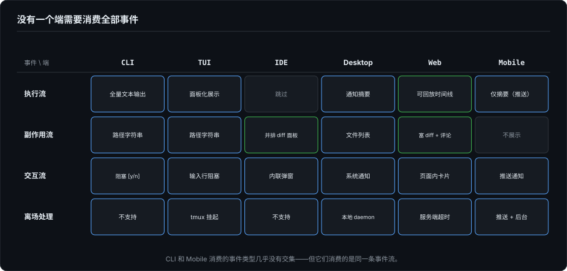
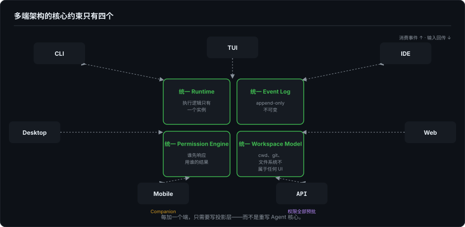

# Agent 时代的开发者界面（九）：多端 Agent 架构——CLI、TUI、IDE、Desktop、Web、Mobile

> 系列第九篇。第 5 篇提出了 Event Sourcing 框架——Agent 的执行是一条事件流，不同 UI 是同一事件流的不同投影。这一篇把这个框架展开到六个具体的端，外加 API 这个没有界面的入口，讲清楚每个端各自适合承载什么、不适合什么，以及它们怎么共存。

---

## 一、不是多端适配，是多端投影

传统软件做多端，思路是"一套代码，多处适配"——同一套业务逻辑，为每个平台写不同的 UI 层。

Agent 多端的思路不完全一样。不是"把同一个聊天界面适配到 6 个屏幕尺寸"，而是**同一条事件流，每个端挑选自己最适合投影的那部分事件，用自己最擅长的交互方式呈现。** CLI 不需要渲染 diff 面板，Mobile 不需要展示 3000 行日志，IDE 不需要做独立权限弹窗——权限确认以内联形式嵌在编辑器里——每个端只消费它擅长消费的事件子集。

---

## 二、六端 + API 的定位

在展开六个端之前，先给"端"定个坐标。六个端是产品形态，底下其实是两条正交的技术轴。

**第一条轴：应用和 UI 平台之间用什么契约说话。** 一边是结构化对象——AppKit/UIKit 的 view、浏览器的 DOM，应用改界面就是改对象，布局、命中测试、遮挡恢复由平台负责；另一边是 ANSI 字节流——程序面对 PTY 只能向前写，改已显示的内容要自己定位、擦除、重写（第 2 篇）。第 2–4 篇的渲染税、第 11–14 篇的记账之争、第 16 篇的信任面，全是这条轴上的事。

**第二条轴：UI 平台跑在哪、能碰到什么资源。** 本机原生平台能直接继承 shell 和文件系统；浏览器是带沙箱的运行时，默认碰不到本机的 cwd、PATH、git 凭证；终端模拟器则两种身份都有——iTerm2 是本机原生 app，xterm.js 是浏览器里的 JS 模拟器。

两条轴切出四格：

| | 对象契约（GUI） | 字节流契约（TUI） |
|---|---|---|
| **本机** | 原生 GUI（AppKit/UIKit/Qt） | 原生 TUI（iTerm/kitty + 真实 PTY） |
| **浏览器** | Web GUI（DOM/CSS） | Web TUI（xterm.js + 远端 PTY） |

四格里有三个推论，正好解释后面六个端里最容易混的几处：

- **Web TUI 里，TUI 应用什么都没变。** xterm.js 只是把终端模拟器搬进浏览器：parser、字符网格、CJK 双宽、alt screen 全在 JS 里重写一遍，但对 TUI 应用暴露的还是那条字节流——它照样发转义、收 SIGWINCH。变的是部署位置：agent 跑在远端，继承的是那台机器的环境（Codespaces、Cloud Shell、ttyd 都在这格）。SSH"进入工程现场"的语义还在，现场换成了云主机。
- **Electron 在一个浏览器平台里并排摆了两份契约。** VS Code、Cursor 这类应用，界面主体走 DOM（聊天、diff、设置是 Web GUI），主进程再通过 node-pty 开出一条真实 PTY（内嵌终端是字节流契约）。它们不是在 GUI/TUI 之间二选一，而是两格都占——IDE 端能同时给你网页式 diff 和原生终端，靠的就是这个结构。
- **Web GUI 默认被沙箱挡在本机之外。** 浏览器里的 agent 不能直接 spawn 编译器、读未提交文件、用你的 ssh agent，所以纯 Web 产品的 runtime 天然在服务端，浏览器只是投影端；服务端事件流从第一天就是事实源——基建系列的主线在这一格是出厂设置，不是后来补的。

六个端可以直接放进坐标系：CLI/TUI 是字节流格（终端模拟器可本机可浏览器）；Desktop、Mobile 主要是本机对象格（Mobile 也大量用 WebView，第 7 篇展开）；Web 是浏览器对象格；IDE 跨在 Electron 的两格之间。下面逐个看它们各自承载什么。

### CLI：执行入口 + 自动化接口

CLI 是最薄的投影。它的核心能力不是"展示"，而是"执行"——继承 cwd/PATH/env/git/SSH 全部上下文，直接把 Agent 接入工程现场。

适合承载：全量事件流，但以最原始的方式（文本输出）。适合 CI/CD 集成（`./agent fix --auto`）、管道组合（`cat error.log | agent diagnose`）、远程执行（SSH + tmux）。

不适合承载：diff 审查、权限管理、多任务队列。

CLI 永远不会被"替代"——因为管道的价值是结构性的，不依赖任何 UI 框架。

### TUI：本地工作台

TUI 是 CLI 往上走一层——在终端里提供结构化面板，但保留键盘优先和远程可用的特性。第 2–4 篇拆解的渲染引擎、Markdown 降级和 Agent 事件展平，构成了 TUI 的完整技术栈。

适合承载：执行时间线、工具调用状态、流式输出、权限确认、文件变更列表。适合长时间运行的 Agent 会话（tmux 断线恢复）、低配机器和远程开发场景。

不适合承载：富 diff 审查（并排对比）、多模态附件预览、团队协作。

### IDE：代码上下文 + Diff 审查

IDE 插件是天生的 diff 审查工具。编辑器的并排 diff view、行级采纳/拒绝、与语言服务器的集成——这些都是 IDE 的内置能力，Agent 插件只需要对接事件流。

适合承载：`file.changed` 和 `validation.finished` 事件的投影——也就是 diff 审查和测试结果。第 8 篇讲的"按文件组织 + 按风险标记 + 部分采纳/拒绝 + 测试关联"，在 IDE 里是出厂能力。

不适合承载：长会话管理、权限审批、多 Agent 任务编排。IDE 擅长"审查"，不擅长"管理"。

### Desktop：本地工作台 + 系统集成

Desktop App 的能力介于 TUI 和 Web 之间——有完整的 GUI 控件和原生性能，但不需要浏览器的内存开销。适合独立的 Agent 桌面客户端。

适合承载：系统通知（本地 daemon 在后台跑 Agent，桌面端推送结果）、文件系统集成（拖拽文件到 Agent）、离线恢复（本地 event log 持久化）。

不适合承载：多用户协作（Web 更合适）、纯键盘工作流（TUI 更强）。

### Web：团队协作 + 历史 + 审批

Web 是唯一天然支持多用户的端。Agent 产出的 event log 在服务端持久化后，Web 端可以做会话分享、历史搜索、团队审批——这些是 CLI/TUI/IDE 都不擅长的。

适合承载：多任务队列、团队审批流、会话回放和分析、成本统计。Zacp 项目是这条路线的一个实际案例——WebUI + ACP 协议 + 多 CLI Agent：CLI Agent 不知道 WebUI 的存在，WebUI 只消费 ACP 事件，加一个 Web 端不需要改任何 agent 核心。它还顺便回应了一个争论——第 5 篇引过的两种极端观点，"GUI 必然到来"和"GUI Agent 方向根本上错了"（CLI-Anything 的立场），Zacp 恰好是两者的折中实例：agent 核心保持 CLI 原生、走结构化协议，用户界面侧用 Web 做投影。

不适合承载：实时执行（延迟和网络依赖）、本地文件系统操作。

### Mobile：Companion，不是主战场

Mobile 不适合做 Agent 的主执行入口——屏幕小、输入慢、后台限制、散热墙、文件系统权限受限。但 Mobile 有一个不可替代的价值：**用户离开电脑后，Mobile 是唯一能触达用户的端。** 它作为审批触达点的具体场景，第 10 篇展开。

适合承载：任务状态查看、高风险操作审批、执行总结阅读、简单回复。类似"远程任务控制器"，不是"缩小版 IDE"。

### API：自动化与集成入口

六个端之外还有第七个入口：API。它没有任何界面——CI/CD 流水线里触发 Agent（`./agent fix --auto` 背后就是一个 API 调用）、GitHub webhook 回调（PR 打开时自动发起 review）、脚本化工作流（定时任务、批量仓库维护），事件流以 JSON 形式被程序直接消费。

适合承载：自动化触发、机器消费的执行结果、与现有 DevOps 工具链的集成。

不适合承载：任何需要人在环路的交互——API 端的权限必须全部预批，否则任务挂起。它是统一 Permission Engine 的极端投影：所有交互流事件的答案在调用参数里预先声明。

---

## 三、不只"适合做什么"：从渲染架构推导端定位

上面六个端的定位看起来像功能分配——"因为 IDE 有 diff view 所以适合审查，因为 Web 有多用户所以适合协作"。但往下挖一层，每个端的**渲染架构**决定了它天然擅长和不擅长处理什么类型的事件。

第 7 篇详细拆解了各技术栈在 Markdown 流式渲染上的差异。同一个逻辑可以迁移到端定位：

| 渲染架构 | 核心特征 | 擅长的事件消费模式 | 对应端 |
|---------|---------|------------------|--------|
| 纯文本 stdout（ANSI） | 零布局开销，线性追加，无 undo | 高频流式事件（tool.started/finished），单维信息 | CLI |
| 字符网格增量 diff（ANSI） | 增量 diff + commit/live 分区，可原地重绘 | 高频流式事件 + 结构化面板（工具状态、权限确认） | TUI |
| CoreText 全量 invalidate | 每次 attributedText 变更触发完整重排，50-100× 富文本开销 | 一次性富文本展示，不适合高频更新 | 原生 Desktop / Mobile |
| WebView 增量 reflow | 脏区传播，只重排受影响子树，出厂能力 | 高频局部更新 + 复杂富文本（diff 面板、协作视图） | Web |
| Yoga / Lynx 后台增量 | 后台线程 diff，主线程只应用变更 | 中频更新 + 低延迟交互 + 列表虚拟化 | Mobile Companion |

这里有一个反直觉的结论：**原生端（CoreText）做流式 Agent 聊天反而是最脆弱的。** 同样的 3000 字流式 Markdown，iPhone 上 CoreText 全量 layout 每次 20-60ms，WebView 增量 reflow 的代价远低于此。所以"Web 适合协作"不只是因为它有多用户能力，还因为它的渲染引擎天生能消化高频事件更新。而 Mobile 原生端之所以只适合做 Companion（通知 + 轻量审批），不是因为屏幕小——是因为在被动散热的手机上，CoreText 全量 invalidate 的高频布局在实测中很容易顶到 thermal throttling，形成恶性循环。

这不是说原生端不该做 Agent GUI。而是说：**如果你用原生 CoreText 做流式 Agent 客户端，你的性能天花板比 WebView 低。** 选择技术栈的时候，这比"哪个平台用户多"更根本。

---

## 四、每个端的交互契约不同

第 5 篇区分了事件的三层分类：执行流、副作用流、交互流。不同端对这三层的消费策略完全不同：

| | CLI | TUI | IDE | Desktop | Web | Mobile |
|---|---|---|---|---|---|---|
| **执行流** | 全量文本输出 | 面板化展示 | 跳过（IDE 不关心工具调用过程） | 通知摘要 | 可回放时间线 | 仅摘要（推送） |
| **副作用流** | 路径字符串 | 路径字符串 | 并排 diff 面板 | 文件列表 | 富 diff + 评论 | 不展示 |
| **交互流** | 阻塞 `[y/n]` | 输入行阻塞 | 内联弹窗 | 系统通知 | 页面内卡片 | 推送通知 |
| **离场处理** | 不支持 | tmux 挂起 | 不支持 | 本地 daemon | 服务端超时 | 推送 + 后台 |

Mobile 的"仅摘要"来自推送通知和任务卡片——对应前面说的"任务状态查看"；副作用流（diff）则完全不投影到手机。没有一个端需要消费全部事件。CLI 和 Mobile 在消费的事件类型上几乎没有交集——但它们消费的是同一条事件流。

> 补记（2026.09）：这张表写成后，"离场处理"一行开始在头部产品里过时——而且是以印证本文的方式。Claude Code 现在有后台会话（`/bg`）和独立的 agent 视图，配合 Remote Control 和"Push when Claude decides"配置，Agent 可以在用户离开后继续跑、必要时直接往手机推通知——第 10 篇说的"用户离开电脑后，Mobile 是唯一能触达用户的端"，已经是出货的功能，不是设想。"CLI/TUI 离场 = 挂起"从此只是默认行为，不再是能力上限。

---

## 五、统一 Runtime，统一 Event Log，统一 Permission Engine，统一 Workspace Model

多端架构的核心约束只有四个：

**统一 Runtime。** Agent 的执行逻辑（model loop、工具调用、plan-revise 循环）只有一个实例。不是每个端跑一个 Agent——是一个 Agent 跑在 Runtime 里，所有端只做投影。

**统一 Event Log。** append-only，按时间排序，不可变。每个端从这个 log 里读取自己需要的事件。这是恢复、审计和协作的基础设施。

**统一 Permission Engine。** 权限请求从 Agent Runtime 发出，所有端都可以响应。谁先响应就用谁的结果。超时策略和信任规则持久化在 Permission Engine 层，不是某个 UI 层。

**统一 Workspace Model。** cwd、git branch、文件系统状态——这些不属于任何 UI，属于 Workspace。Agent 操作的是 Workspace，不是某个端的"视图"。

满足这四个统一之后，每个端只是一个轻量的投影层——消费事件、渲染 UI、发送用户输入回 Runtime。你加一个 Mobile 端不需要改 Agent 逻辑，加一个 Web 端不需要改权限模型。

---

## 六、不是所有产品都需要所有端

六端 + API 是分析框架，不是 checklist。一个独立开发者的 Agent 工具可能只需要 CLI + TUI。一个团队协作的 Agent 平台可能需要 Web + IDE + Mobile。选哪些端，取决于用户在哪里、用户在那个场景下需要消费哪些事件。

关键不是端多不多，而是每加一个端，是不是只需要写投影层——而不是重写 Agent 核心。如果每次加端都要重构事件模型和权限引擎，说明架构还没到位。

---

## 七、下一篇

最后一篇。从具体的技术和架构回到人——一个大前端开发者，在 Agent 时代的能力地图是什么？移动端、桌面端、TUI、全栈——这些经验怎么迁移到 Agent Workflow Engineer 这个新方向上。

---

*本文的多端架构框架参考了 ForgeLoopTUI 的 CoreRenderEvent 设计、Zacp 的 ACP 多 Agent WebUI 架构，以及第 5 篇提出的 Event Sourcing 模型。*
