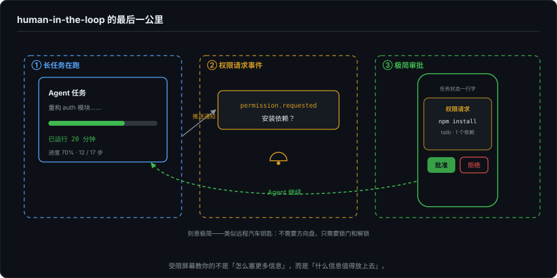
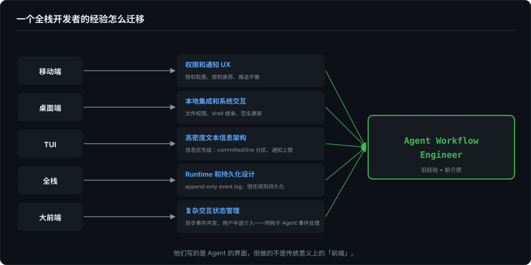
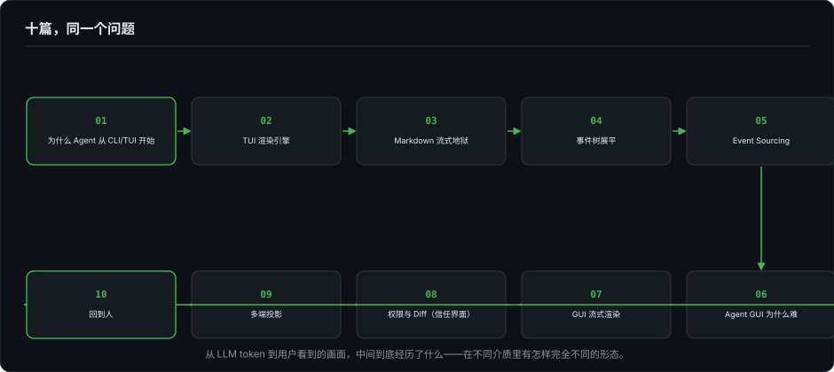

# Agent 时代的开发者界面（十）：移动端的位置 + 从大前端到 Agent Workflow Engineer

> 系列第十篇，最后一篇。前九篇从第 2 篇的 ANSI 序列一路讲到多端架构——完整的技术和设计全景。这一篇收束到个人：做移动端、桌面端、TUI、全栈这些经验，在 Agent 时代到底意味着什么。

---

## 一、移动端在 Agent 产品中的位置

先把这个说清楚。移动端不适合做 Agent 的主执行入口——这不是"屏幕小"的问题，是结构性的：

- **长运行**：Agent 的一个任务可能跑 20 分钟。iOS 的后台限制让长运行进程几乎不可能。
- **高密度文本**：diff、日志、堆栈——这些在 6 寸屏幕上阅读体验极差。
- **本地工具链**：编译器、包管理器、git——手机上跑不了完整的开发环境。
- **散热**：持续高负载 = thermal throttling = 恶性循环。第 7 篇的 CoreText 例子已经展示了移动端的散热墙有多真实。

但移动端有一个不可替代的位置：**human-in-the-loop 的最后一公里。**

用户离开电脑。Agent 在后台继续跑（Mac 上跑着本地 daemon，或者远程服务器上跑着 Agent）。碰到一个需要确认的操作——移动端推一条通知。用户看一眼——知道 Agent 在做什么，批准或拒绝。Agent 继续。

这不是"把桌面端缩小"。移动端 Companion 应该极简：当前任务状态、最近一次权限请求、一键批准/拒绝。类似远程汽车钥匙——不需要方向盘，只需要锁门和解锁。

从移动端交互经验里带过来的直觉：**在受限屏幕上，你学到的不是"怎么塞更多信息"，而是"什么信息值得放上去"。** 这个克制力在做 Agent 的任何一端时都有用。

---

## 二、一个全栈开发者的经验怎么迁移

这几项我都做过——移动端、桌面端、TUI、全栈。回头看，每一项在 Agent 时代都有直接的迁移路径：

**移动端 → 权限和通知 UX。** 移动端的天性就是处理权限——相机、定位、通讯录、通知。授权粒度怎么分（以定位权限为例：授权状态其实只有"使用期间 / 始终"两级，弹窗上那个"允许一次"是临时的"使用期间"，App 停止使用后失效；而且首次弹窗根本没有"始终"选项）、授权疲劳长什么样、推送通知的触达率和骚扰率之间怎么平衡，这些是移动端开发者的日常。我做 FlowDown 的时候，这些经验直接映射到了 Agent 的权限模型和 Mobile Companion 设计上。

**桌面端 → 本地集成和系统交互。** 文件系统权限、shell 环境继承、code signing、auto update、crash recovery——第 1 篇和第 6 篇反复提到的 GUI 额外成本，做桌面端的时候我已经交过学费了。Agent Desktop App 是这些经验的直接应用场景。

**TUI → 高密度文本信息架构。** 写 ForgeLoopTUI 的过程，就是在一个只有字符的终端里把信息组织清晰的过程——靠的不是像素能力，是信息优先级。什么该放 committed 区、什么该放 live 区（第 2 篇），通知超过 3 条就该移除（第 4 篇），这些判断不是框架给的，是在字符网格里逼出来的。这套判断力在 GUI 上同样适用——信息多了，Panel 不会帮你自动排优先级。

**全栈 → Runtime 和持久化设计。** Event log 的 append-only 模型、权限引擎的信任规则持久化、Workspace 状态管理——这些不是 UI 问题，是后端问题。全栈经验让我能同时理解 Agent 的 Runtime 层和投影层，而不是只能做其中一半。

**大前端 → 复杂交互状态管理。** 大前端的核心能力不是"会写多个平台"，而是**管理复杂交互状态**——一个操作触发多个副作用、多个异步事件并发到达、用户中途介入改变状态流向。这和第 4 篇拆解的 Agent 事件处理模型是完全同构的能力。我在 ForgeLoopTUI 里手写的 `pendingTools` 稳定槽位队列 + `shiftIndices` 偏移追踪，回头看就是一个手动实现的响应式状态管理系统。

---

## 三、新岗位方向

如果"Agent 时代的开发者界面"成为一个独立的专业领域，这些岗位可能会出现或已经在出现：

**Agent Workflow Engineer。** 不设计聊天框，设计 Agent 的工作流界面——工具调用时间线、权限审批流、diff 审查面板、多任务编排。需要同时理解 Agent 的执行模型和 GUI 的交互模式。

**AI DevTools Product Engineer。** 介于产品经理和工程师之间——不需要手写 ANSI 状态机，但需要知道物理行计算为什么让增量 diff 翻倍复杂。在工程约束和用户体验之间做判断。

**Local-first Agent Platform Engineer。** Agent 核心跑在用户机器上，event log 本地持久化，隐私和延迟优于云端方案。需要桌面端开发经验 + Runtime 设计能力。

**IDE / CLI Integration Engineer。** 把 Agent 嵌入开发者的现有工具链——不是另起一个 Agent 专属界面，而是让 Agent 在 VS Code、终端、git 工作流里自然出现。

这些方向现在还处于早期。但回头看第 1 篇列的那个名单——Claude Code、Codex CLI、Gemini CLI、Goose、Aider、Devin CLI、Qwen Code——每个项目背后都需要这样的人（名单的时间锚点、以及到 2026 年秋天各家 GUI 的进展，见第 1 篇的补记：界面在变多，这类岗位的需求只多不少）。他们写的是 Agent 的界面，但做的不是传统意义上的"前端"。

---

## 四、回到系列的开头

十篇文章，从 ANSI 转义序列写到多端架构，回答的是同一个问题：

> **从 LLM token 到用户看到的画面，中间到底经历了什么——以及，这个经历在不同介质里有怎样完全不同的形态。**

第 1 篇问：为什么 Agent 从 CLI/TUI 开始？答案不是因为 GUI 不好，是因为当前最核心的问题不是界面表达能力，而是执行过程不确定、权限边界敏感、本地工程环境复杂。CLI/TUI 以最低成本解决了当前最硬的问题。

第 2–4 篇展示了这套"最低成本方案"底下的真实代价。第 5 篇把问题抽象为 Event Sourcing 框架。第 6–7 篇展示了同一套问题进入 GUI 世界后的新形态。第 8 篇是跨端的信任设计——权限与 diff 这两块"信任界面"，才是 Agent 的主界面。第 9 篇回到全局——多端并存才是终态。

如果这个系列在读者心里留下了一件事，我希望是：

> **Agent 的界面不是聊天框的变体。它是为一种全新的执行体——不确定、长运行、可中断、可审计、会调用工具——设计的工作流界面。这个领域需要的人，不是"会写聊天 UI 的前端"，而是同时理解终端渲染、事件系统、权限模型、diff 审查和本地开发环境的工程师。**

---

## 五、没有结语

这个系列写到这里，10 篇的结构性工作完成了。但内容本身还有很多可以深入的点——权限模型的信任规则 DSL、diff 审查面板的具体交互稿、多端 event log 的同步协议、Mobile Companion 的推送通道设计。这些是下一个阶段的事。

（补记：本篇写完时是原定的收官。后来在正文之外又续写了两篇——第 11、12 篇，讲渲染的所有权模型——所以你手里的系列到这里还没有完。）

如果这个系列对你正在做的事情有参考价值，[ForgeLoopTUI](https://github.com/BiBoyang/ForgeLoopTUI) 和 [FlowDown](https://github.com/Lakr233/FlowDown) 的源码是最好的延伸阅读。

---

*全系列基于 ForgeLoopTUI v1.2.0 和 FlowDown 的实际源码分析。知乎讨论参考：[为什么现在大多 Code Agent 的主形态是 CLI/TUI？](https://www.zhihu.com/question/2026125412049101416)。*
