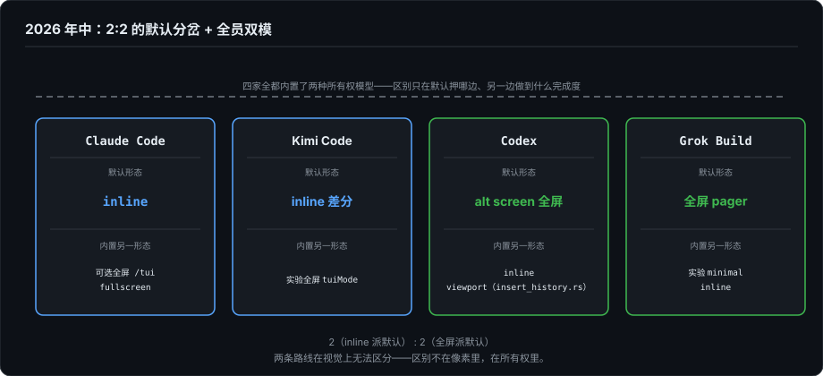
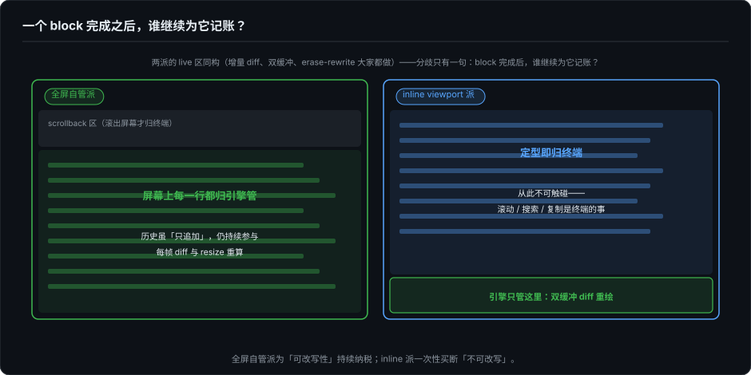
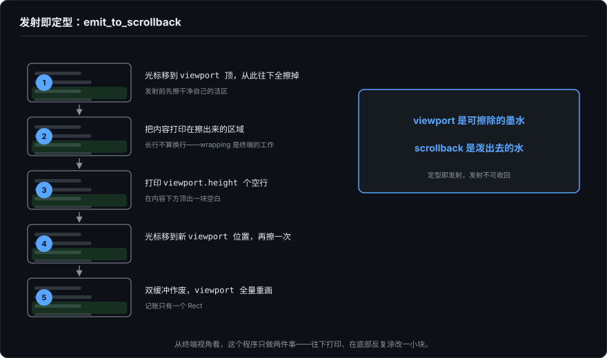

# 渲染的所有权模型——谁为已完成内容记账

> 系列第十一篇，严格说是续篇：第 0–10 篇构成系列正文，第十篇是原定的收官篇；本篇与下一篇是正文写完后的续写。本篇的写作动机是一次自我修正。第 2 篇我以 ForgeLoopTUI 为样本拆解了 TUI 渲染引擎的完整构造，并默认了一个前提：主流的 Agent TUI 都长这样。写完之后我去读了 Codex、Grok Build（xai-org/grok-build，2026 年 7 月开源）的源码和 Claude Code 的发布产物，发现这个前提是错的。但错的方式比"另一条路线"更有意思：这条被我漏掉的分界线真实存在，而 2026 年中的头部实现没有一家把赌注押在单边——**分界线在每家内部都成了一个开关**。这篇讲这条分界线，以及四家各自站在线上的什么位置。

---

## 一、一个我以为不存在的问题

第 2 篇的结论是：Agent TUI 的渲染，核心是在"终端没有 undo"这片地基上，做增量 diff、物理行计算、帧状态记忆、commit/live 分区。这些内容全部基于 ForgeLoopTUI 的实际源码，描述本身没有错误。

问题在于一个隐含假设：我以为 Claude Code 和 Codex 也是这么做的，毕竟用起来是一样的，流式输出原地更新，工具调用状态行被结果替换，底部输入框固定不动。

直到我在 Codex 仓库里看到这个文件：

```
codex-rs/tui/src/insert_history.rs
```

名字就说明了一切：把完成的内容**插入历史**（`insert_history_lines()`，用 DECSTBM 滚动区把内容注入 viewport 上方）。配套的测试文件叫 `vt100_live_commit.rs`：live 区内容"提交"进历史。快照测试里还有 `zellij_raw_terminal_wrap_above_viewport.snap` 这种为冷门终端复用器准备的用例。

Claude Code 建在自己的 Ink fork 上（发布产物中可见 `src/ink/` 目录），它的渲染层保留着同一个分裂：`shouldRenderStatically()` 判定一条消息是否可以"静态化"，静态内容打印进 scrollback 后不再参与重绘。`CompanionSprite.tsx` 里一句注释把约束说得很白："floating into Static scrollback can't be cleared"（飘进 Static scrollback 的东西就擦不掉了）。

再翻 Grok Build，找到一个独立 crate `xai-ratatui-inline`，核心函数就叫 `emit_to_scrollback`："发射进 scrollback"。我以为找到了第三个同路人。但继续追调用方，故事拐了弯：**这个函数在生产代码里没有调用者**，只出现在 crate 自带的示例和测试里。Grok Build 的默认形态（`[terminal] alt_screen = auto`）是一个进 alt screen 的全屏 pager，应用自管 scrollback，那恰恰是第 2 篇那条路的工业化版本。真正的 inline 形态是一个默认关闭的实验模式（`xai-grok-pager-minimal`），而且它也不用 `emit_to_scrollback`：它用 ratatui 自带的 `insert_before`（DECSTBM 滚动区）提交定型内容，还立了一个编译期守护测试，禁止任何人把 purge 重印机制接进 minimal 模式。

把四家的默认形态摆在一起，得到的不是收敛，是一张 2:2 的记分牌：

| 产品 | 默认形态（普通终端） | 内置的另一形态 |
|---|---|---|
| Claude Code | inline（Ink `<Static>` 静态化） | 可选全屏 `/tui fullscreen`（2026 年中起，alt screen） |
| Kimi Code | inline 差分（主屏） | 实验性全屏（`KIMI_CODE_TUI_FULL_SCREEN=1`，详见第 12 篇；到 9 月底已升格为正式配置项 `tuiMode`） |
| Codex | alt screen（`tui.alternate_screen = auto`，无条件生效；官方文档仍称"auto 在 Zellij 里跳过"，与代码脱节数月，见第七节第 7 条的补正） | inline viewport（`insert_history.rs` 那套） |
| Grok Build | 全屏 pager（auto；tmux 控制模式和 Zellij 里降级为全高 inline） | 实验 minimal inline（`xai-grok-pager-minimal`） |

第 2 篇描述的引擎不是一条"少数派的错路"，它是四家全都内置着的一半。真正的新问题是这条分界线本身：**一个 block 完成之后，谁继续为它记账？** 以及，为什么每家都在同一产品里养着线的两边。



---

## 二、分界线：已完成的内容，谁继续为它记账

先把两个学派定义清楚。

**全屏自管派（ForgeLoopTUI；Grok Build 和 Codex 的默认形态所属）**：屏幕上每一行都归引擎管。每一帧合成完整画面，与上一帧 diff，精确改写变化的行。已完成的历史内容虽然逻辑上"只追加"，但只要它还显示在屏幕上（或活在自己接管的 alt screen 里），就持续参与每帧的 diff 计算和 resize 重算，引擎为它持续记账。

**inline viewport 派（Claude Code 与 Kimi Code 的默认、Codex 与 Grok Build 的内置降级路径所属）**：内容一旦"定型"就立刻打印进终端的原生 scrollback，从此归终端管，引擎销账。引擎自己只维护底部一小块"活区"（viewport），用双缓冲 diff 重绘。

```
全屏自管派:                     inline viewport 派:
┌─ scrollback ────────────┐    ┌─ scrollback ────────────┐
│ （滚出屏幕才归终端）      │    │ 历史（定型即归终端）      │
├─ 屏幕 ──────────────────┤    │ 历史（定型即归终端）      │
│ 历史      ← 引擎管       │    ├─ 屏幕 ──────────────────┤
│ 历史      ← 引擎管       │    │ 历史（可见但不可触碰）    │
│ live 区   ← 引擎管       │    │ viewport ← 引擎管（仅此处）│
│ 输入框    ← 引擎管       │    │ 输入框（在 viewport 内）  │
└──────────────────────────┘    └──────────────────────────┘
```



这里要特别强调：**两派的 live 区是同构的。** ForgeLoopTUI 的增量 diff、Codex 的 ratatui 双缓冲、Ink 的行级 erase-rewrite，做的是同一件事，这正是我当初误判阵营的原因。表层行为一模一样。

真正的分歧只有一个问题：**一个 block 完成之后，谁还继续为它记账？**

- ForgeLoopTUI：完成了也继续记。`committedLines`、`lastCommittedPhysicalRows` 等帧状态字段持续追踪它，直到它滚出屏幕顶边。
- inline 派：完成即销账。之后它的滚动、搜索、选择、复制都是终端模拟器的事，引擎一行代码都不用写。

---

## 三、inline 派的机制：发射即定型

这套机制最干净的教科书版本在 Grok 的 crate 里：`emit_to_scrollback` 全部逻辑只有 60 行（`xai-ratatui-inline/src/scrollback.rs`，以下为简化伪代码）：

```rust
fn emit_to_scrollback(terminal, content) {
    // ① 光标移到 viewport 顶部，从这里往下全部擦掉
    //    —— viewport 里现在画着输入框，发射前先把自己的活区擦干净
    move_to(0, viewport.y);
    print("\x1b[J");

    // ② 把内容打印在擦出来的区域。长行不做换行计算——
    //    wrapping 是终端的工作
    print(content_segments);

    // ③ 打印 viewport.height 个空行，在内容下方"顶"出一块空白
    for _ in 0..viewport.height { print("\r\n") }

    // ④ 光标移到新的 viewport 位置，再擦一次
    move_to(0, new_viewport_y);
    print("\x1b[J");

    // ⑤ 双缓冲作废，viewport 全量重画；记账只有一个 Rect
    terminal.reset_back_buffer();
    terminal.set_viewport_area(new_viewport_y);
}
```

不变式值得逐字读：**viewport 是可擦除的墨水，scrollback 是泼出去的水。** 每发射一批内容，就先擦掉自己画的输入框、把内容印在那个位置、再在下方顶出新的空白区。从终端的视角看，这个程序从头到尾只做两件事：往下打印、在底部反复涂改一小块。



但要如实说一句：这个参考实现在 Grok 产品里目前没有生产调用方。真正在跑的生产路径用的是同一思想的更保守版本：Codex 的 `insert_history_lines()` 和 ratatui 自带的 `insert_before` 都走 DECSTBM 滚动区，把内容"插"到 viewport 上方，不擦掉重印；Grok 的 minimal 模式直接复用后者。思想是同一条，工程上各家选了介质兼容性更好的变体。

这套机制的纪律性质，在 Grok 仓库里有一个字面物证。`xai-grok-pager-minimal/src/guard.rs` 是一个守护测试：它用 `include_str!` 扫描 minimal 模式的每一个源码文件，断言其中**不出现** `emit_to_scrollback`、`resize_purge_rerender`、`resize_viewport_height` 这三个标识符。注释把理由写得很白：这些函数会重印已经归终端的历史，结果是 "double-printing (or, with ED3, wiping) committed scrollback"。这条路线赖以生存的纪律，在这里不是口头约定，是一个挂了就算构建失败的测试。

对照第 2 篇的记账成本。全屏自管派维护 8 个帧状态字段，错一个全屏偏位；inline 派的全部渲染状态是一个 `Rect`（实质只有 `y` 在变）加一块可以随时作废的双缓冲。**它不追求"记住屏幕"，它追求"随时能重建"。**

发射时机的选择也随之改变。第 2 篇的 Live Budget Planner 是空间驱动：live 区超预算就把旧行沉降到 committed。inline 派是语义驱动：一个 block 在事件流里完成了（工具返回了、回复结束了）才发射。**"什么时候算定型"从几何问题变成了生命周期问题。** Claude Code 的 `shouldRenderStatically()`（`src/components/Messages.tsx`）把这个判定写得很直白：一条消息想"静态化"，需要它关联的 tool use 不在 streaming、不在 in-progress、已全部 resolved，连同组的兄弟 tool use 和 PostToolUse hooks 都结束了才行。推论是：未定型的内容必须钉在 viewport 里。一个跑五分钟的工具调用，它的 block 就在 viewport 里被反复重绘五分钟，直到拿到结果、定型、发射。

这个变化和第 5 篇的 Event Sourcing 框架是自洽的：事件完成 → 投影定稿 → 归档。inline 派相当于把 Event Sourcing 在渲染层做到了底，投影一旦定稿，连撤回投影的能力都主动放弃。

---

## 四、第 2 篇的痛点在这条路线下的命运

| 第 2 篇的问题 | 全屏自管派的解法 | inline 派的答案 |
|---|---|---|
| 物理行/逻辑行错位 | 每行 `visibleWidth` + `physicalRows`，每帧依赖 | 只在发射瞬间做一次切分；发射后永不再算 |
| 8 个帧状态字段 | 持续维护，错一处全盘偏 | 一个 Rect + 可作废的双缓冲 |
| Live Budget Planner | 超预算沉降，不做部分行切割 | 机制消失，由 block 生命周期替代 |
| 用户两帧之间滚动 | 假设破坏，diff 坐标出错 | 历史区滚动是终端的事，不构成假设 |
| 历史的搜索/选择/复制 | 需要自己实现（或放弃） | 终端原生免费，Cmd+F 直接可用 |
| resize | 缓存全失效，重算重绘当前屏 | 见下节，这是 inline 派交税的地方 |

前五行是真实的收益。但税没有消失，只是换了征收点。

---

## 五、税单：inline 派的代价

### 5.1 发射后的内容不可触碰

ANSI 光标序列只能寻址可见屏幕。一行内容滚过顶边进入 scrollback 后，不存在任何转义序列能再碰到它。而对还停在屏幕上、位于 viewport 上方的历史，inline 派给自己立了纪律：**光标从不越过 viewport 顶边**，一旦回写，就重新背上了帧状态记账的债，这条路线的全部意义就消失了。

产品后果：用户想展开一个三分钟前完成的折叠 block，历史不能改。Grok Build 的 minimal 模式的答案是 `full_view.rs`：把整个 transcript 以强制展开模式重新渲染成一段 ANSI 文本，交给 `$PAGER`（`less -R`）。**"重新消费历史"的需求被路由到外部 pager，不靠历史改写。** 不可变历史 + 按需导出，是这条路线对"可改写性"需求的最终回答。（应用内的模态查看器 Grok 也有：`block_viewer.rs`，Ctrl-F 打开，提供搜索、选择、复制，但它长在默认的全屏 pager 里。那边的历史本来就归应用管，模态查看器是功能，不是妥协。）

### 5.2 resize 的核平重印

终端 resize 时，终端会先自动 reflow scrollback，应用随后才收到 SIGWINCH，边框被拆花，且各家终端的 reflow 行为不一致（grok 的注释原话：试过按字符数自己算 reflow，被各家终端的边界行为打回来了）。inline crate 里留着的解法是不修，直接重建（`xai-ratatui-inline/src/resize.rs`）：

```rust
// 注释是个事故报告：本来可以用 RIS (\x1bc) 硬重置，
// 但 RIS 在 iTerm/Terminal.app 里不清 scrollback
write("\x1b[2J\x1b[3J\x1b[H");   // 清屏 + 清 scrollback + 归位
print(history);                  // 内存里的全部历史按新宽度重新打印
// 顶出 viewport 空行、重算位置、clear
```

（同一个文件的文档注释和 README 还写着"用 RIS 重建"的旧方案，文档滞后于代码，以代码里这段事故报告式的注释为准。）

走这条路的前提是必须在内存里保留完整的 block 数据模型，目的不是逐帧渲染，是为了 resize 后能重印，以及支撑应用内的搜索/选择/导出。值得记下的是，Grok 的 minimal 模式**拒绝**走这条路：它宁可使用终端内建的 autoresize、忍受各家 reflow 的差异，也绝不调用 purge 重印，因为 `\x1b[3J`（ED3）会把已经归终端的 scrollback 一起清掉。guard.rs 那个守护测试，禁的正是这条路。

代价有两笔。一是 **I/O 爆发**：pty 是串行字节流，3 小时会话的历史是几万行、几 MB 文本，每次 resize 都重推一遍（用同步输出模式压住闪烁）。二是 `ESC[3J` **误伤无辜**：它清空终端的整个 scrollback，包括启动 agent 之前 shell 里留下的内容。

对照第 2 篇：全屏自管派的 resize 成本是 CPU（物理行重算），量级是一屏；inline 派是 I/O 带宽，量级是整场会话。账单寄到了不同的地址。

### 5.3 终端免费给的能力，想用就得自建一份

终端 scrollback 的滚动/搜索/选择对人免费，但对程序是黑箱：不能导出会话、不能程序化跳转、不能带格式复制。想把历史当数据用，只能靠内存里那份模型自建。Grok Build 那份 4242 行的 `text_selection.rs`（连同独立的 scrollback pane、history search、export 模块）就是这类自建的样子。不过严格按所有权划分，它长在默认的全屏 pager 里，是全屏派赎回原生能力的赎单（第 12 篇会逐条点这张赎单）；inline 派的 minimal 模式反而没有补这张票，它把"再看一眼历史"导出给了 `$PAGER`。

### 5.4 活区膨胀的退化

长任务场景下（后台任务跑 20 分钟、权限等待用户离开），未定型 block 一直钉在 viewport 里参与每帧 diff。"活区极小"的优势被稀释，渲染负担向全屏自管派回归。

---

## 六、为什么分界线变成了开关

我初稿把四家写成了"收敛到 inline"，那是错的。真实的图景是 2:2 的默认分岔 + 全员双模。逐项分析之后，我认为有几个结构性原因。

**1. 对话的介质本性。** Agent 会话天然 append-only。为"历史原地改写"这个低频需求维护一条常驻的精确 diff 管道，是三条路线里最不划算的一笔投资。模态 viewer 和 `$PAGER` 导出覆盖了真实需求的大部分。这是 inline 派的拉力。

**2. 失败模式的不对称。** 全屏自管派的失败形态是屏幕上出现无法解释的乱码（IME 劫持光标、tmux 不同步、resize 时机错误），难复现、难定位，且发生在用户最看重的地方（别忘了这是一个需要用户审计 agent 行为的产品）。inline 派的失败形态是 resize 时闪一下，可见、有界、可恢复。对商业产品，这个不对称是决定性的。

**3. 纪律比天才便宜。** 8 个帧状态字段时刻正确，是一个只有引擎作者本人才能长期维护的承诺；"发射后永不触碰"是任何新人都能遵守的纪律。大组织选架构，选的是"不容易被改坏"。Grok 把这个论点推向了字面化：minimal 模式的纪律不是 Code Review 把关，是 guard.rs 里一个扫描全部源码的守护测试，**纪律被写进了构建**。

**4. 成本支付频率的不对称。** 全屏自管派的维护成本每天都在付（任何渲染改动都要过帧状态）；inline 派的爆发成本只在"长会话 + 用户拖窗口"的交集发生时付。pty 本身的吞吐是几十 MB/s，瓶颈其实在终端模拟器的解析渲染，但即便保守估计，几 MB 重印也只是百毫秒级的事。为罕见事件付重税，为日常事件零税。

**5. 可测试性。** `emit_to_scrollback` 的测试是 MockTerminal 接住字节流、断言 clear 了几次、flush 了几次，简单到近乎无聊，因为逻辑本身就简单。系统越聪明，证明它正确的基础设施越贵。

以上五条解释了 inline 派的拉力，但解释不了为什么 Grok 和 Codex 把**默认**押在了全屏。把开关另一端的原因补上：

**6. 会话内体验是真需求。** 滚动、搜索、选择复制、平价 resize（全屏派 resize 是 O(屏高) 的 CPU 操作，没有 I/O 爆发）、鼠标交互，长会话用户每天都会用到。终端原生 scrollback 免费提供这些，但只对"人"免费，不对"程序"免费；而全屏派自建一份之后，这些能力对人和程序同时成立。

**7. 用户环境是分裂的，但回应正在换代。** 同一家公司必须同时服务 iTerm2 用户和 tmux/Zellij 用户，复用器（尤其 Zellij 和 tmux 控制模式）的 scrollback 语义确实让 alt screen 变成事故现场。Grok 的答案保留至今：auto 在 tmux 控制模式和 Zellij 里降级 inline。Codex 的答案则经历了一次转向，还留下一个文档与代码脱节的活案例：它曾经有同款特判，`tui.alternate_screen = auto` 在 Zellij 里跳过 alt screen，官方配置文档至今仍写着这句话；但代码在 2026 年 5 月中就把特判整个删掉了（#22214，提交标题就叫 "remove Zellij TUI workarounds"），auto 从此无条件进 alt screen，还配了一个测试（`alternate_screen_auto_uses_alt_screen`）把新行为钉死。我初稿按文档口径写了"auto 在 Zellij 里跳过"，发布前对源码才核出这个脱节，此处补正。特判也并非被简单扔掉，而是换了一层活法：新的 `ScrollbackStrategy` 在运行时检出 Standard/Zellij/FullScreen 三档终端，决定历史插入和视口生长各自用什么手法（9 月又为 Windows Terminal 补了一档，部分 DEC 滚动区在那儿会丢行）。按终端切模式的开关退役了，按终端选策略的适配接了班。用户环境的分裂没有变，变的是行业对它的回答：从"检测终端、切换模式"走向"统一模式、下放策略"。顺带证明，连"开关是必然产物"这种判断，保质期也可能只有几个月。

**8. 历史有两种消费场景。** 会话中（要交互、要导航）和退出后（要在终端里向上翻、Cmd+F、复制）对所有权的要求恰好相反。两个场景都真实、都高频，于是四家长出了同一答案：都养一套，或者串行地各管一段。这正是第 12 篇的主题。

---

## 七、这对本系列意味着什么

先说修正范围，比预想的小：

- **第 2 篇**的技术内容不需要改，它描述 ForgeLoopTUI，而 ForgeLoopTUI 确实那样工作。需要补的是一个坐标系：TUI 渲染引擎存在两个学派，第 2 篇解剖的是全屏自管派的手工形态（Grok Build 的默认 pager 是它的工业化形态），而 Claude Code 与 Kimi Code 的默认属于 inline viewport 派。两派的分界不在"live 区怎么画"（那层同构），在"已完成的内容，谁继续为它记账"。
- **第 4 篇**只需一句限定：槽位队列和 shiftIndices 作用于 live 区；inline 派把乱序配对提前到了数据层：block 按稳定 id 在内存模型里配对完成后才发射，乱序问题从坐标手术退化为字典查找。
- **第 3、5、6–10 篇**不受影响。第 5 篇的 Event Sourcing 框架反而被 Grok Build 的架构（TUI/headless/ACP 三端共用同一事件流）实证加强。

然后说我的引擎的位置。ForgeLoopTUI 是少数派，但不是错误，Grok Build 和 Codex 的默认形态证明了全屏自管在大组织手里同样能产品化。这条路能做到 inline 派结构性做不到的事：任意可见历史的原地改写、每一帧每一个 ANSI 字节的精确控制、会话内完整的交互能力。如果未来出现"历史必须活"的产品需求（实时协作标注、历史中的 diff 就地更新），inline 派三个实现都得重构，全屏自管派不用。

但演进方向也因此清晰了：ForgeLoopTUI 的 committed 区在语义上已经是 append-only，和 inline 派的 scrollback 只差最后一步：**物理上还归不归我管**。四家的开关给出了同一个提示：这道题不必一次答完，可以按生命周期分期回答。这笔交换是否值得，取决于约束集合，这正是第 9 篇"端的选择由约束决定"的同一个逻辑，在渲染层又成立了一次。

---

## 八、收束

第 2 篇说：TUI 渲染是在"终端没有 undo"的地基上建引擎。这篇补上下半句：**地基没法换，但你可以选择和地基的关系。**

全屏自管派征服介质：终端没有 undo，就造一个 undo（光标手术 + 帧状态），换来 GUI 级的控制力。inline viewport 派顺应介质：终端的本性就是电传打字机，只进不退，那就不退，把"不可变"从限制变成架构原则。

两种选择没有高下，是同一条公理的两种缴税方式：一个持续为"可改写性"纳税，一个一次性买断"不可改写"、再为重印机制和应用内补偿补票。2026 年中的头部产品用配置开关承认了这一点：**四家全都内置了两种所有权模型**，区别只在默认押哪边、以及另一边做到什么完成度。

我漏掉这条分界线的原因值得记下来：两条路线在视觉上无法区分。我是读了源码才发现的。这也是本系列反复出现的主题的另一个实例：**看起来一样的界面，底下的成本结构可以完全不同。** 区别不在像素里，在所有权里。

下一篇（第 12 篇）把这个问题推进到工程细节：既然双模已成事实，那"同一引擎里两种所有权共存"到底怎么实现？Kimi Code 在四家里给出了接口最干净的一个样本，包括一个前无古人的设计：退出时把历史归还给终端。

---

*本文基于 [Grok Build](https://github.com/xai-org/grok-build)（commit `9fabade`，2026-08-16；`xai-ratatui-inline`、`xai-grok-pager`、`xai-grok-pager-minimal`）、[Codex](https://github.com/openai/codex)（`codex-rs/tui/src/insert_history.rs`、`tests/suite/vt100_live_commit.rs`；`tui.alternate_screen` 的 Zellij 特判已于 2026-05-13 在 #22214 中移除，官方配置文档至今仍写旧行为，本文初稿按文档口径转述，2026-09-29 依本地源码（main `6b9826e3`，2026-09-09）补正，见第七节第 7 条）与 Claude Code 发布产物中的源码（`src/components/Messages.tsx` 的 `shouldRenderStatically`、`src/utils/staticRender.tsx`、`src/ink/` 内置 fork）的实际阅读。对照部分基于 [ForgeLoopTUI](https://github.com/BiBoyang/ForgeLoopTUI) v1.2.0。*
