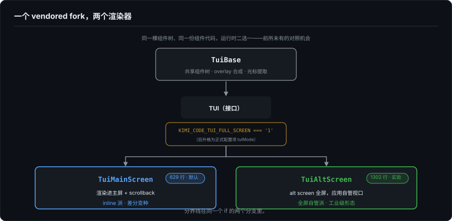
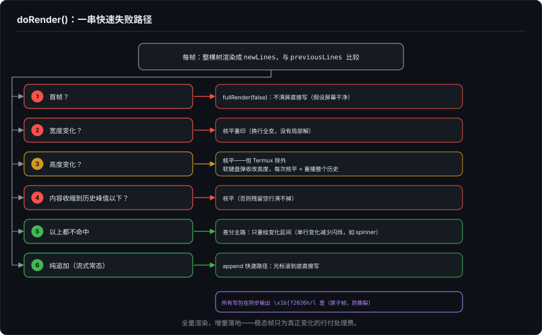
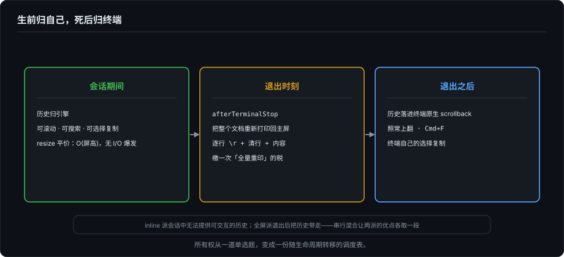

# 双模渲染——同一引擎里的两种所有权

> 系列第十二篇。第 11 篇讲了 TUI 渲染的两条路线（全屏自管派与 inline viewport 派），以及一个新事实：头部 Agent TUI 没有一家押注单边，分界线在每家内部都成了开关（默认形态 2:2）。月之暗面 2026 年把 Kimi Code 的源码放了出来（MoonshotAI/kimi-code，MIT，TypeScript monorepo），它是这条线上最适合解剖的样本：**它的渲染引擎同时实现了两种所有权模型，用同一个接口、同一棵组件树，运行时二选一**，而且代码里处处留着两派交锋过的事故记录。这篇是这个案例的解剖。

---

## 一、基本面：一个 vendored fork，两个渲染器

Kimi Code 的 TUI 框架在 `packages/pi-tui`，是从上游 pi-mono 项目的 pi-tui vendored 进来的 fork。这个 fork 的自我管理方式值得先说一句：`pi-tui/AGENTS.md` 逐条列出"我们和上游的 8 处分歧"，每条都带守护测试，并明确规定：每次从上游同步后，这 8 条必须逐条重新验证，测试挂了就意味着本地分歧被覆盖丢失。这是把"fork 的维护成本"显性化的做法，和第 11 篇说的"纪律比天才便宜"是同一个精神。

渲染层的关键结构是：`TuiBase` 提供共享的组件树、overlay 合成、光标提取；`TUI` 是个接口，有两个实现：

```
apps/kimi-code/src/tui/tui-state.ts:

  fullscreen = KIMI_CODE_TUI_FULL_SCREEN === '1'
    ? new TuiAltScreen(terminal, ...)   // 实验性全屏
    : new TuiMainScreen(terminal)       // 默认
```

（写法以文末标注的版本为准：8 月中它还是环境变量开关，到 9 月底，main 分支已经把这个开关升格为正式的 `tuiMode` 配置项，"实验开关"转正成"产品配置"，方向正是本篇和第 11 篇判断的那条路。）

- `TuiMainScreen`（629 行）：渲染进终端主屏 + scrollback。**inline 派，但是差分变种。**
- `TuiAltScreen`（1302 行）：alt screen 全屏，应用自管视口。**全屏自管派，工业级形态。**

也就是说，第 11 篇那条我以为只存在于不同公司之间的分界线，在这个仓库里是同一个 `if` 的两个分支。这给了我一个前所未有的对照机会：**同一棵组件树、同一份组件代码，喂给两种所有权模型，各自的账单会开在哪里。**



---

## 二、主屏渲染器：inline 派的差分变种

### 2.1 模型：全量渲染，增量落地

`TuiMainScreen.doRender()` 的模型一句话：每帧把**整棵组件树**（全部历史消息 + 编辑器）渲染成一个扁平行数组 `newLines`，和上一帧 `previousLines` 逐行比较，只把变化补丁写入终端。

等等，每帧重渲整棵树？这和 Grok Build 的"发射即销账"不一样。关键在它对历史的处理方式：历史行渲染一次之后，靠**引用相等缓存**摊薄成本。组件的渲染缓存对未变化内容返回同一个字符串引用，于是稳态帧的成本是 O（总行数） 次指针比较，只为真正变化的行付处理费（`tui-main-screen.ts:237-261`，注释原文："a steady frame only pays for the lines that actually changed"）。

所以准确地说，它和 Grok 那种"定型后彻底不管"的区别在于：**逻辑上整棵树都活着，物理上只补丁视口可达的部分。**

### 2.2 所有权分界线被压缩成一个整数

渲染器维护一个 `previousViewportTop`：逻辑行数组里，这个下标以上的行已经滚进 scrollback，归终端；以下的行在屏幕上，光标可达，归引擎。

第 11 篇用了一整节讲"已完成的内容归谁记账"，在这里它就是一个整数加一句检查。整个 `doRender()` 的题眼是这几行（`tui-main-screen.ts:449-455`）：

```typescript
// Differential rendering can only touch what was actually visible.
// If the first changed line is above the previous viewport, we need a full redraw.
if (firstChanged < prevViewportTop) {
    fullRender(true);
    return;
}
```

变化落在视口之内 → 局部补丁；变化越界进 scrollback → `fullRender(true)`：`\x1b[2J\x1b[H\x1b[3J` 清屏、清 scrollback、全量重印。这就是第 11 篇"历史可改写：不可能，除非整体重印"的判官代码。

### 2.3 决策树：一串快速失败路径

`doRender()` 的主体是一串按优先级排列的兜底分支（319-455 行），每条都对应一类真实事故：

1. **首帧**：`fullRender(false)`，不清屏直接写，假设屏幕是干净的；
2. **宽度变化**：核平重印。换行全变，没有局部解，和 Grok Build 的 `resize_purge_rerender` 逐字相同；
3. **高度变化**：原则上也核平，**但 Termux 除外**。注释写着：Android 软键盘弹出/收起会改高度，如果每次核平，"the entire history to replay on every toggle"（整个历史在每次键盘切换时重播）。一条特例就是一份事故报告；
4. **内容收缩到历史峰值以下**：核平（否则残留的空行清不掉）；
5. 以上都不命中，才进入差分主路：扫描出 `firstChanged`/`lastChanged`，只重绘**变化区间**而非"变化行到末尾"，注释明说动机："reduces flicker when only a single line changes (e.g., spinner animation)"；
6. 纯追加（流式输出的常态）走 append 快速路径：光标滚到底直接写。

外加两个通用工程点：所有写包在 `\x1b[?2026h/l` 同步输出里（原子帧，防撕裂）；kitty 图片协议有一整套影子账本（图片行占位行数、changed-range 膨胀、按 id 删除），因为图片在终端里是字节流之外的第二套状态。



### 2.4 和 Grok 的哲学分野：预防 vs 检测

把两家并排，inline 派内部其实有两个档位：

- **Grok Build（实验 minimal 模式）：数据层预防。** block 不到 committed frontier 不发射，发射即归终端，从架构上保证"变化永远不可能越界"。（内存里仍保留完整数据模型，供 `full_view` 导出和搜索用，只是不再参与逐帧渲染；见第 11 篇的税单一节。）
- **Kimi Code 主屏：渲染层检测 + 核平兜底。** 整棵树每帧都可变，渲染器不假设应用守纪律；它在每帧末尾检查变化是否越界，越界就付核平的代价。

前者把正确性建立在纪律上，后者把正确性建立在一句话的运行时检查上。代价结构不同：Grok 的 resize 和"历史变了"都走重印；Kimi 主屏的 resize 走重印，"历史变了"也是重印，但因为整树活着，**它不需要额外的纪律来维持不变式，应用层可以随便改数据**，渲染层总会收敛到正确画面。这是用偶尔的重印换架构上的免维护。

### 2.5 变更史里的税单实录

第 11 篇推导的 inline 派三大代价，在 Kimi Code 的 CHANGELOG 里每条都有对应事故（#1353、#1367 见 `packages/pi-tui/CHANGELOG.md`，#2442、#1188 见 `apps/kimi-code/CHANGELOG.md`）：

- **scrollback 不可改**：#1353，流式输出收缩/膨胀循环时，视口锚定出错，把内容重复堆进 scrollback（重复发射）；
- **自我修正的成本**：#1367，这个 fork 曾经自己改过 viewport/scrollback 的渲染行为，后来**整体回退**，回归上游的差分渲染（`AGENTS.md` 里写着"the fork's viewport/scrollback rendering patches were reverted"）。在 scrollback 边界上自作聪明，最后被介质教育了；
- **I/O 与重绘风暴**：#2442、#1188 反复压全屏重绘次数（"Reduce frequent full-screen redraws"）。

读别人的 CHANGELOG 读到这些条目，感觉是看到自己文章里的推导在别人的事故报告里逐条兑现。

---

## 三、全屏渲染器：全屏自管派的工业级形态

`TuiAltScreen` 是我那派的实现，但它的成熟度远超我自己的 ForgeLoopTUI，值得逐块拆。

### 3.1 模型：文档 + scrollTop + 视口重绘

进 alt screen（`\x1b[?1049h`），关自动换行，开鼠标。文档是完整行数组，`ScrollView` 持有 `scrollTop`；每帧经 `renderLayoutFrame` 只排出**可见的 height 行**，然后逐行和上一屏 `previousScreen` 比较，变化的行用光标寻址覆写（`\x1b[row;1H\x1b[2K` + 新行）。没有 scrollback 参与，没有任何"发射"。

先看我那派的核心优势在代码里的直接兑现：**resize**。尺寸变化只是把 `fullRedraw` 置真，代价是 `\x1b[2J` + 重画一屏 height 行（`tui-alt-screen.ts:1270-1276`）。没有 `3J`，没有历史重印，没有 I/O 爆发。主屏那条路的"核平"在这里是 O（屏高） 的平价操作。第 11 篇说全屏自管派的 resize 成本是 CPU 且量级是一屏，这里是逐字的证据。

### 3.2 赎回清单：终端免费给的，全部自建

第 11 篇说 inline 派"终端免费给的能力"是红利，反过来说，全屏派要把这些能力一件件赎回来。这份赎单在 `tui-alt-screen.ts` 里是明码标价的：

- **滚动**：`ScrollView` 抽象（`scrollTop`、`follow: "end"`、`overscroll: "contain"`），而且是**嵌套滚动**，滚轮事件按坐标在布局树里命中测试，命中最内层 ScrollView，滚不动的余量溢出给外层（`routeWheel`）。这是 GUI 的 nested scroll view 语义，在字符网格上重建了一份；
- **搜索**（Ctrl+Shift+F）：匹配在**数据层**做（对完整文档行全文查找），高亮在**绘制层**做，`applySearchHighlights` 把命中文段从渲染好的行里切出来、包上样式、再拼回去，数据一个字不动。跳转有 anchor 保持和 next/previous 环绕；
- **选择复制**：alt screen 里终端的原生选择是废的（你在不停重绘），于是实现了应用级选择：SGR 鼠标事件、单击拖选、**双击选词、三击选行**（`getClickCount` 按 500ms 窗口计次）、拖到视口边缘 50ms 定时器自动滚屏、反色高亮同样是绘制层拼接（还会小心地保留原行的 ANSI 序列）、松手时 OSC 52 写系统剪贴板。这一段占了文件将近一半的行数；
- **语义锚点（OSC 133）**：transcript 的消息带着 OSC 133 区域标记下发，绘制时剥掉，但滚动导航用它实现"上一个/下一个 prompt"跳转，**用终端的 shell 集成协议，给应用级滚动加了语义站点**。这个设计我觉得是全文件最优雅的一笔；
- **kitty 图片预算缓存**：滚出视口的图片不删会泄漏终端显存，于是屏外缓存带预算上限（16 张 / 32MB 传输字节 / 64MB 解码字节），超预算逐出。

还有一处环境妥协值得记：鼠标默认开全量移动追踪，但检测到 tmux/zellij/screen 就降级为"仅按键时追踪"，复用器转发鼠标事件会卡。**每个免费能力的赎回价里，都包含一笔兼容性税。**

### 3.3 最妙的一笔：退出时归还 scrollback

`afterTerminalStop`（305-328 行）：全屏模式退出时，把**整个文档重新打印回主屏**，逐行 `\r\x1b[2K` + 内容，写完 `\r\n` 收笔。

效果是：会话期间历史归应用（可滚动、可搜索、可选择、resize 免费），**退出之后历史落进终端原生 scrollback**，用户照常往上翻、Cmd+F、用终端自己的选择复制。

第 11 篇的两派在这里出现了第三种所有制：

| 实现 | 会话期间 | 会话结束后 |
|---|---|---|
| Grok Build / Claude Code / Codex | 历史归终端 | 归终端 |
| ForgeLoopTUI（我的） | 历史归引擎 | 留在主屏，但无干净归档（全量重印会把陈旧副本顶进 scrollback）；内存模型随进程蒸发 |
| Kimi Code alt 模式 | 历史归引擎 | **归还终端** |

**生前归自己，死后归终端。** 运行期享受全屏自管的全部自由，退出时把资产清算回介质本身。两派的优点被串行地各取了一段。



---

## 四、这个案例对本系列意味着什么

**1. 第 11 篇的分界线被复用了，但没有被推翻。** 那条分界是真实的结构，真实到四家的开关都压在同一条线上，而 Kimi Code 是在同一个接口后面把两边都实现得最完整的一个。默认主屏（inline 派）说明：对一个要集成进用户日常终端的 CLI，"历史归终端"仍是默认正确答案；实验性全屏说明：会话内体验（滚动、搜索、选择、resize）的诉求强到值得再养一套引擎。

**2. inline 派内部要分两档。** 第 11 篇把 inline 派写成一种做法（发射即定型），Kimi 主屏的差分变种给出了第二种：全量渲染 + 增量落盘 + 越界检测 + 核平兜底。两档的不变式相同（scrollback 不可触碰），但维持不变式的方式一个是数据层纪律、一个是渲染层检查。这个区分应该补进第 11 篇的框架里。

**3. 我那派的"赎回清单"有了工业参照。** 第 2 篇我写的是引擎的渲染核心；Kimi 的 alt 模式展示了渲染核心之外，把一个全屏 TUI 做到产品级还需要什么：嵌套滚动、应用级选择、数据层搜索、OSC 133 锚点、图片显存预算、复用器降级。每一项都是"终端免费给的"对照项。

**4. "退出归还 scrollback"是一个新的架构选项。** 它回避了两派各自最难堪的时刻：inline 派在会话中无法提供可交互的历史，全屏派在退出后把历史带走。串行混合（运行期自管、终态归还）让"所有权"从一个静态选择变成了一个随生命周期变化的转移过程。如果 ForgeLoopTUI 未来要解决"退出后没有干净归档"的问题（它跑在主屏，退出后最后一帧仍在屏幕上，但全量重印顶进 scrollback 的陈旧副本让那份记录不可用），这是可以直接借鉴的范式。

---

## 五、收束

第 11 篇的结论是：两派没有高下，是同一条公理（终端没有 undo）的两种缴税方式。Kimi Code 这个案例把结论往前推了一步：**既然只是缴税方式，就可以按生命周期分期缴。**

运行期，把历史留在自己手里，缴"自建滚动/搜索/选择"的税，换来可交互的会话；退出时，把历史打印回 scrollback，缴一次"全量重印"的税，换来用户终端里的完整记录。甚至同一个引擎里还可以再备一套 inline 差分实现，缴"核平兜底"的税，作为默认模式的日常形态。

所有权模型因而从一道单选题变成了一份调度表：什么东西、在什么阶段、归谁记账，每个问题都可以单独回答。介质还是那个只进不退的电传打字机，但和地基的关系，比第 11 篇设想的还要再自由一点。

---

*本文基于 [Kimi Code](https://github.com/MoonshotAI/kimi-code) 源码的实际阅读：`packages/pi-tui/src/tui-main-screen.ts`（主屏差分渲染器）、`packages/pi-tui/src/tui-alt-screen.ts`（全屏渲染器）、`apps/kimi-code/src/tui/tui-state.ts`（模式选择）、`packages/pi-tui/AGENTS.md` 与两处 CHANGELOG（fork 分歧与事故史）。行文时 Kimi Code 版本为 commit `1e553fc`（2026-08-18）。ForgeLoopTUI 的退出行为核对基于其 v1.2.0 源码：主屏渲染，无 alt screen，无退出时清屏/归还逻辑。*
