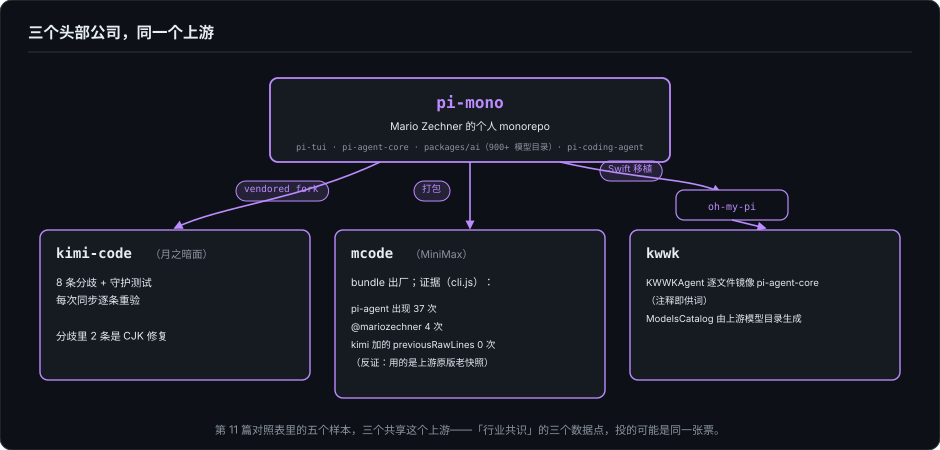
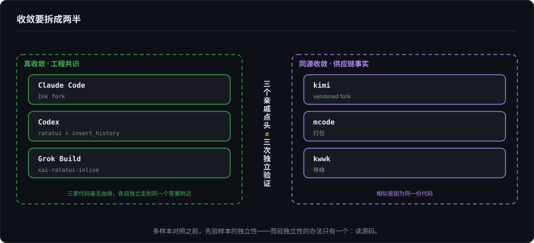

# Agent 时代的开发者界面（十三）：收敛的另一面——pi-mono 暗线与生态同源

> 系列第十三篇，第 11、12 篇的直接续篇。第 11 篇发现渲染所有权的分界线在四家头部产品里都成了开关，我把它当作"行业收敛"的证据写了下来。这一篇补另一半：我去取证 MiniMax 的 mcode，本想给对照表加第六个样本，结果在它的发布产物里 grep 出一串不属于 MiniMax 的名字。顺着查下去才知道，2026 年中这批看起来"各自收敛"的 Agent TUI，有相当一部分的相似另有来历——它们是同一个上游的下游。

---

## 一、第六个样本里，长着别人的名字

2026 年 8 月 18 日，MiniMax 把 Code TUI 正式公开：npm 包 `@minimax-ai/code@0.1.4`，命令 `mcode`。按这个系列的方法论——第 11 篇对 Grok 做过的那套——新样本到手先做发布产物取证：不读宣传，读字节。

先把这个包的成色摆清楚。MIT 协议，但没有源码仓库，没有 sourcemap，发布物是一个 23.3 MB 的单文件 `cli.js`，类名全部 mangled。属性名、字符串和注释残片仍然可读，足够做阵营判定——这叫"发布产物可检查"，它和"开源"之间隔着什么，第四节再说。

阵营判定本身没有意外：inline 派主屏差分，和第 12 篇拆过的 Kimi Code 主屏行为同源。`previousViewportTop` 出现 3 次，`clearOnShrink` 出现 2 次——pi-tui 主屏渲染器的内部标识符，第 12 篇的读者应该眼熟。

顺着这些标识符继续 grep，出来的东西开始不像 MiniMax 了：

| `cli.js` 里的字符串 | 出现次数 |
|---|---|
| `pi-agent` | 37 |
| `pi-coding-agent` | 2 |
| `mariozechner/pi` | 1 |
| `@mariozechner` | 4 |
| `@earendil-works` | 2 |

一家 MiniMax 的官方 CLI 里，出现次数最多的第三方名字是 `pi-agent`，37 次。npm 依赖恰好两项：`@vscode/ripgrep` 和 `@mariozechner/clipboard`——后者的 scope 正是 pi-mono 作者本人的 npm 账号。公开前一周（8 月 9 日）已有报道称 MiniMax Code 2.0 是 "Rebuilt on Pi Agent"。这三件事叠在一起，"借鉴了某个库"已经解释不了：这是整个 agent 底座带着出厂铭牌。

（`@earendil-works` 的两处引用归属我没有查到，如实记在这里。）

## 二、pi-mono 是什么

先交代我对它本体的了解程度：**本篇写作时我没有 pi-mono 的源码在手**（克隆两次都因网络中断失败）。对它结构的全部了解，来自三个下游仓库里的引用和再生成命令——这件事本身就是本文论点最好的注脚：一个我从未打开过的仓库，它的包结构被我完整重建了出来，因为三个下游把它暴露得干干净净。

pi-mono 是独立开发者 Mario Zechner（GitHub: badlogic）的 monorepo。从下游证据能重建出的骨架：

- **pi-tui**——TUI 框架，差分渲染。第 12 篇拆了一整篇的 Kimi 主屏渲染器，就是它的直系后代；
- **pi-agent-core**——agent 运行时（Agent 主循环、消息队列、事件类型）；
- **packages/ai**——模型目录，`models.generated.ts`，九百多个模型的登记簿；
- **pi-coding-agent**——建在以上部件上的 coding agent。

规模感可以从侧面掂一下：kwwk 从它生成的模型目录有 900+ 个模型条目，kimi fork 的 pi-tui 基线是上游 0.80.2——一个人维护的 monorepo，版本号已经迭代到 0.8x，被三家头部公司以三种方式消费。

## 三、三条血缘线

### 3.1 kimi-code：把 fork 的纪律写成文档

`packages/pi-tui` 是从上游 vendored 进来的 fork，`pi-tui/AGENTS.md` 开头就把身份交代了：基线是上游 0.80.2（commit `7859b0af`），不再走 pnpm patches，所有本地修复直接改源码。然后逐条列出与上游的 **8 处分歧**，每条带守护测试，并写明规矩——每次从上游同步后，8 条必须逐条重验，测试挂了就意味着本地分歧被上游覆盖丢失。

两处细节值得停下来。

第一，8 条分歧里有 2 条是 CJK 修复。第 1 条：`wordWrapLine` 的单字素递归保护——上游在 `maxWidth=1` 遇到 CJK 时会无限递归爆栈；第 6 条：`CjkBoundaryUrlTokenizer`——GFM autolink 会把紧跟 URL 的中文全角标点吸进链接地址。一家中国公司 fork 一个 TUI 框架，第一批不可回退的修复里有两处是中文。fork 的真实动因，写在分歧清单的类型分布里。

第二，第 5 条分歧（`previousRawLines`，逐帧行级缓存：引用没变的行直接复用上一帧的处理结果，"upstream has no such cache"）——这条标记是下面鉴定 mcode 血统的决定性证据。

还有一条自我修正的存档：AGENTS.md 明写这个 fork 曾经自己改过 viewport/scrollback 的渲染行为，后来整体回退、回归上游差分——第 12 篇引过的 CHANGELOG #1367 事故，在这里有了制度层的对应物。

顺带一提，`package.json` 的 `author` 字段如今写着 "Moonshot AI"，version 0.84.4；而血统的完整账本在 AGENTS.md 里。同一份代码，署名权流转，族谱自留。

### 3.2 mcode：上游原版，直接打包

有了 kimi fork 的分歧清单，mcode 的鉴定只剩一道对照题。

判定它在 inline 差分这一侧没有疑问（`previousViewportTop`、`clearOnShrink` 等 pi-tui 主屏标识符都在），问题是：它用的是 kimi 改过的版本，还是上游原版？

答案是原版，证据是一个反证：`previousRawLines` 出现 **0 次**。这个字段是 kimi fork 第 5 条分歧加的，上游没有——如果 mcode 打包的是 kimi 血统，它不可能没有这个标记。再往前追版本：`findAltScreenSearchMatches`、`wheelScrollLines`、`OSC 133` 也都是 0 次，说明内嵌的 pi-tui 早于上游加全屏搜索的那一批提交，是个偏老的快照。mcode 官方文档写支持 PgUp/PgDn 浏览历史，与这个快照的能力对不上——疑点记下待验，不影响血统结论。

于是"开源"的成色可以摊开说了：MIT 协议挂在包上，但没有源码仓库、没有 sourcemap、类名 mangle。合规上挑不出毛病，工程上它是可检查的，社区上它是不开放的。kimi 和 mcode 是头部公司消费同一个个人项目的两种姿势——一个把血统写成文档，一个把血统 mangle 进 bundle。

### 3.3 kwwk：最深的移植，最诚实的注释

kwwk（EYHN 的 Swift-native coding agent，第 12 篇对照表里缓解方案最全的那个）的血缘最深，注释也最坦白。

**agent 运行时是移植的。** `Sources/KWWKAgent/` 整个包在逐文件镜像 pi-agent-core，注释就是供词：`Agent.swift:166`"pi-agent-core's `Agent` class but with Swift-native concurrency semantics"；`PendingQueue.swift:5`"Matches pi-agent-core's `PendingMessageQueue`"；`AgentLoop.swift:125`"Mirrors pi-agent-core's `runAgentLoop`"；`AgentTypes.swift:365`"Mirrors pi-agent-core's `AgentEvent`"。连错误分类的排序都注明"Ordered like omp's classifier"。

**模型目录是生成的。** `ModelsCatalog.swift:3` 写得直白："Access to pi-mono's curated catalog of 900+ models"，再生成命令是 `swift run kwwk-generate-models /path/to/pi-mono/packages/ai/src/models.generated.ts`——上游路径硬编码在注释里。

**TUI 引擎是自己写的，但策略有出处。** 762 行的 `TUI.swift` 是独立实现（第 12 篇拆过它的七层决策树），可一旦到 resize 和回退这类"前人踩过坑"的地方，注释一路引用 omp（oh-my-pi，建在 pi 之上的社区封装层）：152 行引 omp 的 branch/rewind 处理（`chatContainer.clear()` + `renderInitialMessages({clearTerminalHistory: true})`）；313 行引"omp 在 resize 时擦除并重放整个 transcript"的行为；394 行写"exactly like omp's non-clearScrollback full paint (pi-tui emitFullPaint: ...)"——一条注释链穿了两层生态：kwwk → oh-my-pi → pi-tui。甚至 OAuth 流程也有从 oh-my-pi 移植的痕迹（`OAuthLogin.swift:602`"Ported from oh-my-pi's `zai.ts`"）。

把三条线放在一起，2026 年中的 Agent TUI 生态多了一层此前没人画出来的金字塔：

```
pi-mono（Mario Zechner，个人 monorepo）
├── pi-tui ──vendored fork──→ kimi-code（月之暗面，8 条分歧 + 守护测试）
├── pi-tui + pi-agent ──打包──→ mcode（MiniMax，bundle 出厂）
├── pi-agent-core ──Swift 移植──→ kwwk（KWWKAgent 逐文件镜像）
└── packages/ai 模型目录 ──生成──→ kwwk（ModelsCatalog，900+ 模型）
        └─ 中间层：oh-my-pi（omp），kwwk 的策略注释穿它引用 pi-tui
```



第 11 篇对照表里的五个样本，三个共享这个上游。

## 四、回到第 11 篇：收敛要拆成两半

第 11 篇的自我修正记录在案：我初稿把四家写成"收敛到 inline"，后来改成 2:2 记分牌 + 全员双模。现在要再修一层，这次修在"收敛"这个词本身。

inline 这一侧的相似，有两种成因，证据强度完全不同：

- **真收敛**：Claude Code（Ink fork）、Codex（ratatui + `insert_history`）、Grok Build（`xai-ratatui-inline`）。三家代码毫无血缘，各自独立走到同一个答案附近。这是工程共识的证据。
- **同源收敛**：kimi（vendored fork）、mcode（打包）、kwwk（移植）。相似是因为同一份代码。这是供应链的证据。



对"业界都这么做了"这类论断，两种成因的效力天差地别。三个亲戚点头，不等于三次独立验证——它们投的可能是同一张票。

这同时是对本系列方法论的修正。第 11 篇拿五家样本做对照，默认样本相互独立；这一篇证明默认不成立：mcode 作为"第六个独立样本"是假的，kwwk 也得拆开看——TUI 引擎是独立数据点（Swift 自研，注释自证策略出处），agent 运行时不是。**多样本对照之前，先验样本的独立性**；而验独立性的办法只有一个，还是读源码。界面行为相似的两家，底下的血统可以差出一个人的一整个 monorepo——这是"看起来一样的界面，底下的成本结构可以完全不同"（第 11 篇结尾）在生态维度的重演。

## 五、隐形中枢：个人 monorepo 的产业位

为什么被反复选中 pi-mono？顺着第 11 篇的框架看，答案不神秘：它小（TypeScript，可以整包 vendored）、它站在 inline 派（第 11 篇论证过的那条结构性拉力）、它的测试文化过硬（kimi 那套"分歧必须带守护测试"的制度，没有上游测试密度做地基是立不住的）。头部公司评估自研 vs 拿来主义的账，第 11 篇第六节算过一遍——个人项目恰好落在"便宜且不容易被改坏"的格子里。

值得多看一眼的是风险面。三家的关键路径共享一个单点上游：上游从 0.80 到 0.84 之间的任何破坏性改动，同时波及三家。kimi 的同步重验制度，本质上就是这份风险的显性化管理——他们比谁都清楚自己骑在谁的仓库上。而 mcode 和 kwwk 连这份管理都各有缺口：mcode 钉死在某个老快照上（升级要重新过一遍取证），kwwk 的镜像靠注释自觉对齐。

还有一个更冷的说法：当"行业共识"的三个数据点其实同出一个人的仓库，这个共识的证据强度要打折。它仍然是证据——说明这套设计至少被三家认为可用——但它更接近 left-pad 式的供应链事实，而不是三次独立的工程投票。分辨两者，界面上看不出来。

## 六、这张图上，我的引擎站在哪

最后把 ForgeLoopTUI 放回这张图上，说个私人的部分。

ForgeLoopTUI 最早的起点，是想模仿 kwwk。动手之后，在"已完成内容归谁记账"那条轴上分了岔：kwwk 选了 inline，我造出了全屏自管。当时觉得是走岔了——要模仿的东西没模仿成。放在血缘图上看，岔路反而是位置：独立实现的那一侧只剩 Claude Code、Codex、Grok Build，全部出自头部公司；一个无血统、Swift 原生、全屏自管的引擎，是这张图上稀有的独立数据点。

第 11 篇说分叉发生在所有权轴上。这一篇补一句：分叉之上还有血缘轴。个人项目在巨头生态里的活路，往往不在主路上，在血缘图的空格里。

## 七、收束

第 11 篇问"谁为已完成内容记账"，第 12 篇答"可以按生命周期分期"，这一篇的答案更平淡：先问这份代码是谁的。三篇连起来，"所有权"从引擎与终端的关系，延伸到了 fork 与上游的关系——你的渲染器记得每一行的账，但它的族谱决定了它的默认值、它的坑、它下一次升级时要重验的八件事。

下一篇回到自己的引擎：读完五份源码之后，ForgeLoopTUI 吸收 inline 派工程件的改造做到哪一步了——什么抄了，什么没抄，什么决定不抄。

---

*本文基于本地源码副本的实际阅读与发布产物取证：[kimi-code](https://github.com/MoonshotAI/kimi-code) `1e553fc`（2026-08-18，与第 12 篇同一 pin；`packages/pi-tui/package.json`、`packages/pi-tui/AGENTS.md`、`src/tui-main-screen.ts`）；[kwwk](https://github.com/EYHN/kwwk) `ae0771d`（2026-08-19；`Sources/KWWKCli/TUI.swift`、`Sources/KWWKAgent/*.swift`、`Sources/KWWKAI/ModelsCatalog.swift`、`Scripts/GenerateModelsCore/`）；mcode 为 `@minimax-ai/code@0.1.4` 发布产物取证（`cli.js`，23,321,152 字节，标记计数见文中表格）。pi-mono 本体未直接阅读——本文对其结构的了解全部来自上述三个下游的引用与再生成命令，这一点本身即文中论点的一部分。*
