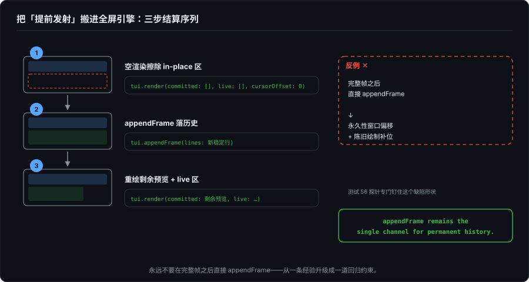
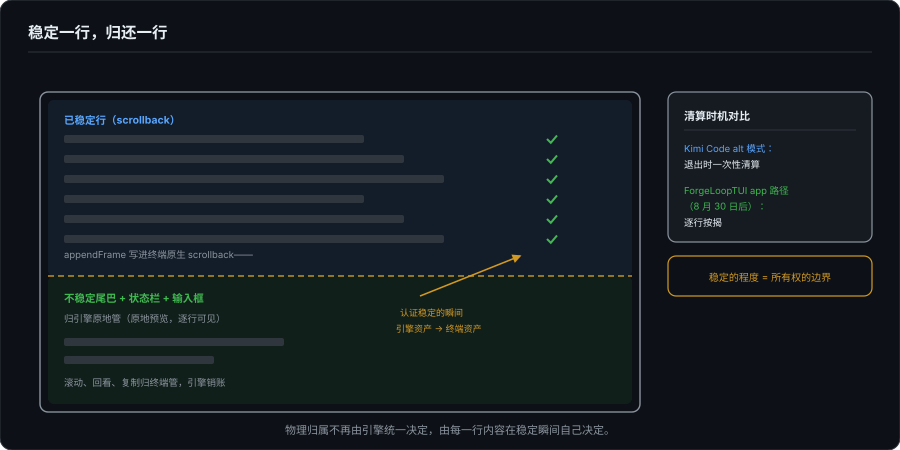

# 回到自己的引擎——ForgeLoopTUI 改造实录

> 系列第十四篇。第 11–13 篇拆完了别人的引擎：两派所有权、Kimi 的双模实现、pi-mono 血缘暗线。八月中的审计给 ForgeLoopTUI 开过一张七件套的"吸收清单"，把 kwwk 和 inline 派已经验证过的工程件搬过来。这一篇是两个月后的清点报告。先说结论：清单的执行情况说出来有点难堪，但清单外发生的一件事比整张清单都重要：为了修第 3 篇的"弹入"问题，我的引擎在默认应用路径上，往对面阵营走了一半。

---

## 一、先清点：七件清单，落地零件半

审计表原样重跑一遍（对照 `素材-forgelooptui-audit`，2026-08-19）：

| 工程件 | 审计判定 | 现状 |
|---|---|---|
| 无操作抑制 | ✅ 已有 | ✅ 不变 |
| suspend/resume 几何重置 | ✅ 已有 | ✅ 不变 |
| 渲染合并 | ❌ 缺 | ⚠️ 仍是半件：引擎里 `RenderLoop`（16ms 合并 + immediate 双优先级，2026 年 5 月就有）始终没接进流式路径，token 到达仍然直呼 `render()`，缺的从来是接线，不是零件 |
| DEC 2026 同步输出包帧 | ❌ 缺 | ❌ 未动 |
| SIGWINCH 事件化 + 去抖 | ❌ 缺（轮询） | ❌ 未动，仍每帧比对 `getTerminalSize()` |
| width-1 留列 | ❌ 缺 | ❌ 未动 |
| forceRepaint 逃生舱 | ⚠️ 半有 | ⚠️ 原样：有内部 fullRedraw 诊断，无公开 API |

那这两个月干了什么？8 月 28 日到 9 月 1 日，五天，61 个提交。清单之外的地方：Markdown 表格单元按词换行（三连修）、嵌套列表缩进保真、代码围栏标签泄漏、宽度歧义字符、括号粘贴模式、kitty 键盘协议、OSC 8 超链接、Python 高亮。再往后是这一篇的主角。

为什么清单没动，不是忘了。七件件件正确，但件件属于"引擎更对"；而这段时间用户可见的缺陷全在渲染质量和输入协议上，它们赢了排期。工程排期的真实顺序从来是缺陷在前、正确在后，这一点没什么可辩护的，记录在案。

## 二、清单外的那件事：把"提前发射"搬进全屏引擎

第 3 篇拆过全屏派流式 Markdown 的核心困境：Stable Prefix Cache 只在引擎认证"稳定"后才把行放进正式布局，于是流式观感是**整块内容在稳定后一次性弹入**。inline 派没有这个问题，它们不等稳定，内容到了就发射进 scrollback，反正发射即定型，视觉上永远是渐进生长。全屏派赢回了原地改写的能力，代价是丢掉了"逐行可见"。

8 月 30 日的 TASK-27/28 是对这个困境的一次正面强攻，做法是把 inline 派的核心策略搬进来：

**不稳定尾部预览。** 活跃流式块里，越过引擎认证稳定前缀的那些行（还没定型的尾巴），作为 `tui.render(committed:live:)` 的 committed 区参数**原地预览**，于是 Markdown 在流式期间逐行出现，不用等稳定后弹入。行一旦被引擎认证稳定，就离开预览、落进正式历史。

**三步结算序列。** 预览行转正的时刻是危险时刻：既要把新稳定行写进历史，又不能和历史区、预览区的既有内容打架。方案被钉成一个固定序列：

```
1. 空渲染擦除 in-place 区        tui.render(committed: [], live: [], cursorOffset: 0)
2. appendFrame 落历史            tui.appendFrame(lines: 新稳定行)
3. 重绘剩余预览 + live 区        tui.render(committed: 剩余预览, live: …)
```

并且立了铁律：**永远不要在完整帧之后直接 `appendFrame`**。



这条铁律有出处。TASK-27 是测试先行的，只写测试不改库。`CommittedPreviewAnchorTests` 造了一个预言机：`ScrollbackTerminal`，实现了真实终端语义（deferred wrap、宽字符、底部滚动入 scrollback，覆盖 TUI 输出的全部 ANSI 子集），每个 API 调用后断言屏幕与 scrollback 和"期望内容物理换行后的尾部"逐行一致。S1–S5 场景验证 erase→append→redraw 在各种组合下锚定正确；S6 是一个专门的探针，**故意钉住直连序列的缺陷形状**：满帧后直接 appendFrame，结果是永久性的窗口偏移加陈旧绘制补位。把"为什么要先擦"从一条经验升级成了一道回归约束。

还有一个归属细节值得记：`StreamingTranscriptAppendState`（维护"哪些行已落卷轴、哪些未结算"的增量状态机）放在 `Sources/ForgeLoopTUI/Transcript/`，在引擎里，不在示例 app 里。合流是引擎级的决定，app 只是消费者，现在有两个消费者：MinimalAIApp 和 dsh-tui，两者帧模式一致。

## 三、这件事在所有权坐标系里意味着什么

盘点一下新稳态。一条回复流式期间：不稳定尾巴 + 状态栏 + 输入框，归引擎原地管；行一旦稳定：`appendFrame` 写进**终端原生 scrollback**，从此滚动、回看、复制都是终端的事，引擎销账。

把这个状态放到第 12 篇那张三行所有权表里：

| 实现 | 会话期间 | 会话结束后 |
|---|---|---|
| Grok / Claude Code / Codex | 历史归终端 | 归终端 |
| ForgeLoopTUI（第 12 篇时的判断） | 历史归引擎 | 无干净归档 |
| Kimi Code alt 模式 | 历史归引擎 | 归还终端 |
| **ForgeLoopTUI app 路径（8 月 30 日后）** | **稳定一行，归还一行** | **已在 scrollback** |

比 Kimi 的"退出时归还"更早：不是终态一次性清算，是逐行按揭。第 12 篇的结论是"所有权可以按生命周期分期缴"，现在"会话期间"内部也可以分期了，**稳定的程度就是所有权的边界**：每行内容在它被认证稳定的那个瞬间，从引擎资产变成终端资产。



但要说清楚：引擎没有换阵营。窗口化全帧 API 原样保留，AppKit 桥、全屏路径都在，另一个 app 仍然可以选"历史全归引擎"。引擎做的事是提供了两种语义（原地帧 + 发射通道）让 app 自选，这恰好是八月审计里"问题 2"（历史持久化路径待确认，实为 API 设计问题）的答案，也顺带回答了当时挂着的 Phase 0 决策 A：要不要提供 kwwk 式 `commit(_:)` 一等沉降语义？实践给出的答案是**已经有了**，`appendFrame` 就是 commit 通道，差的只是把它作为一等语义写进文档和 README 的选择指引。挂了两个月的问题，被一次修 bug 顺手回答了。

## 四、新税种：混合模式的账单

第 11 篇推导过 inline 派的税单。混合模式不免税，而且发明了一个新税种。9 月 1 日的 TASK-37 是它的第一张账单。

**事故**：`inlineAnchor` 超屏回退路径复用了 `renderLegacy`：`ESC[2J` 清屏后从 home 重写整帧。当 committed+live 超过终端高度，重写本身就会滚屏，把帧的顶部行顶进 scrollback；而流式预览是每个 chunk 重渲染一次，于是**同一张表格在 scrollback 里落地了几十次，连原始的管道符都在**。更糟的是 iTerm2 风格终端上，擦除帧的 ED2 会把清掉的内容存一份进 scrollback，每个 chunk 存一份上一次预览的副本。第 3 篇的"表格地狱"以指数形态在 scrollback 里重现。

**修复**的原则比细节重要：回退路径改为只原地渲染帧的**底部 terminalHeight 物理行**：CUP 到窗口原点 + `ESC[0J`（局部擦除，无 scrollback 语义）、整行窗口选择、到底行后不再尾随换行。它永不滚屏，所以瞬态预览永远到不了 scrollback。commit message 里有一句话值得原文引用：

> appendFrame remains the single channel for permanent history.

（appendFrame 是永久历史的唯一通道。）这就是 inline 派"发射即定型"纪律在混合模式里的对应物，只不过它管的方向反过来：inline 派用它约束"不许碰已发射的历史"，这里用它约束"不许从别的门进历史"。同一句纪律，两种所有制下各管一边。

配套的是一笔记账：`unretainedAppendedRows`，appendFrame 写下、但还没被任何 retained 帧接管的光标行数。有了它，erase→append→redraw 序列里万一发生超屏重绘，重绘从新追加历史的**下方**开画，而不是从 home 把刚 append 的行覆盖掉。回归测试的口径也很硬：118×12 终端、7 字符 chunk、帧模式与两个消费者 app 完全一致；断言整场流式期间 scrollback 保持为空、`| --- |` 永不出现、`Kubernetes` 哨兵词恰好出现一次。

这个事故值得单独定性：它不是第 11 篇 5.2（resize 核平误伤 scrollback）的复读，诱因不是 resize，是**回退路径 × 混合所有权**的乘积。单一所有权下不存在这类 bug：历史全归终端时没有"回退重写"，历史全归引擎时没有"scrollback 污染"。第 12 篇说每种所有权都要缴税；这里补一条：**分期缴税本身也要缴税**，两条通道并存的那一刻，就要为"别让内容走错门"付出工程。

## 五、收束

两个月，五天里的 61 个提交，七件清单落了半件，但引擎完成了一次跨阵营的半程：全屏自管的引擎，长出了一条逐行归还 scrollback 的通道，配上了一个真实终端语义的预言机、一道"唯一之门"的纪律、和一笔跨通道的记账。

第 11 篇结尾说过，ForgeLoopTUI 的 committed 区在语义上已经是 append-only，和 inline 派的 scrollback"只差最后一步——物理上还归不归我管"。这一步现在有了答案的形状：**物理归属不再由引擎统一决定，由每一行内容在稳定瞬间自己决定**。所有权从引擎的出厂设置，变成了内容级的调度表。

下一篇（第 15 篇）把这套账本带出终端：GUI 和移动端没有 scrollback 这回事，没有免费的历史基础设施，每一行从诞生起就必须有人管。FlowDown 是那边的样本。

---

*本文基于 [ForgeLoopTUI](https://github.com/BiBoyang/ForgeLoopTUI) 本地仓库的实际阅读：HEAD `f99367b`（2026-09-01），覆盖 2026-08-28 至 09-01 的 61 个提交；关键证据为 `Examples/MinimalAIApp/Sources/MinimalAIApp/main.swift`（render() 的预览切片与三步结算）、`Sources/ForgeLoopTUI/Transcript/StreamingTranscriptAppendState.swift`、`Tests/ForgeLoopTUITests/Runtime/CommittedPreviewAnchorTests.swift`（ScrollbackTerminal 预言机与 S1–S6）、`Sources/ForgeLoopTUI/Runtime/TUIRuntime.swift`（TASK-37 的 unretainedAppendedRows 与底窗回退）、`Sources/ForgeLoopTUI/Runtime/RenderLoop.swift`（2026-05-07 引入的 16ms 调度器）。性能类实测数据（帧字节数、resize 耗用对比）尚未采集，本篇以行为学证据（oracle 断言）替代，数据缺口留待补记。*
