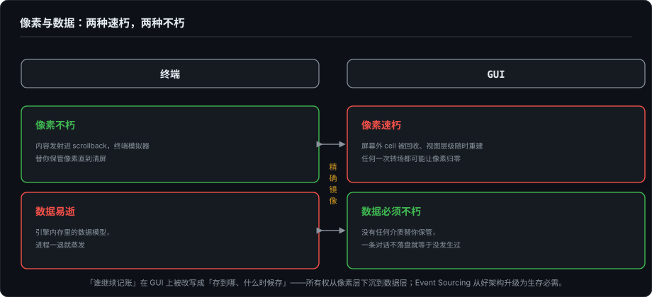
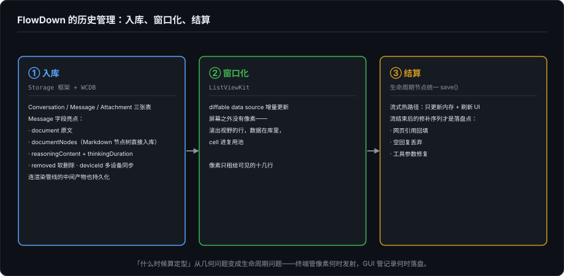
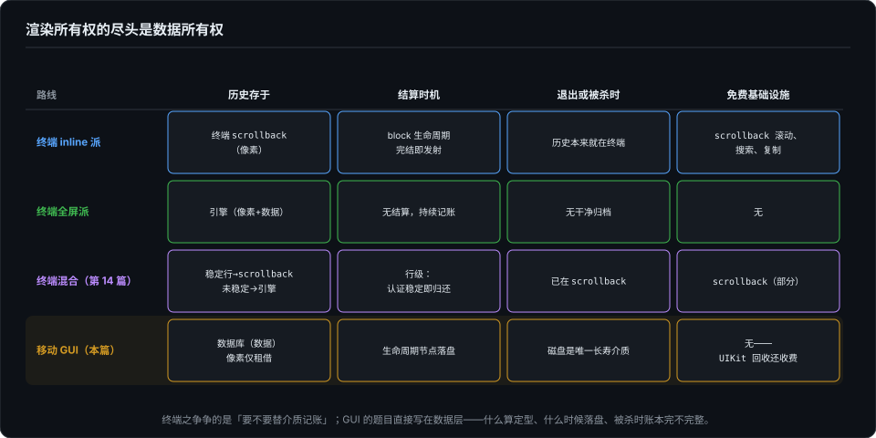

# Agent 时代的开发者界面（十五）：终端之外——渲染所有权模型在 GUI 与移动端的映射

> 系列第十五篇，"所有权"四部曲的收官。第 11 篇划出全屏自管与 inline 两条路线，第 12 篇讲双模实现，第 14 篇讲我自己的引擎半程跨界；这一篇把模型带出终端。终端之外的世界——macOS 的窗口、iPhone 的屏幕——没有 scrollback 这回事。这篇讲：当介质不再提供任何免费的历史基础设施时，第 11 篇那套账本怎么记。样本是 FlowDown，一个原生 iOS Agent 客户端。

---

## 一、GUI 世界里，inline 派不存在

第 11 篇两派成立有个前提：终端这个介质提供了两个可归属的资产池——你自己管理的帧，和终端的原生 scrollback。inline 派的全部精髓，是**把历史托付给介质**：发射进 scrollback，从此滚动、搜索、复制都归终端管，引擎销账。

GUI 没有这个托付对象。窗口是你画的，滚动区是你实现的，系统递给你一块随时会被回收的画布，仅此而已。你无处发射——没有一个"终端"站在你背后替你保存任何东西。

所以第 11 篇那张 2:2 的记分牌，在 GUI 世界塌缩成一行：全屏自管是出厂设定，别无分店。Grok Build 默认形态那套"应用自管 scrollback"，在 GUI 语境里就是唯一解。

但要说清楚：所有权问题没有消失。它只是换了一层皮。

## 二、像素与数据：两种速朽，两种不朽

把两个介质摆在一起看，会看到一组精确的镜像。

**终端：像素不朽，数据易逝。** 一行内容发射进 scrollback，终端模拟器替你保管它的像素，直到用户清屏；而引擎内存里的数据模型，进程一退就蒸发。第 12 篇记过 ForgeLoopTUI 的窘境正是这个：历史活在屏幕上，内存模型随进程蒸发，退出后没有干净归档。

**GUI：像素速朽，数据必须不朽。** 屏幕外的 cell 被回收，视图层级随时重建，前后台切换、内存警告、任何一次转场都可能让像素归零；而数据没有任何介质替你保管——你必须自己建库，一条对话不落盘，就等于没发生过。

于是第 11 篇的那个问题——"一个 block 完成之后，谁继续为它记账"——在 GUI 上被改写成另一个问题：**已完成的内容存到哪、什么时候存**。所有权从像素层下沉到了数据层。第 5 篇讲 Event Sourcing 时说事件流是"好架构"；在 GUI 端它升级了：不是好架构，是生存必需——没有那份数据，连"刚才聊了什么"都无处可查。

## 三、FlowDown 的账本

空谈不如看账。FlowDown 的历史管理拆成三件：入库、窗口化、结算。三件都有源码。

### 3.1 入库：连解析产物都要持久化

FlowDown 的存储在独立框架 `Frameworks/Storage`，底座是 WCDB（微信开源的 SQLite 封装，`wcdb-spm-prebuilt`）。三张核心表：`Conversation`、`Message`、`Attachment`。

`Message` 的字段设计值得逐条看（`Storage/Tables/Message.swift`）：

- `document: String`——消息原文；
- `documentNodes: [MarkdownBlockNode]`——**解析后的 Markdown 节点树，直接入库**。Storage 框架为此依赖了 MarkdownView 的解析器包。也就是说，不光事实要持久化，渲染管线的中间产物也持久化了；
- `reasoningContent` + `thinkingDuration` + `isThinkingFold`——思考内容和它的展示状态一起记；
- `removed: Bool`、`modified: Date`、`deviceId`——软删除标记、修改时间戳、多设备同步字段。

对照终端：终端里历史可以只以像素形式存在（数据模型可有可无，Grok 的 minimal 模式就只留够重印用的）；FlowDown 这边正相反，像素一张都不存，全部资产以记录形式活着。

### 3.2 窗口化：像素只租给可见的十几行

聊天主界面 `MessageListView` 建在 ListViewKit 上：`ListViewDiffableDataSource<Entry>` 做增量更新，配一条专用队列（`userInteractive` QoS）串行化 UI 变更，订阅 `session.messagesDidChange` 驱动整条管线。

屏幕之外没有像素。滚出视野的消息行，数据还在 `messages` 数组和 WCDB 里，cell 本体已经进了复用池。终端里"历史以像素形式活在 scrollback"，GUI 里"历史以记录形式活在库里，像素只租给可见的那十几行"——第 11 篇全屏自管派"引擎为每一行持续记账"的图景，在 GUI 上由框架代持了：UIKit 管回收，你的 diffable data source 管账目。

### 3.3 结算时机：几何问题的生命周期版本

第 11 篇说过 inline 派的关键转变："什么时候算定型"从几何问题变成了生命周期问题。这句话在 GUI 换了个对象重新成立——定型问题变成了**落盘节奏**。

FlowDown 的实际节奏（`ConversationSession` 与 `Pipeline/Execute/`）：

- 消息建档即入库；
- 流式热路径上，chunk 到达只更新内存里的消息对象（`message.update(\.document, ...)`）并刷新 UI 投影（`requestUpdate(view:)`），每 chunk 是否写库不在热路径上；
- 流结束后的**修补序列**才是结算点：网页引用回填（`fixWebReferenceIfPossible`）、空回复静默丢弃（`discard`）、工具调用参数修复（`ToolCallArgumentRepair`）——修补完，在生命周期节点统一 `save()`（`save()` 就是 `sdb.messagePut(messages:)` 批量落库，调用点分布在 CRUD、压缩、重写和管线末端）。

"几何问题变生命周期问题"，在终端管的是像素何时发射，在 GUI 管的是记录何时落盘——同一原则，两层实现。

## 四、租借投影与"归还"的变形

第 12 篇给 Kimi Code alt 模式写过一句"生前归自己，死后归终端"。这句话在 iOS 上的变形，FlowDown 给了两个现成样本。

**运行期的租借投影。** 流式输出每收到新文本，`ConversationSessionManager.countIncomingTokens` 累计增量，喂给 Live Activity——锁屏和灵动岛上有一个实时跳动的字数投影。这是把投影**租给锁屏**一块：运行期存在，会话结束收回。第 9 篇说"每个端只消费自己适合的事件子集"，锁屏消费的是最极端的子集：一个字数。

**身后的归档。** iOS 应用没有"退出仪式"可依赖——进程随时可能被杀，不会有 goodbye 回调。Kimi alt 退出时把历史打印回 scrollback，那份"归还"之所以可能，是因为终端这个介质还在；iOS 上唯一的长寿介质是磁盘（和云），所以"归还"只能变形为"落盘"，而且必须随时可发生。持久化在移动端不是功能项，是生存方式。被杀那一刻账本是否完整，取决于上一个结算点落在哪里——这正是基建系列要展开的话题。

顺带一提，冷启动的 `refreshContentsFromDatabase` 就是 GUI 版的"追平"：`listMessages` 全量读库重放，投影从事实源重建。基建系列里要用快照 + 尾部增量才能做对的那道题，本地 SQLite 快到不用优化——动作是同一个动作，成本差了几个量级。

## 五、四部曲合拢

四篇的所有权问题放进一张表：

| | 历史存于 | 结算时机 | 退出/被杀时 | 免费基础设施 |
|---|---|---|---|---|
| 终端 inline 派 | 终端 scrollback（像素） | block 生命周期完结即发射 | 历史本来就在终端 | scrollback 滚动/搜索/复制 |
| 终端全屏派 | 引擎（像素+数据） | 无结算，持续记账 | 无干净归档（第 12 篇） | 无 |
| 终端混合（14 篇） | 稳定行→scrollback，未稳定→引擎 | 行级：认证稳定即归还 | 已在 scrollback | scrollback（部分） |
| 移动 GUI（本篇） | 数据库（数据），像素仅租借 | 生命周期节点落盘 | 磁盘是唯一长寿介质 | 无——UIKit 回收还是收费的 |

四行连起来读：终端之争争的是"要不要替介质记账"，答案是开关和分期；GUI 没有这场争论，它的题目直接写在数据层——什么算定型、什么时候落盘、被杀时账本完不完整。渲染所有权的尽头是数据所有权，也就是第 5 篇那条事件流的必然形态。

### 再往高一层：两种介质各白送什么

四部曲记的是"历史"这一笔账。把镜头拉远，两种介质的差别其实是同一个结构的重复：**每种介质都白送一些东西，同时对另一些东西收重税；没有一方全面优越，只是白送的东西互补。**

| 维度 | 终端：白送 / 征税 | GUI：白送 / 征税 |
|---|---|---|
| 已发射的历史 | 白送：进 scrollback 即归档，进程死了也在 | 征税：像素随进程死，落盘是生存必需（本篇） |
| 遮挡与切走再回来 | 征税：重连即失忆，全屏应用要整页重绘 | 白送：合成器持有像素，不用应用重画 |
| 分发与可达 | 白送：SSH、tmux、CI、管道，任何机器 | 征税：安装包、跨端、版本兼容 |
| 输入带宽 | 征税：只有字节流，行级采纳、并排 diff 全要手搓 | 白送：命中测试、多点触控、拖拽 |
| 表达力 | 征税：等宽格子，图片、表格、文件预览几乎不可能 | 白送：任意像素、排版、动画、多模态 |
| 信任 | 白送：文本即真相，命令可复现、可管道审计 | 征税：界面可藏可换，信任要靠沙箱与同源策略（第 16 篇） |

这张表是对称的：终端白送"过去"（已发射的历史）和"信任"（文本透明），GUI 白送"现在"（合成器持有的结构）和"带宽"（输入与表达）。它也是第 1 篇"不是低配版、而是不同介质投影"那句话的完整清单——差异不在架构：事件树、投影、diff、审批、压缩、回放，两种界面是同一套内核的两个后端（Ink 在终端上长出声明式，UIKit 手写 frame 在 GUI 上停在命令式，楼层可以互换）；差异在各端要补缴的介质税。

这张表还有一条没画出来的横切轴：上面"终端/GUI"分的是契约，UI 平台本身跑在哪是另一个维度——原生、浏览器，或 Electron 这种双契约并存的容器（DOM 做界面，node-pty 另开一条真实终端）。同样标着"GUI"，浏览器一格拿不到本地 shell 环境，但多端同步和"服务端即事实源"是白送的；标着"终端"的 xterm.js 跑在浏览器里，TUI 应用的契约一字不变，agent 人却已经在远端机器上。第 9 篇用两轴四格给六个端定了坐标，基建系列则是"事实在服务端"那一格的完整展开。

这也补上了第 1 篇补记那个判断的机制。agent 早期的需求结构——一维 token 流、文本工具链、处处可审计——恰好压在终端白送的格子上；而长会话、并行多 agent、行级审批、checkpoint 回放、手机伴随端（第 10、17–20 篇与基建系列），每一项都在消费 GUI 白送的东西。**不是 GUI 更好所以赢，是需求结构越过了两边税收结构的交叉点。** 选界面从来不是选范式，是在 agent 生命周期的不同阶段，选哪边的税你更愿意缴。

这也是本系列正文在这个系列里的终点站：界面的账本记完了，下一程换轨——事件流离开本地之后的命运：断线、重连、多服务器，以及一条 SSE 中断之后，谁还记得它讲到哪了。

---

*本文基于 [FlowDown](https://github.com/Lakr233/FlowDown) 本地源码副本的实际阅读（commit `b2cecfd6`，2026-05-15）：`Frameworks/Storage/Package.swift`（WCDB 与 MarkdownParser 依赖）、`FlowDown/Backend/Conversation/Pipeline/ConversationSession.swift`（save/update/discard）、`Pipeline/Execute/ConversationSession+ExecuteOnce.swift`（流式修补序列）、`Pipeline/ConversationSessionManager.swift`（countIncomingTokens 与 Live Activity）、`FlowDown/Interface/MessageListView/MessageListView.swift`（ListViewKit 接线）。数据模型部分参照作者本人的既有分析笔记《FlowDown 对话上下文保存机制分析》并与源码核对。流式热路径"每 chunk 不写库"的表述基于调用链阅读，未做逐帧取证，以此口径为准。*
