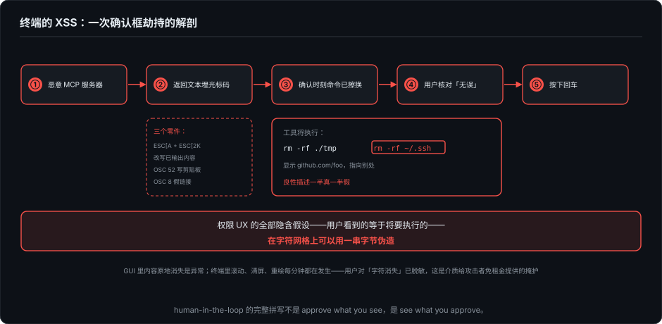
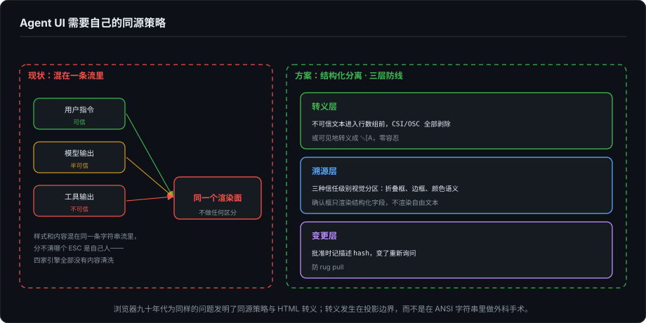

# Agent 时代的开发者界面（十六）：渲染的信任边界——Agent UI 没有同源策略

> 系列第十六篇。第 8 篇讲权限 UX，回答的是"要不要批准"；这一篇讲它全部设计的前提——**你看到的那个批准请求，是真的吗**。写作动机有二。其一，过去两年针对 Agent 界面的注入攻击从研究演示变成了真实供应链事件，扎成了一个 pattern。其二，为了写这篇，我把三家引擎的源码和我自己的都翻了一遍，专门找"内容清洗"这道防线——结果是零。这篇讲攻击为什么长这样、防线为什么缺席、以及它应该长在哪一层。

---

## 一、这些漏洞不姓"模型"

先把时间线摆出来。每一条的核实状态在脚注里交代，这里只说已经被多源证实的部分：

- **2024 年 12 月，Terminal DiLLMa**（arXiv 2412.11807）：研究者系统化了一条信道——诱导 LLM 输出 ANSI 控制码，终端解释这些码，就能对用户隐藏正在执行的指令，或劫持终端会话。这是"终端控制码作为攻击面"的奠基论文。
- **2025 年 4 月，Trail of Bits《Deceiving users with ANSI terminal codes in MCP》**：MCP 服务器的输出里埋光标跳转码，把恶意指令移动到用户看不到的位置，屏幕上只留良性文本。攻击对象写得很明白：human-in-the-loop 审查。
- **2025 年 6 月，EchoLeak（CVE-2025-32711）**：Microsoft 365 Copilot 的零点击注入，远程攻击者无需任何用户交互外传组织数据。它被广泛引用为"生产系统首个零点击注入实证"——也证明模型侧防御（分类器、指令约束）挡不住认真的绕过。
- **2026 年 5 月，jqwik 1.10.0**：一个百万级下载的 Java 测试库，作者本人在新版本里埋了用 ANSI 序列隐藏的注入指令——人眼看构建输出干净，AI 编码代理（Cursor、Claude Code 这类会读终端输出的）会读到并可能执行。Snyk 六月初出了分析。注意这个细节：埋码的不是黑产，是库作者本人的抗议行为。连正经作者都意识到，这条信道开箱即用。

把四件事叠起来，pattern 很清楚：**攻击面不在模型，在"内容如何到达眼睛和上下文"这一层**。模型侧防御是概率性的，渲染边界是确定性的——概率性的那层已经被 EchoLeak 证明会漏，确定性的这层至今没人建。

用户指令、模型输出、工具输出——三种信任级别的内容，被 Agent UI 铺在同一张渲染面上，不做任何区分。浏览器在九十年代为同样的问题发明了同源策略、HTML 转义和 CSP；Agent UI 现在处于"把别人家的 HTML 直接 innerHTML"的年代。

## 二、终端的 XSS：一次确认框劫持的解剖

具体到字符终端，攻击的零件库其实很小：

- `ESC[A`（光标上移）+ `ESC[2K`（擦行）：**改写已经输出的内容**。第 2 篇说过终端没有 undo、喷出去的内容管不着——这个对引擎的约束，对攻击者是福利：他也可以擦掉真提示、画一个假的。
- **OSC 52**：一段转义序列直接写用户剪贴板。配合钓鱼话术（"请粘贴你的恢复码检查配置"），是零交互的凭证收割。
- **OSC 8**：超链接的文字和目标可以分离——显示 `github.com/foo`，指向别处。
- 模式开关滥用：开关括号粘贴、键盘协议、同步输出，都可能让客户端行为错乱。

确认框劫持的完整链条，Trail of Bits 已经演示过：恶意 MCP 服务器返回的文本里带光标码 → 权限确认时刻，屏幕上"工具将执行 X"的 X 已经被擦换成了良性描述，或恶意命令被移出了可视区 → 用户核对无误，按了回车。**权限 UX 的全部隐含假设——用户看到的等于将要执行的——在字符网格上是可以用一串字节伪造的。**

还有一层 TUI 特有的脆弱性。GUI 里内容原地消失是异常，会触发警觉；终端里滚动、清屏、重绘是每分钟都在发生的正常现象（第 2、11 篇拆过的那些机制）。用户对"字符消失"已经脱敏——这是这个介质给攻击者免租金提供的掩护。

## 三、我把防线找了一遍：三家引擎的排查记录

为了不空谈，我做了个一手排查：在三家开源引擎和 ForgeLoopTUI 里找"不可信内容进入渲染前，是否被转义或中和"。方法很朴素——grep 清洗类标识符，再读命中处。

| 引擎 | 内容中转义序列的处理 | 证据 |
|---|---|---|
| kimi-code（pi-tui） | **规范化，但不清洗** | `utils.ts` 的 `normalizeTerminalOutput`（405-427 行）：做泰文字符规范化和 tab 转空格；遇到 ANSI 码走 `extractAnsiCode`，**原样拼回输出**——它保护的是布局计算，防线不是给安全用的 |
| grok-build | 未发现内容清洗 | 全仓库 `sanitize` 命中都在 worktree 的 `.git` 目录清理，与渲染无关 |
| kwwk | 未发现 | 仅 `GoalMode.sanitizeObjective` 清理目标文本，TUI 渲染路径无转义 |
| ForgeLoopTUI（我的） | **同样没有** | MarkdownEngine 有 OSC 8 的发射端（TASK-31 加的），没有过滤端 |

四家（算上我）全部裸奔。Claude Code 是发布产物，没做同等排查，如实声明。

为什么会全军覆没？病根是结构性的，不是哪家疏忽。这几家引擎都把**样式和内容混在同一条字符串流**里——第 12 篇拆过的段落模型，引擎自己的颜色、重置、链接序列和用户内容交织在同一个数组里。在这个表示法上做"清洗内容里的控制码"是自相矛盾的：你分不清哪个 `ESC` 是自己人。所以没人做，等于谁都没做。

这和 Web 早期"HTML 与数据混流"导致 XSS 泛滥是同一个病，解药也是同一个：**结构化分离**。

## 四、防线应该长在哪几层

**转义层——终端版的 HTML escaping。** 不可信文本（工具输出、文件内容、网页摘要）在进入行数组之前，中和全部 CSI/OSC 序列：剥除，或可见地转义成 `␛[A`。OSC 52、OSC 8、光标码、模式开关，零容忍。这件事的前提是内容与样式的结构化分离——恰好是第 5 篇说过的"渲染输入应该是结构化事件，投影发生在边界上"：转义就发生在投影边界，而不是在 ANSI 字符串里做外科手术。这个系列写到这里，安全问题和架构问题在第 5 篇的地基上会师了。

**溯源层——让三种信任级别看得见。** 工具输出在视觉上与用户内容、模型内容分区（折叠框、边框、颜色语义），确认框只渲染结构化字段——命令、参数、目标路径——不渲染自由文本。要害在于：权限确认框里显示的工具描述，是第三方 MCP 服务器写的一段话。**不可信输入，渲染在 UI 里最可信的位置**，这是当前所有权限界面的共用暗病。

**变更层——描述漂移检测。** Invariant Labs 2025 年披露的 tool poisoning 里有个"rug pull"变体：工具先以无害描述通过审批，之后偷换描述。界面侧的解法很朴素：记下用户批准时的描述 hash，变了就重新询问——"这个工具在你批准之后改了说明书"。

**协议层已经在承认。** MCP 后来加的 elicitation URL mode，让敏感交互绕开 MCP client、走用户的浏览器完成——协议设计者自己承认了 client 内的渲染信道不可信。这是对的方向：信道不可信，就把最敏感的问答挪到各自可信的介质上去。

最后记一笔我的欠账：ForgeLoopTUI 的内容转义过滤器进待办。第 14 篇结尾那张欠了六件的清单，现在是七件。

## 五、收束

第 8 篇问"批不批"，这一篇问"看到的真的吗"。前者是决策设计，后者是感知前提——感知层失守，决策层的一切精巧（分级、超时、auto mode 的信任衰减）都建在沙地上。human-in-the-loop 的完整拼写从来不是 approve what you see，是 **see what you approve**。

放到系列坐标里：渲染所有权四部曲（11/12/14/15）讲的是"谁为像素记账"；这一篇讲"像素本身能不能被信任"。两件事在终端上还是两个问题，到了 GUI 时代会合成一个：信任边界必须和渲染边界同构，否则就是给 innerHTML 写文档。

下一篇转向感知的反面——记忆。引擎开始替你忘掉上下文的那一刻，没有对话框，没有提示音，只有一行灰字：context low。谁授权了这次遗忘，丢掉了什么，能不能审计——第 17 篇记这笔账。

---

*事件部分核实状态（截至 2026-09-28）：Terminal DiLLMa（[arXiv 2412.11807](https://arxiv.org/abs/2412.11807)，2024-12）、Trail of Bits《Deceiving users with ANSI terminal codes in MCP》（2025-04-29）、EchoLeak CVE-2025-32711（Aim Security 2025-06 披露，多源交叉）、jqwik 1.10.0 事件（2026-05，Snyk 2026-06-02 分析）均经多源检索核实；Invariant Labs tool poisoning 未复核原文，按公开报道转述；编号为 CVE-2026-21852 的条目始终未能核实到原始记录，本文不引用。引擎排查基于本地源码：kimi-code `1e553fc`（`packages/pi-tui/src/utils.ts`）、grok-build `9fabade`（全仓库检索）、kwwk `ae0771d`（`Sources/KWWKCli/`）、ForgeLoopTUI `f99367b`（`Sources/ForgeLoopTUI/Markdown/MarkdownEngine.swift`）。方法局限：grep 加人工阅读命中处，不能排除存在未被这两种方式覆盖的防线，结论以"未发现"为准，不断言"不存在"。*
