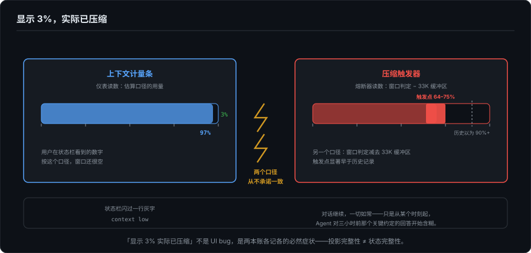
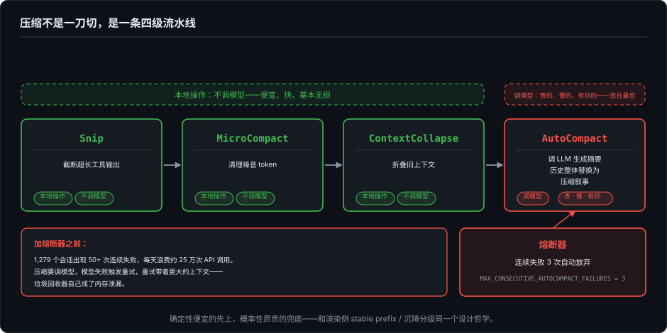
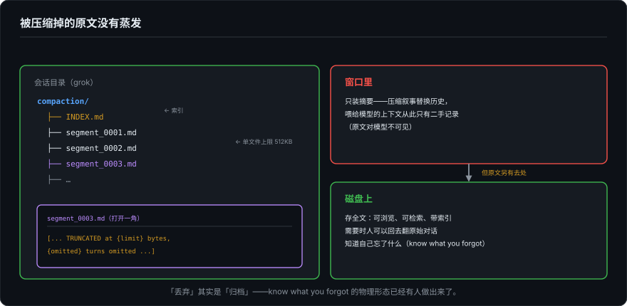

# 上下文账本——Agent 唯一的内存，和它的 GC

> 系列第十七篇，"所有权"线的收尾。11/12 讲像素的账（渲染所有权），15 讲数据的账（GUI 端必须自己持久化），16 讲像素的真（信任边界）；这一篇记最后一本账：**状态的所有权**。上下文窗口是 Agent 唯一的内存，而它的垃圾回收（自动压缩）是无提示、有损、事后不可申诉的。这篇先看用户看到的遗忘，再下到引擎层看各家怎么记账，最后回答一个问题：这笔账，用户有没有权利查。

---

## 一、一次没有对话框的遗忘

用户视角的自动压缩是这样的：状态栏闪过一行灰字 context low，对话继续，一切如常，只是从某个时刻起，Agent 对三小时前那个关键约定的回答开始含糊。没有对话框，没有确认，没有"本次丢弃了哪些内容"的清单。**程序没有崩，它只是忘了你为什么雇它。**

比遗忘本身更值得拆的是那个计量条。第 6 篇 3.3 节讲过它有三层麻烦（滞后值 vs 估算值、压缩后的非单调回落、预警的产品决策）；今年的公开材料把第四层也暴露了：Claude Code 为自动压缩保留了约 33K token 的缓冲区（从更早的 45K 降下来），触发点因此显著早于历史，有分析认为在 64–75% 而非早期的 90%+；GitHub 上有 2026 年 6 月的 issue 标题就叫 "Auto compact does not trigger at 100% context"。

把这些摆在一起会看到一个结构性事实：**仪表和熔断器各读各的表**。计量条显示的是一个估算口径的用量，触发压缩的是另一个口径（窗口判定减缓冲区），两者从不承诺一致，"显示 3% 实际已压缩"这类报告不是 UI bug，是两本账各记各的必然症状。

第 5 篇的投影理论在这里遇到它的反面案例：事件流的投影是完整的：tool.started、tool.finished、file.changed，条条在案，回放无损；但**状态**的投影被静默替换了。投影完整性不等于状态完整性。事件流记得 Agent 做过什么，窗口里装的已经是一份改写过的记忆。

## 二、引擎账：四级流水线与那行熔断注释

把 Claude Code 的引擎侧摊开（泄露源码的多家交叉分析，出处见脚注），会发现它的压缩不是一刀切，是一条四级流水线：

**Snip → MicroCompact → ContextCollapse → AutoCompact。**

前三级是本地操作，不调模型：Snip 截断超长工具输出，MicroCompact 清理噪音 token，ContextCollapse 折叠旧上下文：便宜、快、基本无损。只有最后一级 AutoCompact 调 LLM 生成摘要，把历史整体替换成压缩叙事：贵的、慢的、有损的，放在最后。这个分级和渲染侧的 stable prefix / 沉降分级（第 3、14 篇）是同一个设计哲学：确定性便宜的先上，概率性昂贵的兜底。

流水线自己也有防线：连续失败 3 次自动压缩就放弃（`MAX_CONSECUTIVE_AUTOCOMPACT_FAILURES = 3`）。为什么要防它？泄露源码里的注释给出了数字：加熔断之前，曾有 **1,279 个会话出现 50 次以上连续失败，每天浪费约 25 万次 API 调用**。失败循环的机理值得一提：压缩本身要调模型，模型失败触发重试，重试带着一个更大的上下文，垃圾回收器自己成了内存泄漏。这行注释是"压缩是分布式系统问题"的最好证词。

## 三、别家在怎么做账

批评"静默丢失"很容易，但只盯着一家会错过全貌。我把本地能查的三家实现翻了一遍，结论是：**引擎账家家都记，差别大得惊人的是账本给谁看**。

### 3.1 kwwk：压缩有自己的渲染器和预算表

kwwk 的压缩是三个文件的正经子系统：`AgentContextCompactor`、`CompactionFactsExtractor`、`CompactionRecapRenderer`。两处设计值得抄录：

一是配置全参数化且默认值全公开：最少 4 条消息才可压缩、工具输出 4000 字符上限、摘要目标 900 词、保留最近 20,000 token、单条消息 12K/思考 8K/工具参数 4K 字节上限、恢复比例、最大摘要尝试次数，一张完整的预算表，不是黑箱数字。

二是 `CompactionRecapRenderer` 的头部注释，写了一句同行很少想到要防的事：摘要的各组成部分（历史、本轮上下文、文件事实、运行中任务）**从同一份 token 预算里按权重支取（6:3:2:…），为的是辅助账本不能悄悄把替换物做得比规划者预留的更大**。翻译一下：这家防的是"压缩摘要自己撑爆窗口"，第二节那个失败循环的另一种形态，被预算表在事前管住了。另外它还有 `AgentContextUsage`（tokens/window 及比值），一枚真正的用量表。

### 3.2 grok-build：丢弃的内容落盘成带索引的档案

grok 的 `xai-compaction-transcript` crate 把压缩做成了**档案系统**：每个会话一个 `compaction/` 目录，`INDEX.md` 索引加 `segment_` 前缀的分段文件；分段上限 512KB，超限就地在文内写明 "[... TRUNCATED at {limit} bytes, {omitted} turns omitted ...]"；逐 turn 有细节档位（verbose/balanced，后者每轮文本 2000 字符、回复 500 字符）。与 Python 实现的列头、段落、索引格式对齐。

换句话说：**被压缩掉的原文没有蒸发，它变成了磁盘上一份可浏览、带索引的 Markdown 档案**。窗口里装摘要，档案里存全文，"丢弃"其实是"归档"。

### 3.3 FlowDown：用户主使的 fork 式压缩

FlowDown（GUI 端）的 `compressConversation` 是另一种所有权答案：用户手动触发 → 导出整段会话为 Markdown → 调模型生成摘要 → **创建一个新会话**承载摘要。原始会话一个字节都不动。压缩在这里不是对历史的改写，是一次用户签字画押的衍生交易，原账本不可变，摘要是新资产。

## 四、真正的分界：账本的可见性

把四家摆在一起，分界线不在工程深度（Claude Code 的四级流水线加熔断是四家里最深的引擎账），在**这本账给谁看**：

| | 引擎账（预算/归档/熔断） | 用户账（丢了什么，可见吗） |
|---|---|---|
| Claude Code | 四级流水线 + 熔断 + 33K 缓冲 | 一行灰字；计量与触发各读各的表 |
| kwwk | 全参数预算表 + 权重式 recap | recap 有专门渲染器，但面向窗口，不面向用户 |
| grok-build | 分段档案 + INDEX.md + 行内截断通告 | 档案在磁盘上，主动去看则有 |
| FlowDown | 用户主使，fork 出新会话 | 原会话完整保留，账即本体 |

第 16 篇说权限的前提是 see what you approve；这一篇是它的对偶：**记忆的前提是 know what you forgot**。四家里最接近这句承诺的，竟然是动作最"原始"的 FlowDown，因为它压根没把压缩做成对历史的改写。

## 五、两条设计主张

**压缩应该是一等事件。** 事件流里应该有 `context.compacted { kept: 摘要引用, dropped: [被折叠/截断的事件引用], reason }`，可订阅、可审计、可回放。grok 的落盘档案已经示范了"丢弃即归档"的物理形态；差的是把它接回事件协议，让 UI 能渲染"本次压缩收起了 47 条工具输出，保留 3 个决定，点开看原文"。摘要错了要能申诉：拒绝这次压缩、带着原上下文重开会话。第 15 篇说 GUI 端数据所有权是生存必需；这条是它在状态层的延伸，**上下文的内容归用户，窗口只是引擎租用的**。

**仪表和熔断器必须读同一张表。** 计量失真的根治不是校准估算，是让显示和触发共享同一个事实源。这句承诺在本系列的下一程兑现，事件流离开本机之后，"单一事实源"从好实践变成整个系统的地基。

## 六、收束

四本账连起来读：11/12 记像素的账，15 记数据的账，16 问像素的真，17 记状态的账。所有权的问法始终同一个：**这个东西归谁，什么时候换手，换手时留没留字据**。渲染所有权争的是和终端的关系，数据所有权争的是和磁盘的关系，状态所有权争的是和用户记忆的关系。前两笔账行业已经开始算了，第三笔刚刚开张：谁家的产品先给用户一本可查的上下文账，谁就先拿到这个时代界面信任的下一块地皮。

下一篇换轨。事件流离开本机：断线、重连、多服务器，以及那条中断的 SSE 流，谁还记得它讲到哪了。基建系列，从"账本"开始。

---

*Claude Code 部分基于泄露源码的多家交叉分析（知乎"Claude Code 代码分析"系列、GitHub 上下文压缩深度解析、腾讯云分析报告；熔断注释数字"1,279 会话/50+ 次连续失败/日 25 万次调用"出自 CSDN 源码分析引注，二手转述）与公开 issue（"Auto compact does not trigger at 100% context"，2026-06）；33K/45K 缓冲与提前触发的量化来自 claudefa.st 与 hyperdev 的第三方分析。泄露源码分析中提及的 25K 附件重注入预算、Session Memory 快路径、effectiveWindow−13K 三个数字未能独立核实，本文不引用。本地一手取证：kwwk `ae0771d`（`Sources/KWWKAgent/AgentContextCompactor.swift`、`CompactionRecapRenderer.swift`、`CompactionFactsExtractor.swift`）、grok-build `9fabade`（`crates/codegen/xai-compaction-transcript/src/lib.rs`）、FlowDown `b2cecfd6`（`ConversationManager+Compress.swift`）。*
