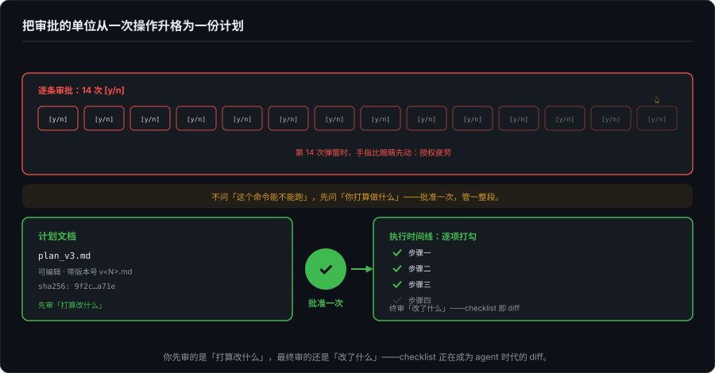
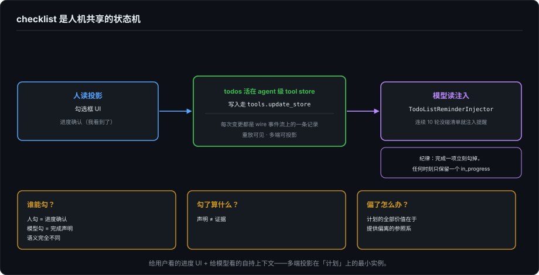

# 计划即界面——checklist 正在成为 Agent 时代的 diff

> 系列第十九篇，界面本体轨，控制三部曲之首。第 8 篇讲事中控制（逐条审批），这一篇讲事前（计划），下一篇讲事后（回滚）。论点一句话：逐条审批的粒度撑不起长任务，第 14 次弹窗时你已经不读内容了。真正可扩展的控制，是事前批准一份可编辑的计划，执行中看着它被逐项勾掉。checklist 正在成为 agent 时代的 diff：你最终审的还是"改了什么"，但你先审的是"打算改什么"。

---

## 一、你批准过最贵的一次"同意"

先复述一个每个人经历过的时刻：第 14 次 `[y/n]` 弹出来，你的手指比眼睛先动，按了 y。第 8 篇把这叫授权疲劳，并记录了行业的第一反应：auto mode 让分类器替你按 y（8 月起成了默认），机器抓住八九成的危险命令，比疲劳的人类可靠得多。

但这条路付的代价第 8 篇也写了：分类器是新的黑箱，而程序员要的第一件事是可观察。于是还有第二条路没被走满：**把审批的单位从"一次操作"升格为"一份计划"**。不问"这个命令能不能跑"，先问"你打算做什么"，批准一次，管一整段。这不是新发明，是给审批换了一个更省力的粒度。

## 二、计划在产品里的三个真实形态

**Claude Code 的 plan mode：把审批做成一种模式。** 官方文档的口径：会话里按 Shift+Tab 在权限模式间轮换（default → acceptEdits → plan……），进入 plan 模式后 agent 被禁止编辑文件和执行有状态变更的命令，只能读和探索，产出一份计划；你审完批准，写权限才解锁。注意这个设计的重心：它没有发明新弹窗，它把"只读探索"和"开始动手"之间的那条线，从一条条审批上移成了一道模式边界，**批准计划 = 批准跨界**。

**Kiro 的 spec 三件套：把瀑布搬回来产品化。** `.kiro/specs/` 目录下按序生成 `requirements.md`（用 EARS 语法写，"WHEN… THE SYSTEM SHALL…"）、`design.md`、`tasks.md`，另有 `.kiro/steering/` 存放长期的产品与项目语境。AWS 这套被人叫 spec-driven development，形态上是需求-设计-任务的老瀑布，但角色变了：文档不是给人执行的开发计划，是给 agent 的执行输入，写文档的痛苦被 agent 分摊了大半之后，瀑布的结构价值才回来。

**kimi-code 的两件套：清单是被记账的事实。** 这是本篇的一手样本，两个部件都值得细看。

其一，`TodoList` 是一个 builtin 工具（`agent-core/src/tools/builtin/state/todo-list.ts`），模型用它维护"visible plan of sub-tasks"。要害在存储方式：todos 活在 agent 级的 tool store 里，写入走 `tools.update_store`，注释原话，"the store update is visible on wire replay"。**清单的每次变更都是 wire 事件流上的一条记录**，重放可见、多端可投影。工具描述里还写着使用纪律：完成一项立刻勾掉，**任何时刻只保留一个 in_progress**。

其二，一个叫 `TodoListReminderInjector` 的注入器（`agent-injection/todo-list.ts`）：如果模型连续 10 轮没碰过清单，就往上下文里注入一条提醒，之后每 10 轮再提醒一次。这个细节的价值在于它承认了一件事：**agent 会忘记维护自己的计划**。清单不是生成一次就自然保鲜的，得有人（这里是系统）拿着鞭子在上下文里催。

计划文档本身也被记账：每次 ExitPlanMode 的评审提交，计划正文被卸载成带版本号的文件（`v<N>.md`，附 sha256 和字节数），事件流里只存引用记录，冷重建时照样投影出"计划修订"标记和 plan 模式徽章，服务端还有专门的 `/transcript/plan` 查询端。第 17、18 篇的账本思想，在计划上完整落地了一回。

## 三、checklist 是人机共享的状态机

把三个样本放在一起，能看出 checklist 这个界面的真实身份：它同时是两个东西，**给用户看的进度 UI，和给模型看的自持上下文**。kimi 的设计点破了这层双重性：清单活在事件流里，人读它的投影（勾选框），模型读它的注入（"你还剩三项，保持一个 in_progress"）。一个状态，两侧消费，这正是第 9 篇多端投影在"计划"上的最小实例。

由此带出三个没被普遍想清楚的设计问题：

**谁能勾？** 人勾是进度确认（我看到了），模型勾是完成声明（我做完了）。前者是读操作，后者是对用户的承诺，语义完全不同，但多数产品的勾选框长得一模一样。混用的话，清单会在不知不觉中从"共享状态"退化成"模型的自说自话"。

**勾了算什么？** 模型勾掉一项，等于宣称完成——但这是声明，还没有证据（测试呢？验证呢？）。声明与证据的落差是"完成"这个概念最深的一道裂缝，本系列后面讲验收时会回到这里，先立桩。

**偏了怎么办？** 计划批准之后，执行偏离计划时界面该报警还是静默跟随？目前的答案几乎都是静默：计划批准完就退场，agent 做的时候没人再对照。可计划的全部价值恰恰在提供**偏离的参照系**：没有基准读数就没有失真一说（第 17 篇的计量原理），没有批准过的计划，"跑偏"也无从定义。

## 四、计划是契约还是散文

反方观点值得严肃对待：spec-driven 是瀑布借尸还魂；模型从不逐字执行计划，批准它纯粹是仪式感，给人虚假的掌控。

仪式感的批评打不倒计划，因为计划的工程价值从来不在被执行到字面，在于三件更便宜的事：**沟通**（一份可编辑的计划把"我以为你说的是"提前到动手之前暴露）；**对齐**（批准计划是对 08 那套四层授权的一次性打包，计划≈会话级授权的操作集合）；**参照**（偏离子有定义，追责有基准）。真正该批评的是另一种形态：不可编辑的计划、批准后即蒸发的计划、没有版本的计划。kimi 给计划文档上 sha256 和版本号，就是在把"计划是事实"这件事做实，而不是做成一段聊天记录里的散文。

## 五、收束

事前的计划、事中的审批、事后的回滚，是同一根信任链条的三节。第 8 篇讲了中节，这一篇讲了前节：把审批的粒度升到计划，用清单把执行钉在计划上，让偏离可定义。链条还缺最后一节：当一切已经发生，那个叫"回滚"的按钮，到底能兑现多少。下一篇拆它：checkpoint 能回滚什么，以及它假装能回滚什么。

---

*核查分层（截至 2026-09-28）：Claude Code plan mode 基于 [官方权限模式文档](https://code.claude.com/docs)（Shift+Tab 轮换、plan 模式阻止写入直至计划批准）及多家第三方解读交叉；Kiro 三件套基于 kiro.dev/AWS 官方材料与社区文档（`.kiro/specs/` 目录、EARS 语法、steering 目录）；kimi-code 为本地一手（`1e553fc`：`packages/agent-core/src/tools/builtin/state/todo-list.ts` 的存储与纪律注释、`src/agent/injection/todo-list.ts` 的 10 轮提醒注入器、transcript 层的 plan 版本化记录与 `/transcript/plan` 端）。"plans/*.md 社区工作流"的普遍性未核实，不引用。*
