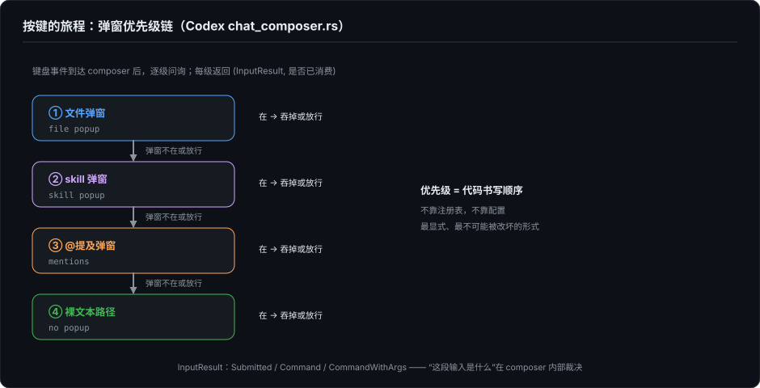

# 输入框——agent TUI 最被低估的组件

> 系列第二十一篇。按编号它排在小册后部，按阅读顺序它插在第 4 篇之后：第 2 到第 4 篇把输出侧讲完了——怎么把内容画对、画快、画不崩。这两篇（21、22）翻过来讲输入侧。输出侧的难点是"画得对"，输入侧的难点是另一句话：**多层交互状态，要在同一条键盘事件流上不打架。**

---

## 一、最大的单文件

先看一个经验事实：在 Codex 的 TUI 里，代码量最大的单文件不是渲染控制器，不是事件总线，是输入框。`bottom_pane/chat_composer.rs` 一个文件 1.3 万行——实现约五千行，测试约八千行——测试比实现还多出六成，这个比例第 24 篇还会回来讲。

一个"打字的地方"为什么值五千行实现？因为键盘事件流只有一条，而想消费它的东西越来越多：普通文本、光标编辑、历史回溯、slash 命令候选、文件引用弹窗、skill 弹窗、@提及弹窗、粘贴、外部编辑器、组合键。这些消费者不是并存，是**互斥又嵌套**——弹窗开着的时候，上下方向键归弹窗，不归文本；但 Enter 归谁，要看弹窗里有没有选中项。第 2 篇 §7 讲的光标定位和 IME 是这个组件的底层，第 4 篇 §8 讲的多行输入竞态是它的边界，本篇不再重复；本篇讲的是它的中层：那个决定"这个按键归谁"的仲裁结构。

---

## 二、弹窗优先级链

Codex 的仲裁结构是一条显式的优先级链。按键到达 composer 后，处理函数按固定顺序逐级问询：文件弹窗在不在？在就归它，它选择吞掉还是放行；放行则问 skill 弹窗；再放行问 @提及弹窗；都没有，才走裸文本路径。每一级的返回是 `(InputResult, bool)`——结果加"是否已消费"。

这个设计的要点不在链本身（任何 GUI 的响应链都长这样），在于它把"哪个弹窗优先"从运行时状态变成了**代码顺序**。弹窗之间的优先级不靠注册表、不靠 z-index，靠 if-else 的书写顺序——最显式、最不可能被配置改坏的形式。考虑到这些弹窗涉及文件引用和 skill 调用这种直接影响上下文组装的功能，"优先级不可配置"是刻意的保守。

Kimi Code 走了另一条路，而且走得更远：它的 `editor-component.ts` 把整个编辑器定义成一个可替换接口（`EditorComponent`），注释明说动机——让扩展可以提供自己的编辑器实现，比如 vim 模式、emacs 模式、自定义键位。Codex 把优先级固化在代码顺序里，Kimi 把整个输入行为做成扩展点。一个防的是"被改坏"，一个赌的是"被扩展"。

---

## 三、"这段输入是什么"在 composer 内部裁决

回车之后发生什么，答案不是一个字符串，是一个枚举。Codex 的 `InputResult` 把提交裁决为几类：`Submitted{text, text_elements}`（普通消息，附带已解析的元素区间）、`Command`（slash 命令）、`CommandWithArgs` 等。"这是消息还是命令"的判断在 composer 内部完成，上游拿到的已经是结构化的裁决结果。

slash 命令因此分两层：composer 层负责解析候选、驱动补全弹窗；执行分派在 ChatWidget 侧，`slash_dispatch.rs` 一个文件 1288 行。另有一个 `!` 前缀的 shell 逃生口，提交时剥掉前缀直接进 shell。这个职责切分值得记住：composer 管"这是什么"，分派层管"拿去怎么做"——前者是交互状态机，后者是业务路由。

---

## 四、粘贴不是一种操作，是四种

"用户粘贴了一段东西"在实现层至少是四种不同的东西：

**其一，bracketed paste 事件。** 终端用 `ESC[200~`/`ESC[201~` 包裹粘贴内容，TUI 收到一个完整的 Paste 事件，做 CRLF 归一化后进 composer。这是最干净的路径，前提是终端支持并开启了括号粘贴模式——第 22 篇会讲这个前提有多不牢靠。

**其二，系统剪贴板直读。** 图片粘贴走的是另一条路：直接读系统剪贴板，探测图片数据、编码、存临时文件、在文本里留占位。Codex 有专门的 `clipboard_paste.rs` 和一整组 `PasteImageError` 类型；Claude Code 的发布产物里也有独立的图片粘贴快捷键处理。

**其三，大粘贴占位符。** 粘贴几万字符的日志，不该把输入框撑爆。Claude Code 的做法：超过一万字符，显示时只留头 500 字符和尾 500 字符，中间折叠成一个占位引用（`inputPaste.ts`）。Codex 同构：大粘贴替换为占位符，提交时才还原展开（composer 头注释里的 "expands pending paste placeholders"）。两家独立收敛到同一个形态：**显示层是占位符，数据层是全文，提交时对账。**

**其四，paste-burst——没有括号粘贴时的湍流识别。** 这是我最喜欢的一个。有些终端（特别是 Windows 上）不发 bracketed paste 标记，粘贴到达时就是一串**极快的普通按键**：人打字到不了那个速度，机器可以。于是识别粘贴变成了湍流识别：Codex 的 `paste_burst.rs` 和 Kimi 的 `paste-burst.ts` 是同一个启发式状态机的两次独立实现——字符间隔在毫秒级（Kimi 的参数：连续 ≥8 个字符、间隔 ≤8ms）就怀疑是粘贴；粘贴流里的 Enter 必须当换行而不是提交（Kimi 的 Enter 抑制窗口是 120ms）。两家的文件头注释写着同一个动机：防止粘贴里的回车把半截内容提交出去。

第四种的启示超出粘贴本身：**当协议信号缺失时，行为信号（速度分布）可以顶替。** 这在终端输入里是通用技法。

---

## 五、把键盘交出去：外部编辑器接力

composer 还有一个出栈方向：把整段输入交给 `$EDITOR`。Codex 的流程是：composer 内触发 → 发 `LaunchExternalEditor` 事件 → 读 `$VISUAL`/`$EDITOR` 起子进程——**起进程之前先退出 raw mode**，把终端归还给编辑器；编辑器退出后恢复 raw mode、读回文件、灌进 composer。期间事件总线可以暂停和恢复（`EventBroker::pause_events/resume_events`）。

这是一次跨进程的状态交接：终端模式、按键流、绘制权，全部先交出去再拿回来。任何一个环节没对齐——raw mode 没退干净、事件流没暂停、恢复时状态对不上——用户看到的就是花屏或按键丢失。输入框因此不只是"消费键盘"的组件，还是键盘这个资源的**进出关口**。

---

## 六、keymap 只做解析

最后一个职责切分：keymap 不管行为。Codex 的 `keymap.rs` 只做"配置 → 运行时键位"的解析（`from_config`），产出键位表；按键命中表之后做什么，是各组件自己的事。组合键（chord）有等待窗口——按下前缀键后等 `KEY_CHORD_TIMEOUT`，超时按单键处理，这个等待是用全局帧调度器的 `schedule_frame_in` 实现的，和状态行动画（第 23 篇）共用同一套定时基建。

Kimi 的对应物是声明式的：`keybindings.ts` 是一张全局键位注册表，下游包靠声明合并往里加键位；编辑动作枚举得极细，连 kill-ring（yank/yankPop，emacs 的剪切环）都有。读这些枚举就像读一份"用户手指习惯"的清单——肌肉记忆是存量资产，输入组件是这笔资产的托管所。

---

## 七、我的引擎在坐标系哪里

诚实交代 ForgeLoopTUI 的位置。它是渲染引擎不是产品，输入侧停在引擎层：`InputPipeline` 做 bracketed paste 聚合（`ESC[200~` 进、聚合成纯文本、`ESC[201~` 出为一个 `.paste` 事件），`KeyParser` 把 CSI/CSI-u/SS3/Alt/控制字符归一成 `KeyEvent`，未知序列静默丢弃。没有弹窗层、没有 slash 命令、没有外部编辑器——这些在它的定位里属于接入方。

读完 Codex 的 composer，我的修正不是"ForgeLoopTUI 缺功能"，而是一个判断尺度的更新：**composer 的状态机复杂度是 harness 成熟度的镜子。** 一个 agent 产品支持多少种"输入不只是文本"的情形——文件、skill、图片、命令、长粘贴、外部编辑器——它的输入框就必须长出一副对应的状态机。输出侧的复杂度藏在渲染管线里，用户看不见；输入侧的复杂度直接顶在用户手指下面，每一个弹窗优先级、每一毫秒 Enter 抑制窗，用户都能感觉到。

下一篇继续往下挖一层：这一篇的所有机制都假设键盘事件流是可靠的——按键是什么、粘贴有没有标记、模式开没开。这个假设在真实终端世界里有多脆弱，是输入侧真正的地狱。

---

*本文基于 2026-10-04 对以下源码的实际阅读：[Codex](https://github.com/openai/codex) 本地快照 main `6b9826e3`（2026-09-09）：`codex-rs/tui/src/bottom_pane/chat_composer.rs`（弹窗优先级链、`InputResult`）、`bottom_pane/paste_burst.rs`、`clipboard_paste.rs`、`external_editor.rs`、`keymap.rs`、`chatwidget/slash_dispatch.rs`；[kimi-code](https://github.com/MoonshotAI/kimi-code) 本地源码 `54117a6b`（2026-09-24）：`packages/pi-tui/src/editor-component.ts`、`keybindings.ts`、`paste-burst.ts`；Claude Code 发布产物中的源码（2026-03-31 经 npm source map 外泄的公开快照）：`src/components/PromptInput/inputPaste.ts`、`src/hooks/useTextInput.ts`。对照部分基于 [ForgeLoopTUI](https://github.com/BiBoyang/ForgeLoopTUI) v1.2.1 源码（`Input/InputPipeline.swift`、`Input/KeyParser.swift`）。*
