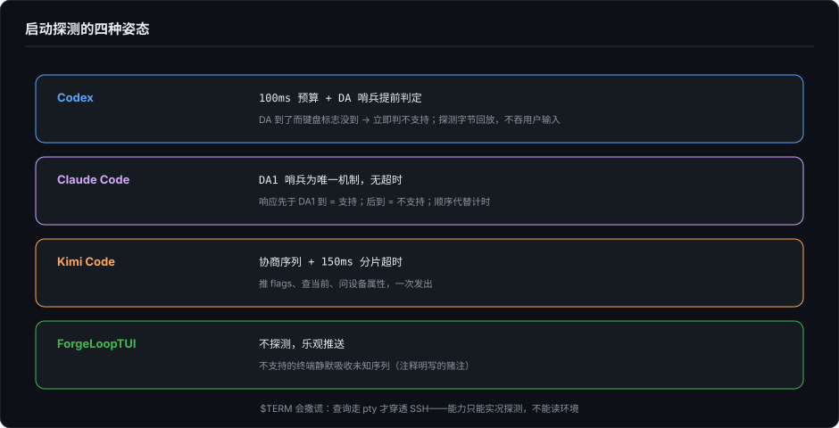

# 输入的地狱——终端能力探测与降级

> 系列第二十二篇，第 21 篇的下半部。第 2 篇 §4.3 讲过输出侧的能力降级链——颜色从 true color 一路退到 16 色，是"能力有没有"的问题。输入侧是另一半，行业讨论比输出侧少一个数量级，难度却更高：**输出降级是"能力有没有"，输入地狱是"行为一不一致"**——同一个按键，在不同终端模拟器里是不同含义；同一条查询序列，有的终端回答、有的沉默、有的回一半。上一篇讲的 composer 状态机，全部建立在这条事件流可靠的假设上。这一篇讲这个假设本身。

---

## 一、探测：启动时的第一次对账

终端能力没法靠 `$TERM` 问出来——环境变量会撒谎（SSH 之后它是远端机器的猜测），所以严肃的 TUI 都在启动时做一次实况探测：向终端发查询序列，等回应，按回应决定启用哪些增强。

但"等回应"本身就是设计难题：等多久？等来的字节和用户的按键混在同一条 stdin 里，怎么分？三家的答案几乎是一个光谱。

**Codex：有预算的轮询，加一条哨兵捷径。** `terminal_probe` 模块存在的原因是注释里的一句话：crossterm 的公共查询 API 最长会等两秒——"对启动和恢复来说太久，不支持的终端应该干脆退回保守默认"。所以 Codex 自己写探测：每组查询 100ms 墙钟预算，探光标位置、OSC 10/11 默认前景背景色、kitty 键盘增强支持；探测消耗掉的字节会回放进 crossterm 的解析器，保证探测期间用户的真实按键不丢。kitty 探测里还藏着一条捷径：查询后面跟着一个主设备属性（DA）请求，终端按序应答，DA 到了而键盘标志没到，就**立即**判定不支持，不必等满 100ms。整个过程带耗时埋点（"terminal startup probes completed"），探测是启动链路里被当成功耗来管理的正式公民。

**Claude Code：用顺序代替超时。** 同一条哨兵，Claude Code 押得更彻底——`terminal-querier` **不设超时**。技巧叫 DA1 哨兵：每批查询末尾追加一个 DA1 查询（主设备属性），而 VT100 以来的每个终端都会回答 DA1，且终端按顺序应答。于是判定变成纯顺序问题：你的响应先于 DA1 到，说明支持；DA1 先到了，说明不支持。超时这个维度被从设计里删掉了，换成对一个老旧但普适的协议不变量的信任。探测目录里的清单也值得看：DECRQM 问同步输出（2026）与 grapheme 聚簇（2027）模式、OSC 11 问背景色、kitty 键盘查询、XTVERSION 问终端名——XTVERSION 的注释点破了为什么环境变量不可靠：查询走 pty 不走环境，**能穿透 SSH**，而 `TERM_PROGRAM` 不能。

**Kimi：协商式握手。** kitty 键盘协议的完整三件套一次发出：推入目标标志位、查询当前标志、追加设备属性查询（`ESC[>7u` `ESC[?u` `ESC[c`），然后按 150ms 分片超时收集回应。另有一个容易漏的收尾细节：退出前先排空 stdin——否则 kitty 协议下按过的键会留下"释放事件"，终端在你退出后还在吐字节。

还有第四种哲学，是我自己的：ForgeLoopTUI **不探测**。`RawTTY.enter()` 无条件推入 kitty 消歧标志和 bracketed paste 开关，注释写明理由——"不支持的终端会静默吸收这些序列"。这是拿终端生态的一个经验事实当赌注：未知序列无害。赌注大体成立，但它是赌，不是证。

---

## 二、一个键为什么不是一个键

探测的主要对象之一是键盘协议，因为传统终端键盘编码是歧义丛生的：Esc 键和 Alt 前缀共用 `0x1b`，Ctrl+I 和 Tab 是同一个字节，Ctrl+M 和回车是同一个字节。kitty 键盘协议（CSI-u）的存在意义就是消歧：给每个按键事件完整的键码与修饰符。

启用它是改善，也是新负债。Codex 留了显式逃生门（`CODEX_TUI_DISABLE_KEYBOARD_ENHANCEMENT` 环境变量）；Kimi 除协议外还备了一条原生侧通路——通过原生 helper 直接轮询真实修饰键状态（`native-modifiers.ts`），协议报不上来的时候问操作系统；Claude Code 则同时解析两套编码——CSI-u 和 xterm 的 modifyOtherKeys——并注释了两者的参数顺序相反（`ESC[13;2u` vs `ESC[27;2;13~`），后者主要在 SSH 场景出现，因为"TERM 嗅探认不出 Ghostty，而我们从不主动推 kitty 模式"。

同一条消歧目标，四家四种姿态：Codex 探测后启用、留开关；Kimi 协商加原生兜底；Claude 只解析不推送，把两种编码都当既成事实接受；ForgeLoopTUI 乐观推送、解析器只映射 Enter 一个键（其余 CSI-u 键码静默丢弃——够用主义：我要的只是 Shift+Enter 和回车的区分）。这没有对错，是各自对"多少终端会把我送进歧义"的不同估计。

---

## 三、模式开关：开了要对，关了要对，被劫持了也要对

bracketed paste、focus 事件、同步输出、kitty 键盘——输入侧的能力几乎全是**模式**：进入时打开，退出时关闭。第 16 篇把模式开关列为攻击面（它讲"为什么危险"），这一篇补工程侧：为什么难对。

难在状态的所有权不排他。终端模式是全 fd 共享的全局状态，而进程会挂起：Codex 里 Ctrl+Z 是特殊键位（`SUSPEND_KEY`），进程切后台再回来，raw mode 可能已经被 shell 或别的程序动过——所以有 `reapply_raw_mode_after_resume`，resume 时重新对账。外部编辑器（第 21 篇）是同一类问题的放大版：起 `$EDITOR` 前退 raw mode、暂停事件总线，回来后全部恢复。模式开关的正确性不是一个布尔值，是"开、关、被别人动过之后恢复"的三态对账。

这也解释了一个看似多余的字段为什么存在：Codex 的输入事件栈从 crossterm 的 EventStream 收敛成七种 `TuiEvent`——Key、Paste、Resize、Draw、Resume、FocusGained、FocusLost。Resume 和两种 Focus 能进这个清单，本身就是对账需求的化石：挂起恢复要重同步，焦点得失要影响光标样式与轮询节奏。事件枚举的形状，记录的是终端现实的形状。

---

## 四、复用器与 alt screen：中间还有一层翻译

以上所有假设之上还有一层：用户可能隔着 tmux 或 Zellij。复用器是一个中间人终端——它代理你的查询、转译你的模式开关、按自己的窗口管理切割你的输出。第 11 篇 §七-7 讲过 Codex 在这上面的演进：从 Zellij 特判，到特判删除、换成 ScrollbackStrategy 三档策略（并用一个测试把"特判不存在"钉死，第 24 篇讲这类守护测试）。这里只补一句输入侧的对称事实：复用器对输出做的是转译，对输入做的是**过滤与改造**——bracketed paste 标记、kitty 序列、focus 事件过一道复用器之后可能变形、延迟或消失，上一篇的 paste-burst 启发式，有一部分用户就是复用器制造出来的。

alt screen 的启用判定（Codex 的 `determine_alt_screen_mode`）因此也不是配置读取，是一次综合判决：用户配置、终端能力、复用器在场与否，三方会审。

---

## 五、雷区表与它的空缺

把这一篇的对照收成一张表（能力 × 各家策略）：

| 输入侧能力 | Codex | Claude Code | Kimi Code | ForgeLoopTUI |
|---|---|---|---|---|
| 能力探测 | 100ms 预算 + DA 哨兵提前判定，字节回放 | DA1 哨兵为唯一机制，无超时 | 协商序列 + 150ms 分片超时 | 不探测，乐观推送 |
| kitty 键盘 | 探测启用 + 环境变量逃生门 | 只解析不推送，兼收 modifyOtherKeys | 推 flags 7 + 原生修饰键兜底 | 无条件推 `ESC[>1u`，只映射 Enter |
| bracketed paste | 支持，缺标记时走 paste-burst | 支持，缺标记时 \r 启发式归一 | 支持，缺标记时走 paste-burst | 支持（`ESC[?2004h`） |
| 挂起恢复 | resume 重上 raw mode | —（未见对应机制） | 退出前排空 stdin | —（引擎层不持有进程模型） |
| 终端身份 | OSC 10/11 默认颜色、光标位置 | XTVERSION（穿透 SSH） | OSC 颜色判明暗主题 | 不探测 |

表的最后我想诚实标注一个空缺：这张表的列是"家"，不是"终端模拟器"。我原本想按第 11 篇四家记分牌的思路，收一张"输入侧能力 × 终端模拟器"的雷区矩阵——哪个终端在哪个序列上行为异常。结果是收不齐：这类数据不存在于任何公开处，它分散在各家的 issue tracker 和运维记忆里，每个 TUI 团队都在私下重攒一份。输入侧讨论比输出侧少一个数量级，这张填不出来的表就是证据本身。

---

## 六、收束

输出侧的降级链有一个舒服的终点：颜色退到 16 色，内容还在。输入侧没有这个终点——按键的含义错了，不是降级，是**错误**。所以输入侧的工程主题不是"降级"，是"对账"：启动时探测对账、模式开关三态对账、挂起恢复对账、复用器在场对账。终端是上世纪七十年代的协议，每一家 agent 都在为它重新谈判一次。

输出侧讲完了，输入侧也讲完了。现在可以去中场了：第 5 篇的 Event Sourcing 会回答一个这两篇不断逼近的问题——为什么输入输出两侧的挣扎，最后都收敛到"事件"这个抽象上。

---

*本文基于 2026-10-04 对以下源码的实际阅读：[Codex](https://github.com/openai/codex) 本地快照 main `6b9826e3`（2026-09-09）：`codex-rs/tui/src/terminal_probe.rs` 与 `terminal_probe/`（启动探测与字节回放）、`tui.rs`（`init()`、七种 `TuiEvent`、`reapply_raw_mode_after_resume`）、`tui/keyboard_modes.rs`、`tui/job_control.rs`（`SUSPEND_KEY`）、`lib.rs`（`determine_alt_screen_mode`）；[kimi-code](https://github.com/MoonshotAI/kimi-code) 本地源码 `54117a6b`（2026-09-24）：`packages/pi-tui/src/terminal.ts`、`keys.ts`、`native-modifiers.ts`；Claude Code 发布产物中的源码（2026-03-31 经 npm source map 外泄的公开快照）：`src/ink/terminal-querier.ts`、`src/ink/parse-keypress.ts`。ForgeLoopTUI 部分基于 v1.2.1 源码（`Input/RawTTY.swift`、`Input/KeyParser.swift`）。Claude Code 的挂起恢复行为未做全量排查，表中"未见"以本次阅读范围为准。*
