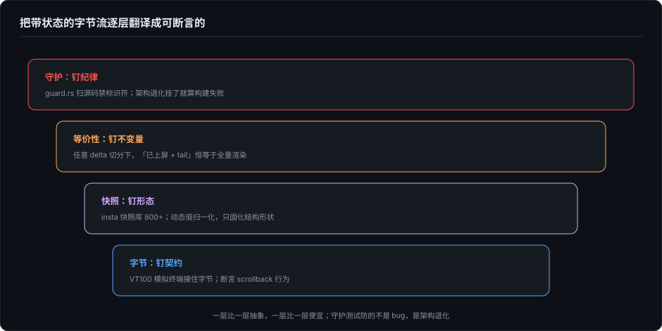

# 把 ANSI 变成可断言的——TUI 回归测试基建

> 系列第二十四篇，接着第 23 篇。前面二十几篇讲了 TUI 渲染的各种机制：增量 diff、流式 Markdown、holdback、防闪烁。这一篇回答一个一直悬着的问题：这些东西怎么测？TUI 的输出不是返回值，是一串带状态的字节——断言它的正确性，需要的不是技巧，是一整套分层基建。2026 年 10 月读 Codex 的 TUI 测试代码，我看到的与其说是一批测试，不如说是一套方法论：把"带状态的字节流"逐层翻译成可以断言的东西。

---

## 一、难在哪：输出是带状态的字节流

普通函数的测试断言输入输出。TUI 渲染的"输出"是写到终端的字节序列，它的含义依赖于终端的当前状态：光标在哪、哪些模式开着、scrollback 里有什么。同一个字节序列，光标位置不同，结果完全不同。第 2 篇讲过帧状态记忆的脆弱性——8 个字段任何一个算错，整帧偏位——这类 bug 的特征是：**单看任何一帧的字节都对，连起来就错。**

所以 TUI 测试的第一性问题不是"断言什么"，是"把输出变成什么形态才可断言"。Codex 的实践可以分成四层，从字节到纪律，一层比一层抽象，一层比一层便宜。

---

## 二、四层断言



### 2.1 字节层：MockTerminal 接住一切

最底下是字节断言：用一个 VT100 模拟终端接住引擎真实发射的字节，然后断言"进了 scrollback 的字节是什么、清了几次屏、flush 了几次"。第 11 篇提过 `tests/suite/vt100_live_commit.rs`，那就是这一层的样本——inline 派"发射即定型"的纪律，最终是靠字节级断言钉死的。

这一层的特点是贵而硬：每个用例都要构造终端状态、喂事件、检查字节行为。它适合钉契约级的行为（"commit 区的字节绝不重复发射"），不适合铺满全部功能。

### 2.2 快照层：insta 与归一化

往上一层是快照。Codex 的 TUI 里有一个庞大的 insta 快照库——`tui/src` 下散落着八百多个 `.snap` 文件，chatwidget、streaming、markdown 渲染、bottom pane 各有自己的 snapshots 目录，配一个 TestBackend 把帧渲染成文本形式入库。第 11 篇提过的 `zellij_raw_terminal_wrap_above_viewport.snap` 就出自这里：冷门终端复用器的换行行为，被一条快照永久钉住。

快照的死穴是抖动：任何无关变化（时间戳、随机 id、路径）都会让快照失败，失败多了审查者就会习惯性 accept，快照随之失效。所以快照层必须配归一化投资——动态值掩码成占位符，快照只固化结构和关键语义。Codex 在 core 侧的测试里把这件事做到了极致：请求快照入库前，权限说明、环境上下文、压缩 prompt 等大段注入全部替换成占位符，UUID 与时间戳掩码，JSON 先排序 key——快照只固化"结构形状"，prompt 文案微调不抖动。**没有归一化层的快照不如不写。**

### 2.3 等价性层：断言不变量，不断言帧

第三层是我认为最有普适价值的一层，也是这个系列里第一次出现的断言形态：**不逐帧断言输出，断言一个不变量。**

流式渲染的正确性可以被一句话钉死：**任意 delta 切分下，流式渲染的可见输出必须收敛于一次性全量渲染。** 切分方式是无限的，逐帧断言永远覆盖不完；但不变量只有一个。Codex 的 streaming 模块里有一批这样的等价性测试：

- `controller_loose_vs_tight_with_commit_ticks_matches_full`：token 级 delta 逐帧放行，与整段一次渲染，最终输出必须相等；
- `controller_live_view_matches_render_during_interleaved_table_streaming`：在表格穿插的流式过程中，**每个 delta 之后**都断言"已上屏内容 + 待放行 tail"恒等于全量渲染——第 3 篇补记讲的 holdback 机制，正确性就是这样被全程盯住的；
- `incremental_holdback_matches_stateless_scan_per_chunk`：增量状态机（每 delta 推进）与非增量的全量扫描函数，逐 chunk 结果必须相等——同一个扫描逻辑写两遍，互为预言机。

注意最后一个测试的手法：**用实现验证实现**。增量扫描器是为性能写的，全量扫描是为正确性写的，两者互相作对方的 oracle。这种"双实现互证"比任何固定预期值都难造假——bug 必须同时以同样的方式污染两份独立实现才能漏网。

### 2.4 守护层：纪律进构建

最上面一层防的不是 bug，是**架构退化**。第 11 篇详细讲过 Grok 的 guard.rs：用 `include_str!` 扫描全部源码，断言 minimal 模式里不出现 `emit_to_scrollback` 这类标识符——纪律不是口头约定，是挂了就算构建失败的测试。Codex 有同构物：`alternate_screen_auto_uses_alt_screen` 把"Zellij 特判已删除"之后的新行为钉成测试，防的不是功能错误，是有人把特判加回来。

守护测试的价值随代码库年龄增长。功能测试保护"现在对"，守护测试保护"对的结构不被未来的善意修改破坏"。第 11 篇那句"纪律比天才便宜"，在构建系统里的字面形态就是这一层。

---

## 三、测试密度的账单

这套基建的规模值得量化一下。`streaming/controller.rs` 一共 1976 行，其中约 1200 行是测试——被测逻辑与测试的体积比接近 2:3。密度花在哪儿很说明问题：resize 与 partial drain 的组合有约十个专测，覆盖丢失、重复、换行余量三类回归，每类都有专名。这些是流式渲染历史上真实咬过人的 bug 类型，每一个都进了专名测试。

这回答了"值不值"的问题。流式渲染的正确性涉及时序、布局、状态机的组合爆炸，人工回归不可能覆盖；而一旦基建就位，等价性层的单个测试能顶掉一整个手工测试矩阵。测试在这里不是成本中心，是让"事前状态机"这类精巧设计**敢存在**的前提——没有等价性测试盯着，任何后来者的"优化"都可能悄悄破坏收敛性，而且没有人会发现。

---

## 四、收束：把散点收成框架

回头看，这个系列里关于可测试性的判断一直是散点：第 2 篇列举 CLI/TUI 优势时提过"管道可测试"，第 11 篇把可测试性列为 inline 派的优点之一（"系统越聪明，证明它正确的基础设施越贵"）。Codex 的四层实践把这些散点收成了一个框架：

```
字节断言  →  钉契约（贵而硬，只钉关键行为）
快照      →  钉形态（配归一化，防抖动失效）
等价性    →  钉不变量（一次断言，覆盖无限切分）
守护      →  钉纪律（防架构退化，随年龄增值）
```

四层的共同主题是翻译：把不可断言的（字节流、时序、纪律）逐层翻译成可断言的（字节计数、文本快照、不变量、标识符）。

对我自己的评测工作，这套基建还有一个反向启发。评测注入故障想测出 UI 层缺陷，等价性层指明了最敏感的注入点：delta 切分方式。同一个模型输出，按 token 切、按行切、按随机字节切，收敛性不变量任何一个被破坏，就是渲染层的真 bug——这是把"流式"这个变量本身变成故障注入的旋钮。测试基建与故障注入，在这里是同一件事的两面。

---

*本文基于 [Codex](https://github.com/openai/codex) 本地源码 2026-10-04 的阅读：`codex-rs/tui/src/streaming/controller.rs`（等价性测试与 resize×drain 组合专测）、`tui/src/**/snapshots/`（insta 快照库）、`tui/src/test_backend.rs`、`tests/suite/vt100_live_commit.rs`、`lib.rs`（`alternate_screen_auto_uses_alt_screen`），快照 main `6b9826e3`（2026-09-09）。Grok Build 的 guard.rs 转述自第 11 篇的既有分析（commit `9fabade`，2026-08-16 阅读）。*
