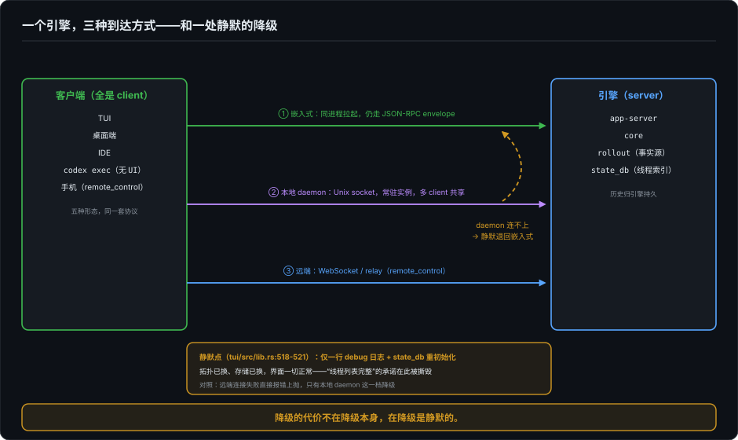

# 第四条边界——当主语是引擎

> 胶水层系列第一篇。前面二十四篇拆的是界面的本体：像素、投影与账本；从这里开始往下走一层，到界面与引擎之间的那条缝。这条缝上，行业已经给三类对话者各造了一套协议，主语各不相同；这一篇从内侧读 Codex，看一个自己养界面的引擎怎么回答同一个问题——它的答案方向性和那三套都不一样：**主语是引擎**。而方向性一旦反过来，界面承诺的兑现方式全部跟着改写：审批怎么问、历史归谁管、版本怎么握手、同进程走不走捷径、拓扑变了要不要告诉你。本卷的准入线：只写这条缝上决定某个界面承诺真假的机制。

---

## 一、三条国境线都没有覆盖的那个对话者

先给一张十秒钟的地图。一个 agent 今天要和三类对话者说话，行业为每条边界造了一套协议：跟工具说话用 MCP，主语是 agent，它去征用外界的能力；跟编辑器说话用 ACP，主语是编辑器，它去征用一个 agent；跟浏览器前端说话用 AG-UI，前端是消费者，它订阅 agent 的事件流。这三条国境线各自怎么划、各欠谁的债，基建第 3 篇会逐条清算——这一篇只需要它们的朝向。因为 Codex 的 app-server 协议不在这张地图上。

它当然不是 MCP——能力方向反了，是引擎被界面征用，不是引擎去征用工具。它有点像 ACP 的镜像：ACP 里编辑器把 agent 当子进程拉起，编辑器是主语；Codex 的 app-server 里**引擎把界面当客户端服务**，引擎是 server，TUI、桌面端、IDE、手机、连 UI 都没有的 `codex exec`，全是 client。三条边界里主语最强势的是"编辑器征用 agent"，这里是"agent 征用一切界面"。

方向反过来，债务清单跟着换。编辑器当主语时，最难的问题是"agent 的权限请求怎么嵌进我的 UI"；引擎当主语时，最难的问题变成：**一个 server，怎么向自己的 client 开口要东西**。审批不是界面弹个窗那么简单——是 server 在 turn 跑到一半时，向 client 发一条反向 request，挂起执行，等一个 oneshot 回填决定。Codex 把这个"反向通道"做成了一个枚举：执行审批、文件变更审批、向用户提问、MCP elicitation、权限申请、甚至宿主代管 token 时的刷新请求，全部走同一类 server→client request。"宿主怎么反问用户"这个 ACP 边界上最难的设计点，在引擎当主语的世界里不是一个 UI 问题，是**协议里的一类消息**。

server 身份带来的第二件事是**历史的归属**。编辑器当主语时，会话历史跟着编辑器的项目走；引擎当 server 之后，thread 的历史归引擎持久：append-only 的 rollout 文件是事实源，客户端看到的 turn/item 视图是投影器的产物——`thread_history.rs`，一个 5024 行的文件，把 rollout 逐行译成增量 ChangeSet。全量水合已经被协议注释判了死刑（"Full-history hydration is deprecated for paginated threads"），往回翻页走 opaque cursor。界面部分第 5 篇的 Event Sourcing、第 9 篇的统一 Event Log，在这里不是主张，是一个每天被好几种客户端消费的真实部件；"换一台设备接着聊"是出厂设置，因为历史从来不在任何一台设备上。记住这个承诺，§四会回来撕它。

server 身份还带来一件 ACP/AG-UI 都没有的事：**多 client 共存，且版本不一**。daemon 让一个引擎进程同时伺候多个客户端——桌面端走 alpha 发布线落后五个 minor 这种事（本机实证：桌面 0.155.0-alpha、CLI 0.160.0），在"编辑器养 agent"的世界里几乎不存在，在"引擎养界面"的世界里是日常。于是每条连接建立时都要重新对账一次能力，这就是下一节的握手。

## 二、协议里没有版本号

先给结论再给证据：Codex 的 initialize 握手有 clientInfo（名字、版本）和 capabilities（实验性 API opt-in、通知 opt-out、MCP 扩展声明），**唯独没有 protocolVersion 字段**。全文 grep 无结果，不是藏得深，是没有。

它用什么替代数字协商？三件套：

1. **加法演化**：serde 忽略未知字段 + `#[serde(default)]`，新方法新字段旧客户端自然跳过；
2. **opt-in 门**：不稳定的表面必须客户端显式举手（capabilities 里的 experimental 标志）才启用，服务端逐请求用 trait 查表拦截——"实验性"不是文档约定，是类型系统属性；
3. **目录冻结**：工程纪律明文"v1 不再加新 API 面，新 API 全进 v2"。版本化不靠数字谈判，靠**老目录封版、新目录演进**。

协议是会咬人的：依赖它承诺的字段，一次破坏性修订说没就没。对这种恐惧，基建第 1 篇里 kimi 的防御是"seq 字段全可选"，Codex 在这里的防御是加法 + 举手 + 封版——同一类恐惧，两种解。数字协商承诺的是"我支持 1.x 到 2.y 的全序"，加法演化承诺的是更弱但更诚实的两句话：旧消息永远可读，新能力你自己举手。

对界面，这意味着承诺的形状：**旧客户端的可见世界被握手时刻永久定格**，它不会因为服务端升级而突然报错，也不会突然多出不认识的能力。反过来，服务端永远不能假定新客户端存在——能力永远以客户端声明为准。界面承诺的边界，在握手那几百毫秒里就签完了。

## 三、同进程，也过协议

这一节是界面部分第 9 篇四个统一（Runtime、Event Log、Permission Engine、Workspace Model）在 Codex 里兑现得最狠的一条。TUI 和引擎跑在同一个进程里，它们之间仍然走 JSON-RPC——进程内 channel 传输的只是换了信封的同一套消息，注释明说不引入第二套响应契约。连"连 UI 都没有"的 exec 模式，也是这套协议的客户端。

初看是洁癖，再想是纪律：**协议一旦为"进程边界"破例，就会为"反正只是内部用"破第二次**。协议一等公民的直接收益是我们验证过的实证：core 侧删掉了 `Op::UserTurn`、换成 `TurnInput`/`start_or_steer_turn` 的破坏性重构，TUI 一行没改——它对 core 内部类型的引用为零。四个统一里"统一 Runtime、统一 Event Log"是主张时人人点头；只有当 UI 连进程内的捷径都不走时，它才从主张变成事实。

还有一句值得单独记住的评注方向：TUI 完全客户端化，保证了**不会出现"内部 API 比公开协议强"的腐化**——界面永远是能力的最小公分母，引擎想长新能力，先扩协议。这条纪律的代价是同进程还要序列化一次的样板税，收益是任何新端接入零特权；税和收益怎么配平，是整部基建卷还会反复拨动的算盘。

## 四、进程形态学：三种连接，和一次静默的降级

引擎怎么被界面"到达"，Codex 给了三种形态：嵌入式（in-process，随客户端拉起）、本地 daemon（走 Unix socket 连常驻实例）、远端（WebSocket）。同一个引擎，三种拓扑，客户端代码几乎无感——这是协议选型的复利。

但 2026-10 读源码时我停在一个降级分支上（`tui/src/lib.rs:518-521`，已逐行亲验）：TUI 优先连本地 daemon，**连不上时静默降级为嵌入式**——只留一行 debug 级日志，顺手还把 state_db 句柄重初始化了。远端连接失败则直接报错上抛，只有本地 daemon 这一档降级。

这不是 bug，是刻意的优雅降级，而且设计得不算坏：daemon 没起来就自己跑一个，用户无感。但它撕毁了一个没被写进任何文档的界面承诺：**"你连的是谁，你会知道"**。我最初怀疑的是更重的那一条——state_db 被重初始化，线程索引会不会落在与 daemon 不同的存储上，让用户启动 TUI 后看到自己的历史少了一块。2026-10-07 晚的源码复核把这条排除了：嵌入式与 daemon 指向同一个 codex_home 下的同一批 SQLite 和 rollout 文件，`thread/list` 与 `thread/resume` 都正常——数据没有断裂。缺口因此显得更纯粹：数据完好，功能如常，动画照转，唯一被撕掉的承诺是"拓扑变了你会知道"——`/status` 里 Remote Connection 一行不是改成"已降级"，而是整体消失；降级日志是 debug 级，被默认过滤挡在所有用户可达的地方之外。界面不是说了假话，是根本没被给过说话的机会。基建第 1 篇会给断线时刻的用户三问：还连着吗、我漏了什么、从哪继续；这一档降级对"我漏了什么"的回答是沉默——不是给了错误答案，是根本没给答案，而界面没有能力诚实。

所以这篇要记的胶水层判断是：**降级的代价不在降级本身，在降级是静默的**。拓扑切换是界面契约的一部分——只要界面承诺的内容依赖"连的是谁"，连接形态的变化就必须至少有信息级的可见性（一行状态、一个脚注、一条警告），不能停在 debug 日志里。界面的每一个承诺，往下挖两层会碰到一条协议的条款——这句话会在基建篇反复出现；这里先补一条：往下挖三层，还会碰到一个 try/catch 分支。

## 五、发布拓扑决定仪式在哪里

继续往内核看一层，有一个漂亮的对照实验。全代码库里唯一不用协议仪式、改用"同构建强校验"的 IPC，是 voice-host——那个替引擎拿麦克风的 helper 进程。它带一个 `--build-commit` 参数，父进程拉起时核对构建 commit，不匹配就拒绝；通信走的是私有帧协议，没有握手、没有 capabilities。

为什么这里可以这么"粗暴"？因为它是全库唯一**和引擎同生共死**的进程：同一个二进制包发布、同一个版本号起落，两端永远不可能错位。而 app-server 那头，0.155 的桌面端撞上 0.160 的 CLI 是真实日常，所以握手、capabilities、加法演化一个都不能少。

一句话：**协商仪式的多少，由两端发布关系的松紧决定，不由洁癖决定。**这反过来给界面一个判断工具：当某个能力承诺"永远随 app 一起更新"，它可以走 voice-host 式的紧耦合（更省、更快）；当它承诺"独立于 UI 演进"，它就必须付协议税。耦合不是罪，错配的耦合才是——用 release train 的关系去定接缝的强度；后面基建第 1 篇用事实源的位置去定重连语义，是同一把尺子的第二次使用。

## 六、能力的方向：手外挂，缰绳内置

最后一个内侧观察，关于新能力怎么进引擎。以 computer use 为例：截屏、点击、拖拽的实现**不在开源引擎里**——它们经一个叫 `cua_repl` 的 MCP server 从宿主（桌面端 JS 侧）进入，引擎核心不认识鼠标。但围绕它的治理是全开源的：功能门由服务端 requirements 控制、每个模型声明自己对 computer_use/shell/file_changes 等动作的审批覆盖、操作规范是模型目录下发的 Markdown、回合中途换模型不允许降低审查水位。

三个问题三个归属：**能做什么由宿主决定，允许做什么由引擎决定，怎么做由模型目录决定。**界面在这套结构里拿到的承诺也因此分层：权限弹窗里显示什么、要不要拦，是引擎和策略面定死的；而弹窗背后那个动作具体怎么执行，界面不需要知道，也不必信任——这正是"协议给说什么、不给怎么画"在能力层的版本。

对想自建 glue 的人，这条比任何机制都可迁移：**核心不长手，手永远可替换；但缰绳必须长在核心身上。**

## 七、收束：界面承诺的胶水层清单

把本篇的账合到最后一张表里。基建篇会反复验证两句话：承诺的真假取决于事实源在哪一层，承诺往下挖两层碰到协议条款；本篇从引擎内侧补上第三步——**承诺的兑现还要穿过一个方向选择、一次握手、一个降级分支**：

| 界面承诺 | 胶水层里兑现它的机制 |
|---|---|
| 我能看到你的线程 | 引擎当 server，rollout 是事实源、客户端视图是投影（§一）；但拓扑静默降级会撕毁它（§四） |
| 审批弹窗问的都是该问的 | 审批是协议里的一类反向 request，弹窗内容来自模型策略面（§一、§六） |
| 旧版本客户端不会被升级弄坏 | 加法演化 + capabilities 握手 + v1 冻结（§二） |
| UI 永远拿到完整能力 | 同进程也过协议，协议一等公民，没有"内部 API 更强"的腐化（§三） |
| 能力可以独立演进 | 手外挂、缰绳内置，cua_repl 式的能力通道（§六） |

而所有这些机制的成本，都由一个朴素的问题定价：这两端，是不是独立发布？是，就付协议税；不是，就允许紧耦合。胶水层的设计，说到底是发布关系的会计。

这条缝先讲到这里。再往下走一层，承诺要穿过的东西从进程边界换成网络和操作系统：连接会断、端会被操作系统杀掉、协议对面坐着别家的主语——那是基建三篇的事，从《没报错，就代表输出没问题吗》那个问句开场。

---

*事实核查分层（截至 2026-10-07）：本文 Codex 事实基于 rust-v0.154.0（HEAD 6b9826e3a，2026-09-09 快照）亲读——initialize 握手结构（app-server-protocol/src/protocol/v1.rs）、experimental 门控（message_processor.rs:912-920）、v1 冻结纪律（仓库 AGENTS.md:269）、TUI 内嵌走 JSON-RPC envelope（app-server/src/in_process.rs:22）、历史投影与分页（app-server-protocol/src/protocol/thread_history.rs、thread_history_projection.rs:1-3、v2/thread.rs:400,450）、静默降级分支（tui/src/lib.rs:518-521，逐行亲验）、voice-host 同构建校验（voice-host/src/main.rs:48 的 --build-commit）、computer use 治理面（features/src/lib.rs:271、protocol/src/openai_models.rs:402、core/src/session/step_activation.rs:110）与 cua_repl 通道（protocol/src/mcp.rs:38）。降级分支的数据影响（同一 codex_home、数据不断裂、`/status` Remote Connection 行整体消失）为 2026-10-07 晚接力复核增补（tui/src/lib.rs:518-521、thread-store/src/local/read_thread.rs:30）。桌面 0.155 vs CLI 0.160 的版本错位为本机实证（2026-10-03）。openai/codex 官方博文《Unlocking the Codex harness: how we built the App Server》（2026-02）为"协议起源"的一手旁证。*
