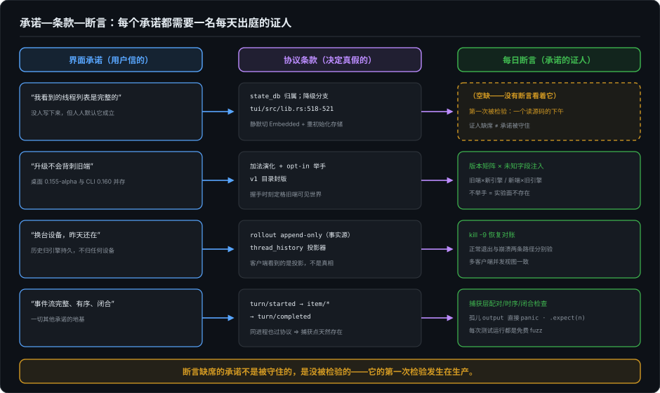
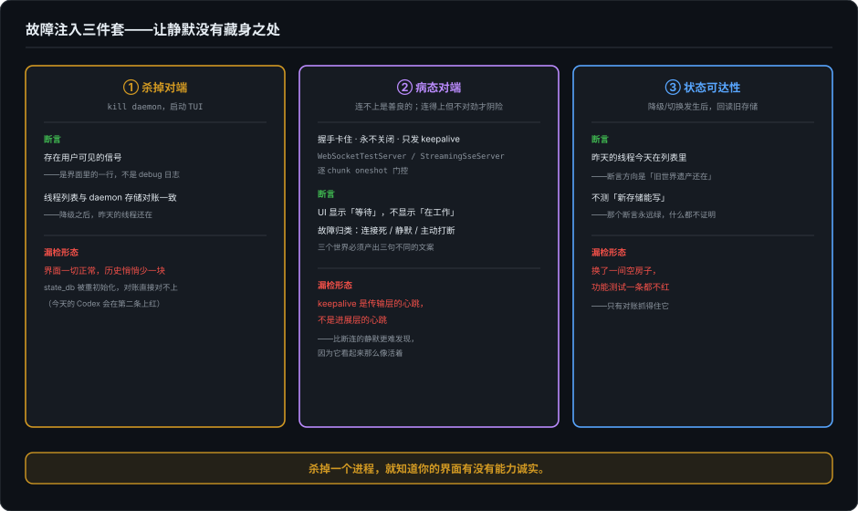

# 把协议变成可断言的——承诺需要证人

> 胶水层系列第二篇。上一篇拆开了界面与引擎之间那道缝：主语是引擎，审批是反向 request，历史归引擎持久，同进程也过协议。但上一篇的结尾留下了一处撕口——一个静默的降级分支，把"你连的是谁，你会知道"这句没人写下来的承诺撕毁了，而界面一切正常。这一篇问的是后半句：**这些承诺，怎么变成每天都要过的一道关**。评测卷的四问地图上标着六层被测对象，"协议"那一层，在这里领走它的断言清单。

---

## 一、承诺需要证人

先把上一篇的病例在桌上重新摆开，只摆三十秒。TUI 启动时优先连本地 daemon，连不上就退回进程内嵌——`tui/src/lib.rs:518-521`，一行 debug 级日志，顺手把 state_db 句柄重新初始化。用户看到的是什么？动画照转，界面如常。2026-10-07 晚的源码复核补上了后半句：连历史都完好无损——嵌入式与 daemon 指向同一个 codex_home 下的同一批 SQLite 和 rollout，昨天的线程今天全在。可没有任何东西告诉他，他脚下的拓扑已经换了。

这个分支值得再停一次，不是因为它错——上一篇已经判过，这是刻意的优雅降级——而是因为它活得实在太安稳了。想一想它活到被发现的路径：不是某个测试红了，不是某个用户报到对的渠道，而是一个人读源码时在降级分支上停了下来。一个每天可能被成千上万人踩过去的分支，唯一的目击者是读者。它为什么能活这么久？

答案简单得有点难堪：**没有任何一条断言看着它。**

工程师当然测过降级。但测的问题是"daemon 没起来，TUI 还能不能用"——能用，绿灯。没有人测"daemon 没起来，用户知不知道"。至于"切换之后，昨天的线程还在不在列表里"——源码复核的答案是"在"，哪怕有人写了这条对账测试它也会绿。真正的缺口由此被隔离得干干净净：**不是数据丢了，是没有人被告知**。数据会丢的故障好歹有对账可抓，沉默连对账都不会触发——它只是某个下午某个读者的意外发现，而且发现时连事故都算不上。

这里要立本章的骨架。一个界面承诺的生命，其实经过三层：

第一层是**承诺**，用户信的那句话："我看到的线程列表是完整的。"第二层是**条款**，协议里决定承诺真假的机制——state_db 归谁、降级走哪条分支，上一篇挖的就是这一层。第三层是**断言**，承诺的证人：一条每天运行、红了会被人看见的检查。上一篇走完了从承诺到条款的挖掘，这一篇走最后一步——**每条条款必须对应一条每天出庭的断言，否则承诺只是愿望。**

注意证人的定义。debug 日志不是证人：它只在有人翻卷宗时才开口，而翻卷宗永远发生在事故之后。文档也不是证人：它记录的是意图，不是现状。证人只有一个特征——**每天出庭，且缺席会被发现**。在工程世界里，满足这个定义的东西只有一种：跑在 CI 里、红了会拦下发布的测试。断言缺席的承诺不是被守住的，是没被检验的；它的第一次检验发生在生产，或者某个读源码的下午。

这条路和全书走过的两段路是同一条。界面部分第 24 篇把渲染变成可断言的：ANSI 序列不再是"看起来对就行"，而是可以逐字节比对的快照。评测卷开篇把行为变成可断言的：没报错只是开始，绿灯会问两种谎。这一篇把那道缝变成可断言的——评测卷那条统一定律在这里有它最具体的形态：**daemon 世界和 embedded 世界产出同一个"一切正常"，你的观测对它们的差异就是盲的。**后面的每一节，都是给这类"两个世界、一个绿灯"的格子配一名证人。

## 二、降级必须有人看见

把所有可以配的证人排一排，密度最高、造价最低的那一组，在降级路径上。所以本章不客气，主战场直接摆在这里。

先把承诺的正面写出来：**拓扑变了，你会知道。**这句话有三层含义，对应三种切换。连接形态的切换——你连的是 daemon 还是内嵌引擎；存储归属的切换——你的历史落在哪个 state_db 里；安全等级的切换——审批通道、沙箱边界有没有随拓扑一起变。三种切换有一个共同义务：至少留下信息级的可见性，一行状态、一个脚注、一条警告，形式不拘，但不能停在 debug 日志里。

先回答那个最自然的反问：静默降级为什么这么常见？因为它从来不是断言的对象。工程师测"降级后还能不能用"——这是功能测试，测的是世界 B 能不能运转；没有人测"从世界 A 切到世界 B 时，有没有人被告知"——这是承诺测试，测的是切换这个动作本身。前者每个项目都有，后者几乎没人写。**可见性不在任何 checklist 上，所以它在每个 try/catch 里都第一个被牺牲。**把它写进断言，它才从品味变成契约——这就是本节要做的事。

方法是故障注入，三件套，按阴险程度排序。

第一件，**杀掉对端**。最直白的注入：把 daemon 杀掉，启动 TUI，然后做两条断言。第一条：存在用户可见的信号——不是日志文件里的一行，是界面里的。第二条：线程列表与 daemon 存储对账一致——降级之后，昨天的线程今天还在。拿上一篇的病例当预期，今天的 Codex 在第一条上红：降级完全静默，`/status` 里 Remote Connection 一行干脆整体消失；而第二条会绿——两条路径指向同一批存储，对账对得上。**第二条的绿恰恰是最有价值的证词**：它把缺口从"数据可能丢了"精确隔离到"可见性"这一层——功能断言全部通过，用户却对换了一个世界一无所知。这两条断言都不复杂，复杂的是意识到它们该存在——**杀一个进程，就知道你的界面有没有能力诚实**，这是全章性价比最高的实验。

第二件，**病态对端**。"连不上"是善良的故障，它干脆利落；真正阴险的是"连得上，但不对劲"——握手卡住、连接永不关闭、只发 keepalive 不发数据。这三种对端在真实网络里比比皆是，而它们恰好是"静默"的天然培养基：连接活着，进展死了，界面该说什么？Codex 自己的测试基建里已经有全套凶器——`WebSocketTestServer` 能伪造握手卡住、永不关闭的对端，`StreamingSseServer` 能精确控制第几个 chunk 在某个事件之后才发。这些武器本来指着引擎与模型的边界，把它们转过来指向前端与引擎的边界，问题清单立刻变长：握手卡住时 UI 是转圈还是报错？转多久才承认？对端只发心跳不发进展时，界面显示的是"正在工作"还是"等待响应"？——**keepalive 是传输层的心跳，不是进展层的心跳；把前者当后者展示，是另一种静默**，而且比断连的静默更难被发现，因为它看起来那么像活着。

第三件，**状态可达性**。降级的断言不能只测新世界的功能，必须测旧世界的遗产：切换发生之后，旧存储里的数据还读不读得到。注意断言的方向——不是"新的 state_db 能写"（这永远绿），而是"昨天建的线程今天在列表里"。状态归属的切换如果只是换了一个空房子，功能测试一条都不会红，只有对账能抓住它。

三件套之外还有一条贯穿的要求：**故障归类必须诚实**。连接死了、对端静默、用户主动打断，是三个不同的世界，界面的文案必须让它们产出三个不同的句子，不能共享一句"出了点问题"。这正是评测卷说的分叉观测在协议层的形态——把"失败了"这一个布尔，拆成"怎么失败的"几次分别记录，分歧日不用再等有人翻日志。

最后回答本节开头那个排序的理由。六个维度里把降级放在第一位，不是因为它最重要，是因为它的**炸弹密度与注入成本之比**最高：杀掉一个进程只要一条命令，而静默降级撕毁的是"历史完整"这种地基级承诺。评测卷里，静默降级只是六条绕行通道之一；在这一篇，它是整个维度——因为协议层的降级不只绕过检查，它绕过的是用户知情本身。

## 三、三个可观察面：证人从哪里取证

降级那节已经把证人派上了庭，现在退回来回答一个更基础的问题：证人的证词从哪来？胶水层的断言，原料只有三样——**出站请求日志、事件流、副作用**。三样加起来，是 agent 行为的全部可观察面，也是证据采集的最小集：多一样不必，少一样不够。

请求日志是最诚实的一样。引擎向模型、向 daemon、向任何对端发出的每个请求都是白纸黑字，而 Codex 测试基建最重要的一次转身，就是把捕获层变成断言层：自定义的 wiremock matcher 在匹配每个请求时，顺带做一次协议不变量检查——call 和 output 必须配对，孤儿 output 直接 panic。妙处在于**寄生**：不需要专门养一套协议测试，已有的每一次普通测试运行都自动变成一次协议 fuzz。证人不是雇来的，是埋伏在每天的例行公事里的。

事件流是第二样。全量落盘成 JSONL，回放即断言。要干净的原料就用 `codex exec --jsonl`——没有 TUI 渲染掺入，逐行带时间戳；要连界面一起审，就开 `CODEX_TUI_RECORD_SESSION=1`，AppEvent 的进出和每一次 commit tick 都在案。同一条流，两个清晰度，各管一段。

副作用是第三样：状态存储、文件系统、rollout 文件——世界被改成了什么样。三样的分工记一句话就够：**请求日志回答"引擎说了什么"，事件流回答"界面被告知了什么"，副作用回答"世界变成了什么样"。**一句承诺的真假，要三样都对得上才算数——降级那节的"线程列表对账"，就是事件流和副作用的交叉质证。

后面四节，是四组承诺各自的证人。你会发现每组的取料都不出这三样，变的是问法。

## 四、契约的配对与时序

第一组承诺：**事件流是完整的、有序的、闭合的。**它是所有其他承诺的地基——事件流本身不可信，建立在其上的一切断言都是沙上塔。

三条不变量。**配对**：每个 begin 恰好一个 end，每个 request 恰好一个 response，每个 call 恰好一个 output——孤儿是协议违例，不是可以原谅的噪声。**时序**：生命周期事件严格有序，Codex 的核心序列是 `turn/started → item/started → item/agentMessage/delta → item/completed → turn/completed`，乱一个位置，前端的状态机就可能整页错乱。**闭合**：任何退出路径——正常完成、abort、错误、超时——都恰好收尾一次，不泄漏、不重复。闭合最容易被漏掉，因为正常路径人人测，异常路径的"最后一次收尾"常常没人等。

断言的写法上一节已经给了：配对和计数挂在捕获层（`.expect(n)` 断言"恰好收到 N 次请求"），时序和闭合写成回放检查。这里真正值得记的是**为什么这些断言在 Codex 里天然有地方挂**——回到上一篇 §三：TUI 连进程内都走协议，没有任何前端拥有绕过协议的特权通道。**协议一等公民的收益，在测试侧兑现得最彻底：捕获点对所有端一视同仁地存在。**反过来想就明白这条纪律的分量——如果 TUI 有一条直连 core 的函数调用捷径，那么 TUI 路径上的所有承诺都脱离了捕获点的视野，断言体系立刻出现一个和最大客户端等大的盲区。捷径省下的序列化税，最后都在可观测性上连本带利地还。

## 五、这段话算不算答案

第二组承诺短得多，也深得多：**前端不需要自己猜"这段输出算什么"。**

先看 Codex 给出的反面标本。它的协议不给定性：`turn/completed` 只说循环结束了，至于最后那段文本是最终答案、是过程性解说、还是被截断的半句话——协议不说，每个前端自己推。后果写在 TUI 的代码量里：一个 232 变体的 AppEvent 总线，加上流式累积源要靠 `item/completed` 的权威文本对账（传输饱和丢 delta 时，以 completion 为权威）。这不是前端写得笨，这是**语义缺位的账单**：协议不回答的问题，复杂度就漏进每个前端，一个端漏一次。

所以本节的不变量是本书提出的正面设计，先把话放这：Codex 协议当前不含此面，以下是"应该有"的断言清单，不是"现有"的机制描述。

**完成语义协议级可判定。**协议应当携带定性标记：这段输出是正常完成的最终答案、是跟随工具调用的过程性输出、是被 max_tokens 截断的续写段、是中断留下的残段、还是失败被回滚的废段。五种定性对应五种界面动作——展示、折叠、拼接、标记、丢弃——前端不该靠启发式分辨。**丢弃语义可区分**："回滚过"不等于"没发生过"，被丢弃的输出必须有记录、占序号，否则前端无法区分"模型沉默了"和"模型说了又被撤回"，而后者的字节必须被明确抛弃，不能留在屏幕上冒充答案。**增量与定稿可对账**：流式累积源与完成事件的权威文本，在任何丢包、乱序、截断下都必须可调和——这一条写成 property-based 测试，随机掐断一千次，次次对得上账才算数。

给协议补一个定性字段，比给每个前端补一台状态机便宜——这笔账不难算，难的是意识到该算。

## 六、迟到的批准

第三组承诺关于时间：**审批与中断的任何交错顺序下，结果确定且安全。**

Codex 的 guardian 测试里有一条值得逐字抄进每个 agent 项目的断言：给审批响应 `.set_delay(200ms)` 拖住，其间注入中断，然后断言——**迟到的批准不会让命令执行**。决定到达时目标已经 abort，决定就必须被丢弃，而不是被补救性地执行。这条断言的形态是竞态测试的标准解法：延迟注入加时序编排，用 `StreamingSseServer` 那种逐 chunk 门控的能力，精确控制"第 N 个事件在某动作之后才发"，把调度器的不确定性挤出测试。

同样值得抄的是断言的落点。guardian 的安全断言不停在"界面显示了拒绝"，而是直接落在请求日志上——**guardian 永远读不到被 deny 的文件内容**。安全属性要断言在数据流上，不是断言在文案上；文案会说谎，请求日志不会。

时间维度上还有一条 Codex 没答、但任何想做异步前端的引擎都该答的题：当人是几小时后才回消息的——IM、邮件、工单——"等待"必须是一个显式语义。阻塞地等、挂起会话等、超时拒绝，是三种合法答案；**隐式死等不是答案，是没有回答**。挂起-恢复路径的断言形态 Codex 给了半个示范：resume 测试就是 `shutdown_and_wait` 加从 rollout 文件重启，不需要第二个进程；补全的另一半是恢复后的对账——会话状态逐字节一致，或者每一处差异都被显式声明。

## 七、握手的兼容矩阵

第四组承诺关于演进：**升级不会背刺旧端。**机制上一篇已经讲完了——加法演化、opt-in 举手、目录封版三件套——这一节只回答一个问题：三件套的断言各长什么样。

加法演化的断言是**注入未知**：往消息里塞旧客户端不认识的字段、发它不认识的方法，断言旧端存活且行为不变。opt-in 的断言是**不举手就不存在**：实验性表面对未声明的客户端不是"报错"，是"不存在"——不返回、不提示、不可发现。封版的断言最简单也最硬：冻结目录的契约测试钉死在 CI 里，任何试图往 v1 加面的提交直接红。

然后把这些单点断言织成版本矩阵：旧客户端 × 新引擎、新客户端 × 旧引擎、能力子集 × 全量引擎。矩阵听起来像理论，在 Codex 的发布拓扑里是日常——本机实证，桌面端跑 0.155.0-alpha、CLI 跑 0.160.0，同一个引擎，两个相差五个 minor 的客户端共存。矩阵不是为假想敌准备的，是为每个发布日准备的。最后还有一条容易漏的：**能力声明的真实性**——客户端在 capabilities 里举手声明的能力，必须与它的实际行为一致；声明了 opt-in 却处理不了对应事件，和没声明一样坏，而且更隐蔽。

## 八、历史的对账

最后一组承诺关于昨天：**换台设备、重启进程之后，历史还在，且是真的。**

先回忆承诺的机制面：rollout 是 append-only 的事实源，客户端看到的 turn/item 视图是 `thread_history.rs`——一个 5024 行投影器——的产物。**这个事实有一个经常被忽视的推论：客户端看到的从来不是真相，是真相的投影。**对界面这是渲染问题，对评测这是取数纪律：任何从 UI 侧采集的数据，都必须意识到投影层的存在——投影器的一个 bug，会让你的评测数据整齐地错，而且错得毫无破绽。

恢复路径的断言要测两条，不是一条。正常退出重启，人人测；**kill -9 之后重启，才是承诺被检验的时刻**。Codex 的崩溃恢复靠一个写入顺序：发首个采样请求前，TurnContext、初始上下文消息、TurnStarted、用户消息依次写 rollout。这个顺序本身就该是断言对象——在顺序的不同点位杀掉进程，恢复后的状态必须一致；顺序错一位，崩溃就从一个可恢复事件变成一次历史撕裂。同样，不持久化的内存态——进程内的 registry、后台任务的活状态——恢复后的缺失必须**可检测**，而不是静默蒸发：界面可以合法地说"这部分状态随进程结束了"，不能合法地假装它从未存在。

## 九、收口：门禁，而不是排行榜

五组证人派完——先交代为什么不是 §二 说的六个维度：完成语义那一组在 Codex 里**没有证人可传**，§五 的不变量是判它缺席之后，我们替它提出的新证人。五组是现存的，第六组是该长的；缺席本身也是证词。把它们放回全书的框架里归位。配对与时序、降级、竞态这三组是纯**炸弹类**：一票否决，百分之百通过才放行，九百九十九次绿的抵不掉一次红的。兼容矩阵与历史对账是**一致性类**：它们不拦单次发布，拦的是回归。胶水层也有可量的东西——TTFT、turn 收敛时长，Codex 的协议自带 `time_to_first_token_ms` 和 `duration_ms`，零插桩就能拿到——但这类分数只做同引擎的纵向回归，**不做跨产品排名**：不同产品的协议形状不同，分数不可通约，硬排就是拿尺子量体重。一句话收束全篇的产出方向：接 fail-closed 的发布管道，不接排行榜。

在全书的地图上，这一篇认领的是评测卷四问地图上"协议"那层被测对象；四问之中，它主要回答"坏了会不会察觉"。评测卷讲统一定律——两个世界产出同一个绿灯，观测就是盲的；这一篇做的事，是在协议层把每个"两个世界"的格子找出来，一格配一名证人。

上一篇结尾说：界面的每一个承诺，往下挖两层会碰到一条协议的条款，挖三层会碰到一个 try/catch 分支。这一篇把这句话补完——**挖到第几层不重要，重要的是每一层都该有一条断言住在那里。承诺不是被信守的，是被看守的。**

---

*（全章初稿，2026-10-07。Codex 行号基准 rust-v0.154.0，HEAD `6b9826e3a`；降级分支病例、guardian 延迟测试、版本并存事实整理自 2026-10-03/05 本机实证与源码亲验；降级病例的数据层结论（同一 codex_home、数据不断裂、对账会绿、`/status` 行消失）为 2026-10-07 晚接力复核增补。§五的语义定性不变量与§六的异步等待显式语义为本书提出的设计，Codex 协议当前不含此面；文中已就地注明。）*
