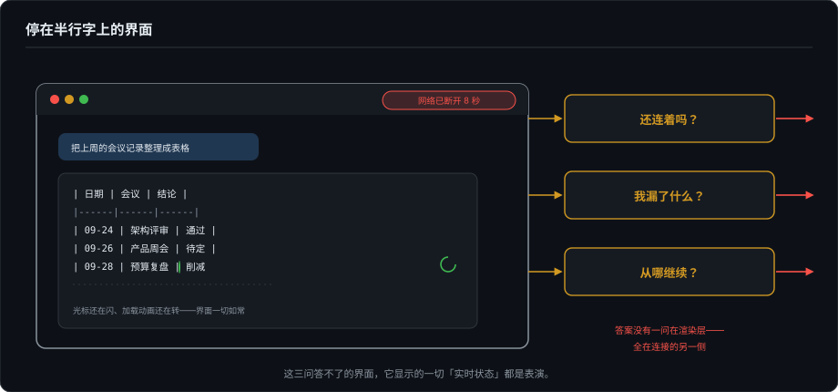
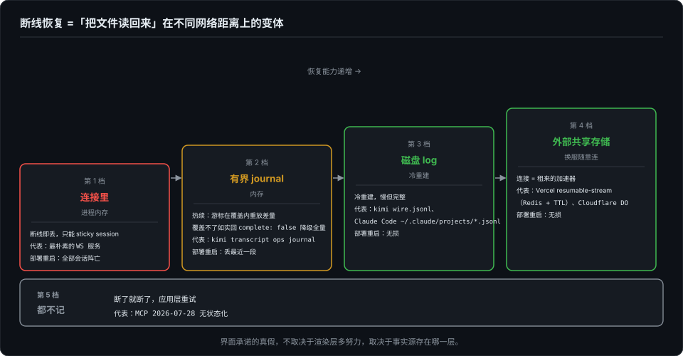

# Agent UI 的另一半（一）：连接与会话——断线之后，谁还记得它讲到哪了

> 基建系列第一篇。第一季（《Agent 时代的开发者界面》00–17）拆的是像素层：界面怎么画、账怎么记、信什么。这个系列拆另一半——**信用层：那些画面凭什么信、承诺凭什么兑现**。两块地基是共享的：00b 教会我们怀疑"没报错就等于没问题"，这次怀疑的对象从模型输出换到整条管道；05 确立了"Agent 是一条事件流，UI 是投影"，这次讲投影怎么穿过一根会断的线。本系列的准入线也只有一条：只写决定某个界面承诺真假的基建。第一篇的题目，来自我在写作期间被自己问住的第一个问题：SSE 流断了怎么办？换一台服务器重连呢？

---

## 一、停在半行字上的界面

流式输出的第 37 秒，界面停在一个写了一半的 Markdown 表格上。光标还在闪，加载动画还在转——而网络连接八秒前就断了。用户盯着屏幕分不清两种状态："模型在想"和"管道死了"。残酷的是，**界面同样分不清**，因为它不知道。

把用户在断线时刻的真实困惑列出来，一共三问：还连着吗？我漏了什么？从哪继续？这三问的答案没有一问在渲染层——全在连接的另一侧。这篇讲的就是让界面有能力诚实回答这三个问题的基建。反过来讲也成立：这三问答不了的界面，它显示的一切"实时状态"都是表演。

## 二、SSE 的出厂设置，和它的三个坑

先还 SSE 一个公道：协议设计者想过断线。每个事件可以带 `id:` 字段，浏览器原生的 `EventSource` 断线后自动重连，并把最后收到的 id 放进 `Last-Event-ID` 请求头带回去——服务端若配合，就能从断点续发。恢复机制是出厂设置，不是发明。

但 agent 客户端拿到手就碎了三个角。

**坑一：原生重连根本用不上。** `EventSource` 不支持自定义请求头——带不了 `Authorization`。所以 agent 客户端几乎都用 fetch 手搓 SSE 流，而 fetch 没有自动重连：出厂设置里最值钱的那部分，正好是要被扔掉的那部分。重连、退避、断点游标，全部自己写。

**坑二：中间层吞流。** nginx 默认缓冲响应、企业代理按住不转发——连接"活着"，数据不动。"连着但没数据"和"断了"在客户端不可区分，唯一的解法是应用层心跳。而心跳间隔是一个两头挨打的权衡：慢了撞上运营商 NAT 的空闲超时（TCP 常见几分钟），快了烧电——这个权衡在移动端还会加倍回来（基02 的主线）。

**坑三：Last-Event-ID 是张支票。** 兑现的前提是服务端肯记账：每个事件有递增编号，且保留一个可重放的缓冲窗口。协议只定义了支票的格式，不担保任何一家银行承兑。

最后是半包。SSE 帧层面协议自解——事件以空行分隔，`Last-Event-ID` 指向的永远是最后一个完整事件。真正的半包在应用层：工具调用的参数以 JSON 字符串增量流式下发，断线时你手里是半个 JSON。第 3 篇讲过 TUI 如何消费"半成品文档"，这是它的网络层孪生；00b 的截断检测，换了个位置再来一次——不完整性是这个家族在每一层的老熟人。

## 三、行业的三个答案

断线恢复没有标准答案，2026 年的主流方案正在朝三个不同方向走。三个都核实过，其中一个是本地一手。

**答案 A：删掉恢复，拥抱无状态（MCP，2026-07-28 修订）。** 官方 changelog 写得毫不掩饰："Remove SSE stream resumability and message redelivery (the Last-Event-ID header and SSE event IDs) from the Streamable HTTP transport."——SSE 事件 id 删了，Last-Event-ID 删了，独立的服务端推送流（GET stream）删了，连 `Mcp-Session-Id` 和初始化握手都删了，协议整体转向无状态优先。后果直白：流断在半路，在途结果作废，客户端在应用层重试。这是一次诚实的设计投降——与其让协议层承诺一个多数实现做不好的恢复语义，不如把问题连同自由一起交还给应用层。**连接是易耗品，协议不替你记账。**

**答案 B：把流镜像进外部账本（Vercel resumable-stream）。** 服务端把流式 chunk 边发边镜像进 Redis（带 TTL），streamId 存在会话记录里；客户端断线后凭 id 请求续读，从最后一个收到的字节继续。连接在这里只是租来的加速器，事实在共享存储里——所以换一台服务器重连毫无障碍。边界也清楚：第三方测评指出它罩得住"同一设备刷新页面"，罩不住多端并发消费；TTL 过期，缓冲即蒸发。

**答案 C：三层防线，自己养账本（kimi-code 的 kap-server/transcript，本地一手）。** 这是 05 事件流模型至今最完整的工程化样本，值得多花两段。

第一层，**序号**：每个 (session, agent) 流上的操作批次分配单调递增的 `seq`，订阅带着 `transcript_since` 游标。第二层，**有界内存 journal**：游标落在 journal 覆盖范围内就重放差量；覆盖不了，服务端如实回 `complete: false`，客户端降级为全量刷新——**降级路径是一等公民，不是异常处理**。第三层，**磁盘事实源**：每个 agent 一份 `wire.jsonl` 追加记录，冷会话由两级 fold 重建——连"关机时还挂起的用户交互"都折叠成 `cancelled` 落账，交互流的终态有交代。基线重置报文是 items-empty 的：历史永远走 REST 分页拉取——"快照 + 尾部增量"在真实产品里的样子。

三个答案，三种记账位置：**协议层拒绝记账；应用层租外部账本；专门服务自己养三层账本。** 没有谁赢——它们分别对应三种产品形态（工具协议、Web 应用、多端会话服务）。

## 四、纲领：重连语义由 source of truth 的位置决定

把三个答案和其余方案放进同一张表，规律只剩一句话：**换服务器重连能不能成立，取决于事件的 source of truth 存在哪一层。**

| 事实存放在 | 重连语义 | 代表 | 部署重启时 |
|---|---|---|---|
| 连接里（进程内存） | 断线即丢，只能 sticky session | 最朴素的 WS 服务 | 全部会话阵亡 |
| 有界 journal（内存） | 热续：游标在覆盖内重放差量 | kimi transcript ops journal | 丢最近一段 |
| 磁盘 log | 冷重建：慢但完整 | kimi `wire.jsonl`；Claude Code 会话文件 | 无损 |
| 外部共享存储 | 换服务器随意连，连接=租借加速器 | Vercel（Redis）；Cloudflare Agents（每 Agent 一个 Durable Object，单写者正确性 + WebSocket 休眠：对象睡了连接还活着，不收活钱的算力费） | 无损 |
| 都不记 | 断了就断了，应用层重试 | MCP 2026-07-28 | 不适用（本来无状态） |

第 9 篇说"统一 Event Log"是四个统一之一，当时它是一句架构主张；这张表是它的工程含义全集。顺带补一句 actor 档的注脚：Cloudflare Agents 的官方仓库里挂着一个重连竞态的 issue（#1837，移动网络抖动或重新部署弹跳 Durable Object 时，客户端 hook 在重连与续传之间赛跑）——每往上一档，省下的是会话状态，欠下的是新的竞态。没有免费的档位。

## 五、幂等与序号：at-least-once 世界的生存守则

只要服务端肯重放，重复推送就不可避免——传输的现实是 at-least-once，不是 exactly-once。消费侧按事件 id 去重是基本功；真正会咬人的是副作用：工具已经执行了，确认事件在断线中丢了，重试会不会再执行一遍？

这里 05 篇的三层分类拿到了第二生命。当初它为解释"不同 UI 消费事件的策略差异"而设计——执行流、副作用流、交互流。放进分布式语义里，它严丝合缝地变成了重放安全性分类：**执行流可重放（幂等投影）、副作用流不可重放（只能记账不能重做）、交互流要仲裁（下节）**。一个为界面写的分类法，在网络层一个字不用改。

序号的分配权同样有讲究。kimi 的答案是每个 (session, agent) 一个单调 `seq`——单写者换秩序，避免了多节点分配的全序难题。而它的契约里有一个细节值得单独致敬：**seq 相关字段全部是可选的**，不带 seq 的旧客户端自动降级为"丢信号驱动的全量刷新"。断线恢复与 schema 演进这两件最难同时满足的事，在同一份契约里和解了——新节点带游标热续，旧节点无游标慢刷，谁也不阻塞谁。

回到 00b 的问句：没报错就代表输出没问题吗？管道版的回答是——在 at-least-once 的世界里，"没报错"的诚实含义是"至少一次，可能更多，请保持幂等"。

## 六、单机同构版：你每天都在用的那台事件溯源服务器

这篇文章的全部难题，有一个零网络版本，你每天都在用。

Claude Code 把每个会话写成本地文件：`~/.claude/projects/<工作目录转义>/<sessionId>.jsonl`。本机取证看一眼结构：append-only 的行式 JSON，类型分布包括 `user`、`assistant`、`attachment`、`queue-operation`（输入排队）、`cost-state`（费用快照）——一条不挑读者的 wire 事件流，每行带 `sessionId` 和时间戳。`claude --resume` 做的事，就是从这份文件重放重建会话。

对照第四节那张表：它的 source of truth 在磁盘 log 档，而"连接"这个东西根本不存在——所有断线重连问题被消解成"把文件读回来"。这不是玩具对照：kimi 的 `wire.jsonl` 冷重建就是这个模式的网络版，Vercel 的 Redis 是它的共享版，MCP 的应用层重试是承认了"读回来"的成本之后干脆不读。**断线恢复的一切难题，本质都是"把文件读回来"在不同网络距离上的变体。** 单机文件、冷重建、热 journal、共享缓存、放弃恢复——五个档位，是同一件事的五种距离。

## 七、交互流也要外置

最后补上断线故事里最容易被忘掉的角色：挂起的审批。

`permission.requested` 发出时用户正在地铁里——这个挂起对象必须和事件一样外置存活：进 log、有超时策略、能被推送唤醒（推送链路是基02 的主战场）。多端竞争是它的分布式形态：桌面点了批准、手机点了拒绝，两个响应经过两台服务器——仲裁需要三件协议工作：先到先得的判定规则、事件版本号防旧覆新、后到端收到"已被他端处理"的收敛事件而不是一个失败。第 9 篇写过一句"谁先响应用谁的结果"，这十几个字背后就是这三件事。kimi 的 fold 把关机时挂起的交互折成 `cancelled`，是同一纪律的关机时刻版本。

## 八、收束：UI 被允许承诺什么

把三问对应到四档谱系，界面的权限边界就出来了：

| | 状态在连接里 | journal 档 | 磁盘/共享 log 档 | 无状态档 |
|---|---|---|---|---|
| "还连着吗" | 心跳，勉强 | 心跳 + 游标水位 | 心跳 + 游标 + 落盘确认 | 只能说"我不知道" |
| "漏了什么" | 无法回答 | journal 覆盖内可答 | 永远可答 | 不可答，请重试 |
| "从哪继续" | 不可承诺 | 短窗口承诺 | **"继续上次会话"按钮敢亮** | "重新开始" |
| UI 敢显示的 | 实时转圈 | + 断点续传提示 | + 完整历史回看与多端 | 只剩重试按钮 |

所以这一篇的结论可以压成一句：**界面承诺的真假，不取决于渲染层多努力，取决于事实源存在哪一层。** 半行字卡在屏幕上的那一刻，界面能说"正在重连，已恢复到第 N 个事件"，还是只能让动画继续转下去骗人——这个差别在上线之前，就已经被后端的一张表决定了。

下一篇把镜头从连接的两端拉近到拿在手里的那一端：一部随时会被操作系统杀掉的手机，如何在一台会话的每个站点——输入、发送、排队、流式、回看——保住"流畅"和"完整"这两件互相打架的事。

---

*事实核查分层（截至 2026-09-28）：MCP 部分引自官方 changelog（[modelcontextprotocol.io/specification/2026-07-28/changelog](https://modelcontextprotocol.io/specification/2026-07-28/changelog)，"Remove SSE stream resumability and message redelivery…"为原文引用）及多家第三方解读交叉；Vercel 部分基于 AI SDK 官方文档（Chatbot Resume Streams，`resumable-stream` + Redis）与第三方边界测评；Cloudflare 部分基于官方 Agents 文档（Agent class internals：DO 单写者、WebSocket 休眠）与仓库 issue #1837；kimi-code 部分为本地一手阅读（`1e553fc`：`packages/transcript/AGENTS.md` 的 op-batch sequencing contract、`packages/kap-server/AGENTS.md` 的 journal/`transcript_since`/冷重建描述）；Claude Code 会话文件为本机取证（2026-09-28，类型分布为单样本）。SSE 协议行为（id/Last-Event-ID/EventSource 限制）为标准协议常识。*
