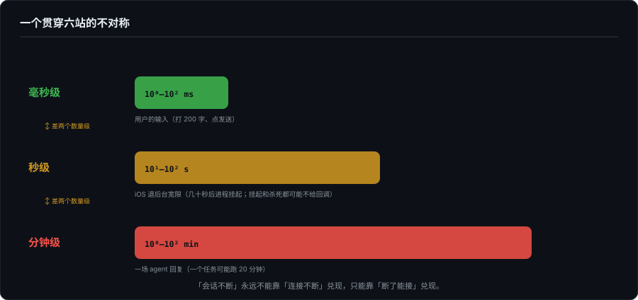
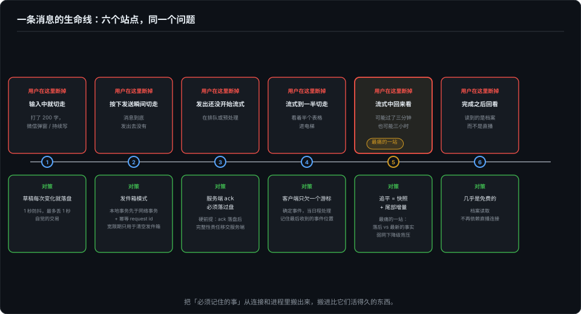

# 一条消息的生命线——移动端会话的六个断点

> 基建系列第二篇之上。上一篇讲连接的两端，这一篇讲拿在手里的一端。移动端 agent 有一个所有桌面讨论都会漏掉的前提：**用户会在任意时刻离开**——不是可能，是必然，而且不挑时间。打字打到一半微信来了；按下发送的瞬间锁屏了；流式输出到一半进电梯了。本篇沿一条消息的生命线设六个站点，每个站点都问同一个问题：用户在这里断掉，会话还能不能既流畅又完整地活下来。一手样本是 FlowDown，旁证是本机的 Claude Code 会话文件。

---

## 零、先立一个不对称

移动端工程里所有关于"断"的决策，都由一个平台事实定价：**iOS 给应用退后台后的宽限是几十秒量级，之后进程挂起**。没有后台特权的应用，连接的死亡不是风险，是日程表上已排定的事件。Android 好不了多少，国产厂商的后台查杀比 AOSP 更积极。

这个事实制造了一个贯穿六站的不对称：**用户的输入是毫秒级的，网络的宽限是秒级的，而一场 agent 回复是分钟级的。** 三件事的时间常数差着两个数量级，所以"会话不断"这个承诺，永远不能靠"连接不断"来兑现，只能靠"断了能接"来兑现。接的逻辑，就是六个站点各自的那道工序。

## 站点一：输入中（还没按发送）就切走

用户打了 200 字，微信弹窗，切走，进程十秒后被挂起或杀死。回来时草稿还在不在？

错误答案是"监听退后台事件，临走前保存"。错误在哪：挂起和杀死都可能**不给回调**，willResignActive 不是遗嘱，进程可能根本等不到执行它的机会。把持久化押在一个不保证送达的事件上，等于把草稿押在运气上。

正确姿势是**持续写**：草稿每次变化就落盘，赌的不是"能等到告别"，而是"丢得足够少"。FlowDown 的实现是现成样本（`ConversationManager.swift`）：内存字典 `temporaryEditorObjects` 的 `didSet` 里挂一个 **1 秒防抖**的保存任务（`perform(#selector(saveObjects), afterDelay: 1.0)`，新修改会取消旧任务），到点后在后台线程写入 UserDefaults 支撑的 `@TypedStorage`；启动时回灌并记日志"loaded N temporary editor objects"。

注意它连代价都是明码标价的：防抖窗口 1 秒，意味着杀死发生在最后一次击键后的 1 秒内会丢最后几个字。**这是一笔自觉的交易**，用"最多丢 1 秒"换"每秒写盘一次"的低频，而不是假装存在零丢失的免费方案。界面上那句"已保存"要不要显示、按什么粒度显示，就是这笔交易的用户侧报价单。

## 站点二：按下发送的瞬间切走

更凶险的站点，因为发送是一个**事务**，而事务怕的正是执行到一半断电。

用户按了发送，请求进了网络栈，进程被挂起，这条消息到底发出去了没有？回来之后，界面该怎么显示？如果客户端这时自动重发，服务器会不会收到两条？

工程答案是发件箱（outbox）模式，三条纪律：

1. **本地事务先于网络事务**：发送动作先落盘（进发件箱），再传输。界面状态跟着发件箱走，"排队中 / 已发出 / 已送达"，每个状态都是本地可查的事实，不猜。
2. **幂等 request id**：每条消息带客户端生成的唯一 id。重发时服务器凭 id 去重，"我可能发过"和"我肯定没发过"从此可区分。这是基01 说的 at-least-once 世界的入场费。
3. **宽限的用法**：几十秒的后台宽限，够把一条消息推出网络栈，不够流完一场回复。宽限期该做的事是"把发件箱清空"，不是"把会话跑完"，认清时间常数，才知道宽限该花在哪。

一个旁证：本机 Claude Code 的会话 JSONL 里，`type: "queue-operation"` 的第一行就是 `"operation": "enqueue"`，用户输入在一开始就被记成排队事件，而不是"即发即忘"的网络动作。把输入当事件记账，是单机版的发件箱；移动端要做的只是让它穿过网络还成立。

## 站点三：已发出、还没开始流式（在排队或预处理）

消息确认送达之后、回复开始之前，客户端切走，这一站的问题最少，但有一个硬前提：**服务端的 ack 必须是落过盘的**。"收到"不能只存在于那台连接着的进程内存里，否则部署重启的瞬间，用户以为已发出的消息就进了量子态。

ack 落账之后，这一站的完整性责任就整体移交给服务端了。这正是基01 那条第一原则的移动端兑现：**agent loop 不能拥有 socket**，执行归执行，连接归连接，客户端的生死从这一刻起与会话解耦。

## 站点四：流式输出到一半切走

用户看着半个表格，进电梯，切走。接下来必然发生的事按剧本走：数十秒内进程挂起，连接断掉——记住，这是**确定事件**，设计时当日程处理，不当异常处理。

断掉之后，责任分两半。服务端那一半：agent 继续跑，产出的事件继续落 log（基01 的全部内容）。客户端这一半小得惊人：**只欠一个游标**，记住自己最后收到的事件位置（last event id / seq），其余什么都不用做。回放、补齐、续传，全是回来之后的事。

这一站还有一个前台版本：网络切换（WiFi↔蜂窝换了 IP），连接半死，TCP 还"活着"，但永远等不来数据。对策是主动保活探测（心跳超时即判死）+ 快速重连 + 凭游标续传，把"半开连接"的窗口压到秒级。判死要快，是因为用户对"转圈但不更新"的容忍度，比对"断线重连提示"低得多，**诚实的坏消息好过沉默的坏状态**，这句话在六站里都成立。

## 站点五：流式中回来看（最痛的一站）

用户回来了。此刻距离断线可能过去了三分钟，也可能三小时。屏幕上那半个表格怎么办？

第一步是**追平**：凭游标向服务端要差量。追平的正确形态是快照 + 尾部增量，基01 拆过的 kimi transcript 就是活样本（`transcript_since` 游标、journal 覆盖内重放、覆盖不了降级全量）。切记不要全量重放几千条事件：移动端的 CPU、电量、流量都在反对。

第二步是**追平期间的脸面**。"正在同步…"不是敷衍，是投影设计，用户需要知道当前画面是"落后的事实"还是"最新的事实"，这两者对信任的含义完全不同（16 篇的信任边界在时间维度的投影）。

第三步是**弱网下的流畅降级**。完整性和流畅性在这一站公开打架：带宽和电量都告急时，把事件粒度降下来（低频刷新、只更新尾部摘要行、折叠中间过程），先把"活着且最新"保住，带宽宽裕再补全渲染。通知要背压（基02 下篇展开），会话内更新同样要背压，这是同一个原则的两个方向。

这一站还有个配角值得记：FlowDown 在流式期间把收到的字符增量累计喂给 Live Activity（`countIncomingTokens`），锁屏和灵动岛上有一个实时跳动的字数。用户切走了，锁屏上那行小字就是整个会话在"离开期间"的最小投影：不完整，但诚实，且免费。

## 站点六：完成之后回看

最好的一站，如果前三站都做对了，这一站几乎是免费的。回复完成后，内容由服务端结算落盘（15 篇拆过 FlowDown 的修补序列与 `save()`），客户端回看时读到的就是档案而不是直播。**完整性在这一站不是客户端的功能，是前五站工程的总和。**

## 收束：六个站点，一个常数

把六站排回去看，每站的答案其实都是同一句话的变体：**把"必须记住的事"从连接和进程里搬出来，搬进比它们活得久的东西**，草稿进 UserDefaults，输入进发件箱，消息进服务端 log，位置进游标，进度进锁屏投影，成品进档案。连接、进程、甚至前台界面，都只是这些事实的临时租客。

流畅和完整这对冤家也是这么和解的：完整性靠事实外置（搬到磁盘和服务端），流畅性靠降级自由（画面可以随时扔，因为事实扔不掉）。下一篇（二·下）把这六个站点背后的架构账单一次摊开：被操作系统禁止的长连接、只肯当信号用的推送通道、替 agent 跑工具的服务端工作区，以及那句话作为第一原则的完整含义：agent loop 不能拥有 socket。

---

*一手取证：FlowDown `b2cecfd6`（`ConversationManager.swift` 的 `temporaryEditorObjects` 防抖持久化、`ConversationSessionManager.swift` 的 `countIncomingTokens`/Live Activity、`Pipeline/` 的流式与结算路径）；Claude Code 本机会话 JSONL（`type: "queue-operation"`/`"operation": "enqueue"`，2026-09-28 取证）。平台行为（iOS 后台宽限为数十秒量级、挂起与杀死可能无回调、网络切换导致 TCP 半开）为移动端工程常识，按量级表述未引具体数字。快照+尾部增量与游标机制的工程细节引自基01 的核查（kimi-code `1e553fc`）。*
