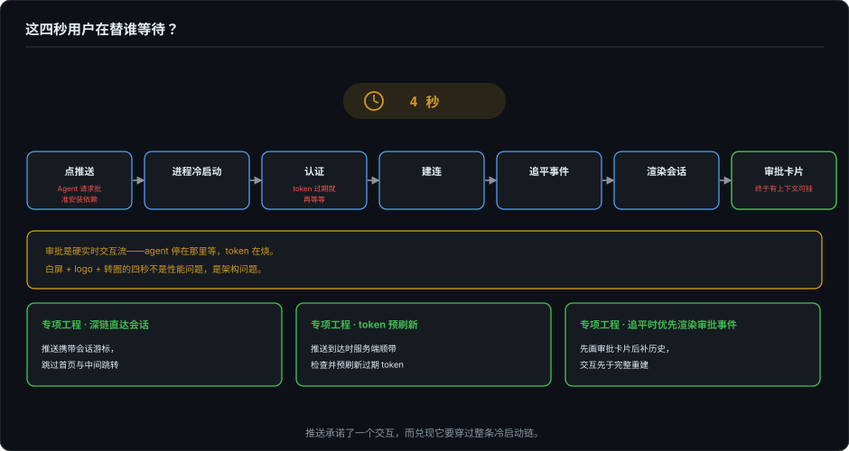
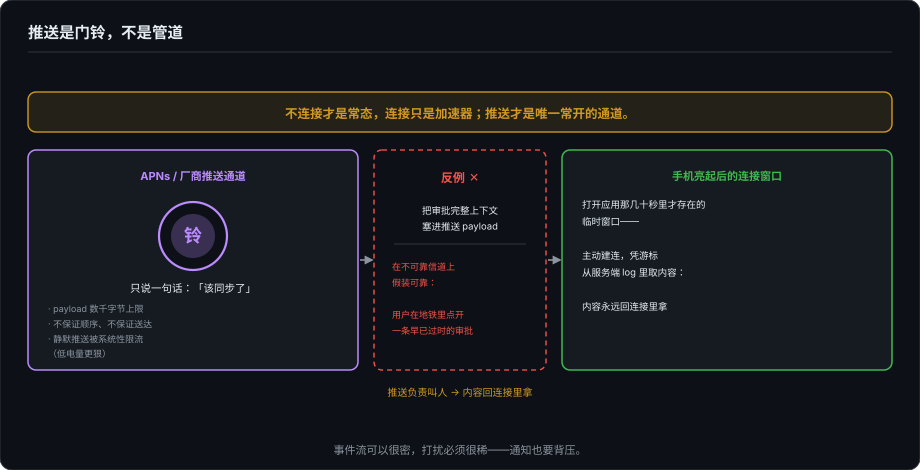
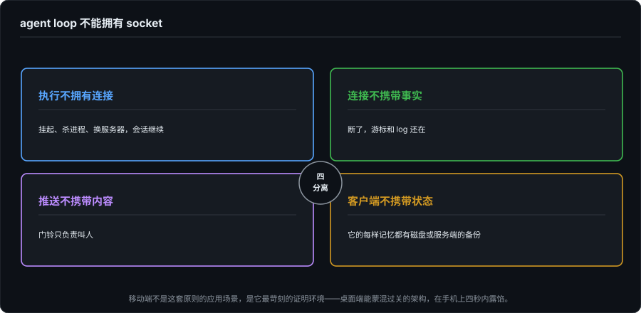

# 移动端的架构代价——推送、工作区与一条第一原则

> 基建系列第二篇之下。上篇沿一条消息的生命线走了六个站点，每个站点的答案都是"把事实搬进比连接活得久的东西"。下篇摊开这张账单的背面：那些搬运工程背后，移动端被迫接受的架构条款，被操作系统禁止的长连接、只肯当信号用的推送通道、被应用商店放大的版本漂移、替 agent 跑工具的服务端工作区。最后把它们收进一句第一原则。

---

## 一、第 4 秒的审批卡片

推送弹出来："Agent 请求批准安装依赖"。用户点开——白屏，logo，转圈——四秒之后，审批卡片才出现。这四秒用户在替谁等待？

把冷启动路径拆开看：点推送 → 进程冷启动 → 认证（token 过期就再等等）→ 建连 → 追平事件 → 渲染会话 → 审批卡片才终于有上下文可挂。链条上每一步都可能失败，而审批是**硬实时**的交互流，agent 停在那里等，token 在烧。四秒不是性能问题，是架构问题：推送承诺了一个交互，而兑现它要穿过整条冷启动链。深链直达会话、token 预刷新、追平优先渲染审批相关事件（先画卡片后补历史），都是对这四秒的专项工程，但这些优化成立的前提，是下面这些架构条款先被接受。

## 二、第一性条款：长连接是被禁止的

上篇立过的不对称，这里升级成设计公理。桌面端的架构假设是"长连为主，断线是要恢复的异常"；移动端的现实是**不连接才是常态，连接是打开应用那几十秒里才存在的临时窗口**。iOS 没有后台特权的应用退后台数十秒即挂起，音频/定位/VoIP 那类长驻 entitlement 轮不到聊天应用；Android 阵营里国产厂商的电池优化比 AOSP 激进得多，长连接在后台存活的期望值按零设计不算悲观。

这个公理反转一切：**推送才是唯一常开的通道，连接只是加速器。** 于是——

## 三、推送是信号，不是传输

推送通道的物理限制决定了它只能当门铃用：payload 有几千字节的上限，不保证顺序、不保证送达。所以正确的分工是：**推送只说"该同步了"，内容永远回连接里拿**。把审批的完整上下文塞进推送 payload 的设计，是在不可靠信道上假装可靠，第一个被坑的场景就是用户在地铁里点开了一条早已过时的审批。

门铃自己也一身坑。静默推送（不响铃、只唤同步的那种）被系统性限流：低优先级、会被合并延迟，低电量模式更狠，用户关掉后台 App 刷新则基本不达。所以推送不可达要有兜底：打开应用时的主动轮询。国内还要再加一层现实：FCM 不可用，接厂商推送联盟，每家的到达率和后台策略都不同，工程上等于维护一条多通道抽象层，而且永远测不全。

然后是两条推送的产品学：

**通知也要背压。** Agent 跑完 30 个工具调用，不该产出 30 条推送。合并、摘要、按重要性分级，通知频率本身就是产品参数，和上篇"会话内更新降级"是同一个背压原则的两个方向：**事件流可以很密，打扰必须很稀。**

**通知是交互流的最小投影。** 标题加一行描述加两个按钮，就是 `permission.requested` 事件在锁屏上的完整投影，这意味着通知按钮本身构成一条 `permission.resolved` 的回传通道。于是 16 篇的信任边界问题在锁屏上重现，而且更尖锐：锁屏内容会被旁人看到（代码片段、密钥名该不该进通知？）；通知直批省了打开应用的四秒，但高风险操作要不要过一次生物识别？**便捷和安全在这条最小投影上没有免费的双全**，每个产品都得画自己的线，而大多数产品目前还没意识到需要画。

## 四、版本漂移被应用商店放大

Web 客户端今晚发布今晚全量；移动客户端发版要过审，用户更新看心情，**几周前的旧客户端是常态，不是遗留**。对事件流协议这意味着：新事件类型必须可跳过（不认识就忽略，不崩），新字段必须可选。基01 里 kimi 那份契约的姿势值得再引一次：seq 相关字段全部可选，旧客户端自动降级为丢信号驱动的全量刷新，**宽容旧端不是兼容性礼貌，是移动端的生存环境。** 桌面端可以把 schema 演进当工程问题慢慢做，移动端它直接约束协议设计的第一天。

## 五、服务端执行环境：agent 到底跑在哪

移动端是瘦客户端，这四个字把执行整体搬到了服务端，而"跑在哪"本身就是一整套生命周期工程。

**工作区是有生命周期的。** 工具调用要碰文件系统和 git，服务端就得给每个会话配一个工作区（容器或等价物）：创建、挂起、快照、迁移、回收，每一步都有成本。移动端用户拍完审批就走了，工作区还热着，TTL 定多长，挂起要不要快照，都是钱。

**审批挂起与会话休眠。** 用户三小时不回，agent 停在等审批的状态上，会话资源怎么办？Cloudflare 的 Durable Object 休眠给了一个参考形态：对象睡了，WebSocket 状态还保着，消息到达即唤醒，休眠期不收活跃算力的钱。**"等待"在服务端是被明码计价的资源**，谁的账单、按什么计，是移动端产品没法回避的伦理题，因为等待的发起者（用户离开）和付费者未必是同一个预期。

**云和本地抢同一个仓库。** 云端 agent 在自己的工作区里跑，用户的桌面可能正开着同一个 repo，两边的改动如何合流，是 09 篇"统一 Workspace Model"在云时代的完整形态。这个问题目前没有谁真正答好，记为开放题。

## 六、收束：agent loop 不能拥有 socket

把上下两篇收进一句话：**agent loop 不能拥有 socket。**

执行不拥有连接（挂起、杀进程、换服务器，会话继续）；连接不携带事实（断了，游标和 log 还在）；推送不携带内容（门铃只负责叫人）；客户端不携带状态（它的每样记忆都有磁盘或服务端的备份）。移动端不是这套原则的一个应用场景，**它是最苛刻的那个证明环境**：进程朝不保夕、网络七零八落、版本几周漂移，在这样的地基上还能兑现"流畅且完整"，靠的就是把每一样事实都安放在比进程、比连接、比画面活得久的地方。

第 9 篇当年写过"Mobile 是 Companion，不是主战场"，从渲染负担看它依然成立；但从架构纪律看要补一句：**移动端是这个行业里最诚实的甲方。** 它不允许任何"先连着再说"的懒惰假设，每一条都在逼你把事实和传输分开。桌面端能蒙混过关的架构，在手机上四秒内露馅。

下一篇回到地面：agent 与编辑器、前端、工具之间那三套正在三国杀的协议，MCP、ACP、AG-UI，三个边界各欠着谁的债。

---

*核查分层：Durable Object 休眠与单写者语义基于 Cloudflare Agents 官方文档（同基01 核查）；APNs payload 上限与静默推送限流按平台公开行为的量级表述（数千字节；低优先级、合并、受低电量与后台刷新设置影响），未引具体政策编号；厂商推送联盟为国内公开现状。kimi 契约的可选字段姿态引自基01 的本地一手核查（`1e553fc`）。冷启动路径、通知直批安全边界为设计层论述。*
