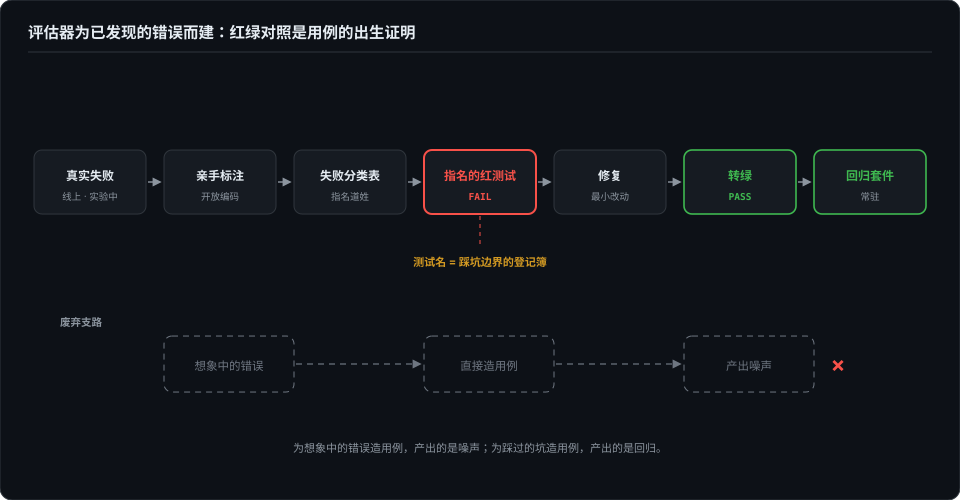

# 考题从哪来——为真实失败而建

> 评估器该为已发现的错误而建，不为想象中的错误而建——想象中的错误测出来，全是噪声。这一篇讲用例的来源哲学：一条评测用例凭什么存在。

> **待办（2026-10-07）· 收编中**：本章正文将由博客《给 skill 建门禁》（2026-09-17）收编改写（原则：论点先行、事件压缩），并补触发评测的双向口径；骨架与配图已定。

## 本章将讲

- 红绿对照：用例的合法出生证明——每个修过的 bug 配一条 FAIL→PASS 用例，与 SWE-bench 的 fail-to-pass 同构。
- 触发层必须测双向：该触发时触发、不该触发时不触发；TP/FP/FN/TN 的口径，以及为什么影子信号不进混淆矩阵。
- 一次红线写法实证：同一条用例，description 写"不管"声明 vs 正文写行为指令，66.7% FAIL → 100% PASS。

