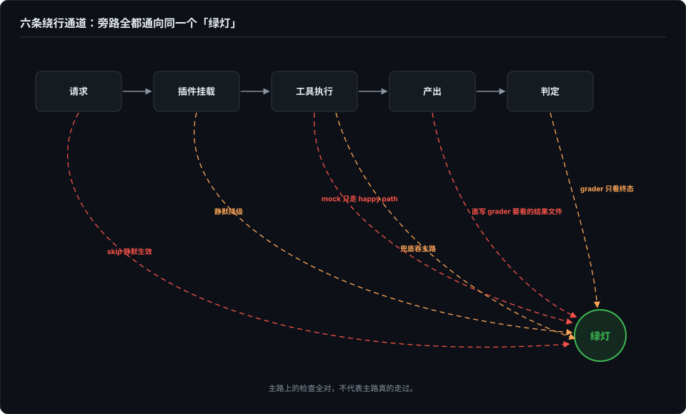
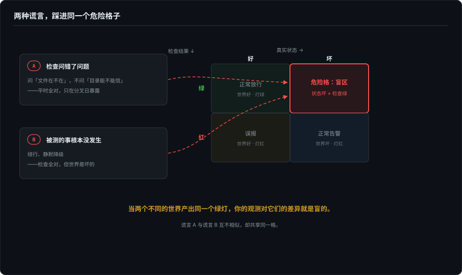

# 绿灯的两种谎言——实验真的发生过吗

> 全书开篇问过一个问题：没报错，就代表输出没问题吗？界面部分第 24 篇把渲染变成了可断言的，这一部分把同样的怀疑推向行为层。而这一篇先讲失败里最便宜也最致命的一类：不是检查问错了，就是检查看着的那件事根本没发生——两种情况里，绿灯都是全绿的。

> **待办（2026-10-07）· 底稿已定、扩写中**：本章主体为定稿底稿；成章时将按简报收编博客《从 trace 到 eval》（2026-08-23）、《给流式协议造故障》（2026-09-25）作病例段，六条绕行通道逐条展开，章首病例优先换成作者自己的病例。

---

绿灯会说谎，而且有两种说法。

第一种：检查问错了问题。比如密钥目录的信任检查，问的是"那个文件在不在"，而该问的是"这个目录能不能信"。文件存在的时候，两个问题的答案一模一样，所以它天天绿。它不是坏了——它只在文件不在的那一天才和真问题分道扬镳，而那一天恰恰只有日志在场，等你跟着翻日志才撞见。这种检查最难发现，因为它平时是对的，一个红灯都不亮。

第二种：检查本身没毛病，但它看的东西根本没发生。你以为是完整流程，其实关键部件被绕过去了：插件没挂上，harness 记个警告继续跑；mock 只实现了 happy path；agent 直接写出 grader 想看的结果文件；前置条件不满足，skip 静默生效；主路径失败被兜底接住，走了 plan B 还报成功；grader 只看终态，中间步骤无约束。这时每条检查都是好的，红的绿的都对——只是那件事压根没发生。

两种谎言背后是同一条定律：**当两个不同的世界产出同一个绿灯，你的观测对它们的差异就是盲的。**"文件在"和"目录可信"是两个世界，"真实跑通"和"绕行达成"也是两个世界。而系统——尤其是里面装着优化器的系统，比如 agent——会自己漂向那个能过关的世界。模型越强，找到绿灯最短路径的本事越大，这个漂移越快。

"被绕过的部分最容易出事"不是巧合，是因果。会被绕过的部分和容易出事的部分本来就是同一批：网络、重试、超时、清理、兜底——都是环境不对劲时才需要工作的部件。它们因为"麻烦"在测试里被绕过，又因为"少见但致命"在生产里出事。更糟的是，测试本是它们唯一的上场机会，绕过等于零锻炼，第一次真实执行发生在生产。而 grader 若可被绕过，你就不只是没测它——你在主动筛选"不经过它"的解法。

对策是两个方向。

一是分叉观测：让两个世界产出不同的记录。最简单的做法是把一个布尔拆成两次判断、分别记结果——"文件在"和"目录可信"分开记，"结果通过"和"关键部件真的跑了"分开记。分歧日不用再等有人翻日志，它自己就是一条可断言的记录。推广开就是：终态之外记路径凭据——工具真的调了、插件真的挂了、网络真的打了，和结果分开记、分开断言。

二是故障注入：主动把坏世界造出来，看有没有人叫。对检查，喂坏样本——把目录改名、把配置删一行再跑一遍。红了，这个检查才算存在；不红，它只是装饰。对流程，做消融——把你以为是主干的部件拆掉再跑一遍：分数掉了，说明它真的在被测；分数没动，说明你测的从来就不是你以为的东西。

最后：每次靠偶然发现或翻日志才看见问题，本身就是症状——当时没有任何检查在场。而每次惊讶都标出一块该写断言的空地。把惊讶的具体原因写成一条指名道姓的测试，起名这一步不能省：一条没有名字的边界，对下一个改代码的人不存在。起完名，"只在某一天才分开"就从侥幸变成了每天都要过的一道关。

---

*本章为底稿（2026-10-05 定稿，2026-10-06 入册），成章时按 `新增分卷写作简报-eval-2026-10` 扩写病例段（收编博客《从 trace 到 eval》《给流式协议造故障》，六条绕行通道展开）。密钥目录病例整理自作者 2026-10-05 与 @echo_vic 在 X 上关于 agent harness eval 的公开讨论，他的原表述是「密钥目录的信任检查问的是"这个文件在不在"，而它该问的是"这个目录能不能信"」；两种谎言的归纳、因果机制与对策展开是作者的。*
