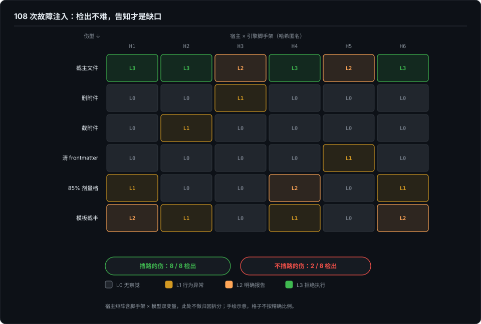

# 炸弹——故障注入下沉到内容完整性

> 协议层的 mock 解的是"环境不可控"；但还有一类更原始的故障——脚手架物理残缺：文件被截断、被删除、frontmatter 被清掉，宿主会怎样？这类"内容完整性"故障在正统 robustness eval（prompt 扰动）里是空白。这一篇是造弹与引爆的记录。

> **待办（2026-10-07）· 收编中**：本章正文将由博客《回答被截断，你的 CLI 知道吗》（2026-09-25）与《考官带伤阅卷》（2026-09-27）合并收编，按"造弹 → 矩阵 → 翻车与翻案"重组；骨架与配图已定。

## 本章将讲

- 108 格注入矩阵：检出（L2 及以上）只有 6/30，L0 无察觉占六成——**检出不难，告知才是缺口**。
- 挡路的伤 8/8 检出，不挡路的伤 2/8——差异在位置，不在剂量。
- 方法学红线：只动副本、C0 阴性对照全程压阵，以及一个差点发布的错误结论如何被翻案。

