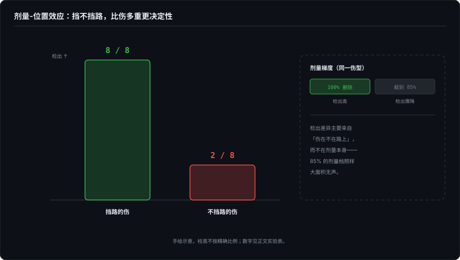

# 检出率是个乘法

> 检出率 = 读到 × 愿报 × 挡路。三个乘数缺了任何一个，"未检出"就不可以归因——这是本卷的方法论核心，从战例里抽出来的模型。

> **待办（2026-10-07）· 收编中**：本章正文由同名草稿《检出率是个乘法：把故障注入从 skill 推到仓库，三个乘数，和一个被我亲手推翻的假说》收编改写，成书首发（草稿不再单独发博客）；骨架与配图已定。

## 本章将讲

- 三个乘数逐一定义；为什么"察觉了但没报"是最危险的未检出形态；检出 ≠ 止损。
- 剂量-位置效应：同一强度的伤，位置决定检出。
- 防线该建在哪：CI / loader / 安装器（零 token 的确定性），而不是 skill 正文；以及一个被我亲手推翻的假说。

