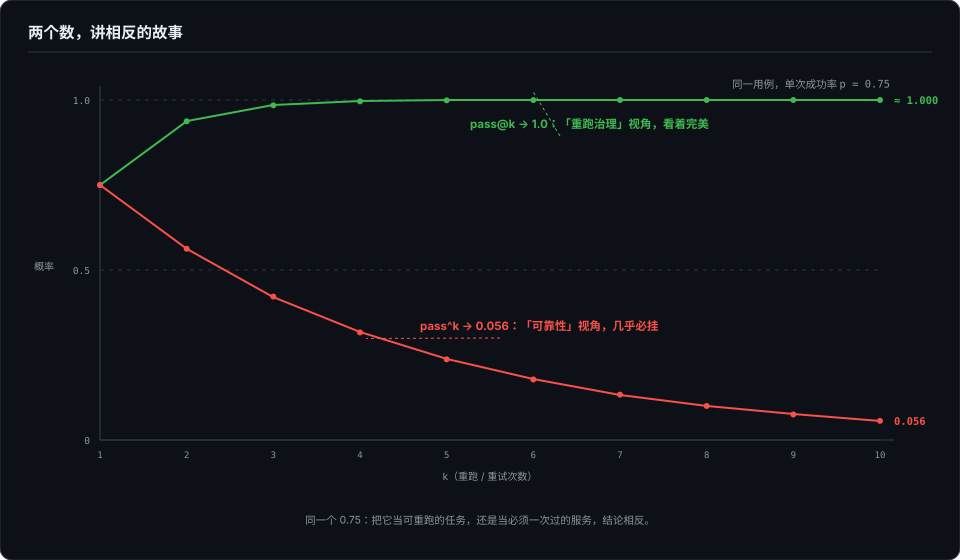

# 对照组的陷阱——归因靠对照不靠证据强度

> 证据再硬，也同时兼容两个相反的故事。对照组选错比没有对照组更危险——它给错误结论配上证据。这一篇讲归因的最低配置。

> **待办（2026-10-07）· 收编中**：本章正文将由草稿《测别人的生态：四层漏斗、三种 oracle、一次推翻自己的归因，和它抓到的三只 bug》收编改写，成书首发；Anthropic 官方 plugin evals 的双臂设计作收编注脚；骨架与配图已定。

## 本章将讲

- 双臂对照（with / without）为什么是归因的最低配置；裸基线缺位时，"全绿"和"没测到"同貌。
- 对照组被污染的三种形态。
- pass@k 与 pass^k：同一个 0.75，两个数讲出相反的故事——单次跑分为什么不作数。

