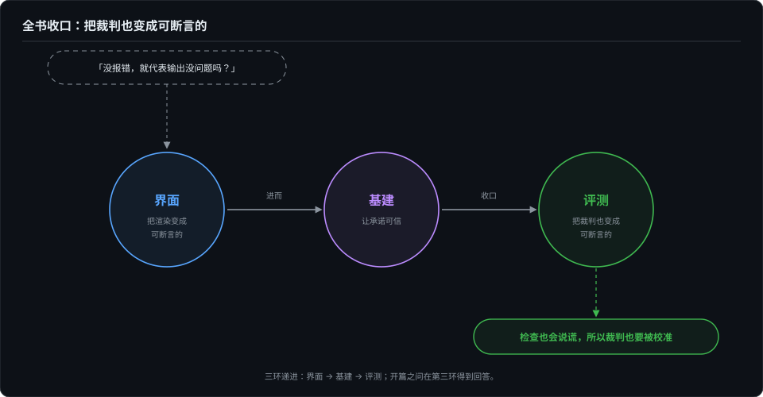

# 裁判也要被校准——meta-eval

> 这个系列翻过的每一次案，最后都指向同一件事：裁判本身也要被校准。评测系统的 bug，比被测对象的更隐蔽——这是本卷收口，也是全书收口。

> **待办（2026-10-07）· 收编中**：本章正文将由博客《我给 skill-up 报了一个不存在的 bug》（2026-09-20）、《CI 红、本地绿》（2026-09-22）收编改写，末节回到全书开篇之问作全书答毕；骨架与配图已定（收口配图将随全书结构定稿）。

## 本章将讲

- 观测会骗人、考题会骗人、对照组会骗人、绿灯会骗人——全书病例的回环。
- 误报公开更正的成本是一次尴尬，收益是一条可信的轨迹。
- "错误 → 机制化"清单：每次翻车长出的机制（排除计数、判活器回归、绝对路径纪律、flaky 分账），作全书方法论清单。

